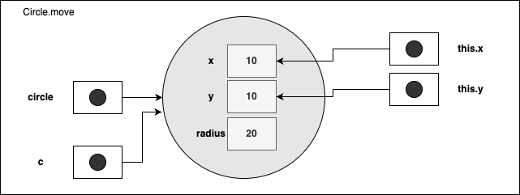
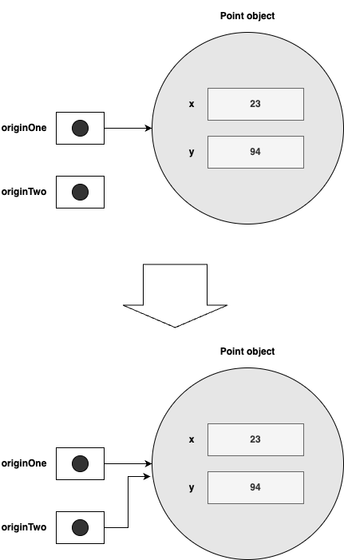
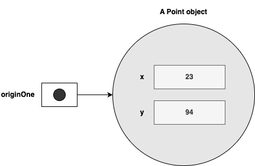
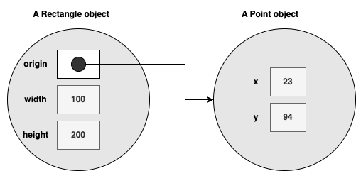

# Class와 Object

이번 장에서는 class를 사용하여 object를 만드는 방법과 object를 사용하는 방법에 대해 배운다.

다음의 내용을 다룬다.

* Classes

  * Class의 구조, field, method 및 constructor를 선언하는 방법에 대해 보여 준다.

* Objects

  * object를 만들고 사용하는 것에 대해 설명한다.
  * object에 dot(.) 연산자를 사용하여 instance의 변수 및 method에 접근하는 방법을 배운다.

* More on Classes

  * object reference 와 dot 연산자를 사용한 보다 많은 class 활용에 대해 알아 본다.

* Nested Classes(중첩 class)

  * 정적 중첩 class, inner class, anonymous inner class, 로컬 class 및 lambda 식에 대해 알아 본다.

* Enum Types(열거형 타입)

  * constant 집합을 정의하고 사용할 수 있는 특수 class인 열거형을 다룬다.


## Classes

본격적인 class 설명에 앞서 예로서 Bicycle class를 보자.

~~~java
public class Bicycle {

    // the Bicycle class has
    // three fields
    public int cadence;
    public int gear;
    public int speed;

    // the Bicycle class has
    // one constructor
    public Bicycle(int startCadence, int startSpeed, int startGear) {
        gear = startGear;
        cadence = startCadence;
        speed = startSpeed;
    }

    // the Bicycle class has
    // four methods
    public void setCadence(int newValue) {
        cadence = newValue;
    }

    public void setGear(int newValue) {
        gear = newValue;
    }

    public void applyBrake(int decrement) {
        speed -= decrement;
    }

    public void speedUp(int increment) {
        speed += increment;
    }

}
~~~


그리고, 이를 늘린 MountainBike class는 아래와 같다.

~~~java
public class MountainBike extends Bicycle {

    // the MountainBike subclass has
    // one field
    public int seatHeight;

    // the MountainBike subclass has
    // one constructor
    public MountainBike(int startHeight, int startCadence,
                        int startSpeed, int startGear) {
        super(startCadence, startSpeed, startGear);
        seatHeight = startHeight;
    }

    // the MountainBike subclass has
    // one method
    public void setHeight(int newValue) {
        seatHeight = newValue;
    }
}
~~~


### Declaring Cleasses (class 선언)

class 선언은 앞에서 본 것과 같이 field와 constructor, method 등을 포함하여 정의하는 것이다.

~~~java
class MyClass {
  // field, constructor, and
  // method declarations
}
~~~

중괄호로 표시되는 class body는 아래와 같이 class에서 생성된 object와 관련된 모든 코드가 포함되어 있다.

* 새 object를 초기화 하기 위한 constructor
* class 및 해당 object의 상태를 제공하는 field에 대한 선언
* 해당 object의 동작을 구현하는  method

class가 완전히 새롭게 선언된 것이 아니라면 클래서 선언을 위해서는 더 많은 구성 요소들이 있을 것이다.

class가 다른 class로부터 확장되고, 특별한 interface를 지원해야 한다면 아래와 같이 추가 정보가 필요할 것이다.

~~~java
class MyClass extends MySuperClass implements YourInterface {
  // field, constructor, and
  // method declarations
}
~~~

Myclass는 MySuperClass를 상속받아 구현되었고, YourInterface를 지원함으로써 관련된 type으로 사용될 수 있다.

또한, class의 접근 권한과 관련된 modifier로서 public, private 등이  class, field 및 method  선언 앞에 올수 있음을 앞서 선언된 Bicycle class나 MountainBike class를 보면 알 수 있다.

일반적인 class 선언은 아래의 내용을 순차적으로 포함한다.

* public , private과 같은 나중에 접하게 될 기타  access modifier
* class keyword
* 첫 글자가 대문자인 class 이름
* 확장 class인 경우,  extends keyword 와 superclass class의 이름 (superclass는 하나로 제한)
* interface 구현이 필요하다면, implements keyword와 하나 이상의 interface 이름이 쉼표로 구분되어 붙으며,
* 중괄호 {}로 둘러싸인 class 본문이 위치한다.

~~~java
<modifier> class <class name> [extends <superclass name>] [implements <interface name>, <interface name>,..] {
  // class body
}
~~~

**참고**

* Modifier는 뒤에서 설명함
* 추가적으로 static keyword가 붙을 수 있으나, 뒤에서 설명하도록 한다.


### Declaring Member Variables

class에서 선언 가능한 변수는 아래와 같다.

* class member 변수 (field)
* Method 또는 코드 block의 변수 (local variable)
* Mehtod 선언에서의 변수 (parameter)

Bicycle class에서 field 선언은 아래와 같다.

```java
public int cadence;
public int gear;
public int speed;
```


field 선언에서도 class 선언에서와 마찬가지로 아래와 같은 구성 요소들이 순차적으로 포함된다.

* public 또는 private 과 같은 modifier(생략 가능)
* field type
* field 이름


Bicycle class의 field들은 public modifier를 상용하고, int type으로 선언되었다.


#### Acccess Modifiers

field 선언의 가장 왼쪽에 있는 modifier를 이용할 경우  다른 class에서 해당 field의 접근을 제어할 수 있다.


Access modifier의 종류와 특징은 아래와 같다.

| Access Modifier | 같은 class | 같은 패키지 | 다른 패키지에 있는 subclass | 다른 패키지 |
| :-------------: | :---------: | :---------: | :-------------------------: | :---------: |
|     public      |    가능     |    가능     |            가능             |    가능     |
|    protected    |    가능     |    가능     |            가능             |   불가능    |
|     default     |    가능     |    가능     |           불가능            |   불가능    |
|     private     |    가능     |   불가능    |           불가능            |   불가능    |

##### private

* class에서만 접근 가능


##### 예제. 다음 코드를 보고, access modifier가 private인 경우에 대해 알아보자.

~~~java
// AccessModifierTest.java
package example;

class A {
  	private int data=40;
  	private void msg(){
        System.out.println("Data is " + data);
    }
}

public class AccessModifierTest {
  	public static void main(String[] args){
        A obj=new A();
        System.out.println(obj.data);
        obj.msg();
    }
}
~~~

* class A의 instance를 생성하여 field와 method에 접근하려 한다. 어떻게 될까?
* class A의 msg method에서 private를 제거하고 해보자. 어떻게 되나?


##### default

* 동일 패키지 내에 선언된 경우, 접근 가능


##### 예제. 다음 코드를 보고, access modifier가 default인 경우에 대해 알아보자.

private 예제의 class A를 같은 패키지 내 다른 파일로 생성하고, private keyword를 삭제한다.

~~~java
// A.java
package example;

class A {
  	int data=40;
  	void msg(){
        System.out.println("Data is " + data);
    }
}
~~~

* 두 파일을 compile하면 어떤 결과가 나오는가?

A.java 파일의 패키지를 바꿔보도록 한다.

example 패키지 대신 example2를 생성하고, 여기에 AccessModifierTest.java를 옮겨서 아래와 같이 수정한다.

~~~java
// AccessModifierTest.java
package example2;

import example.A;

public class AccessModifierTest {
  	public static void main(String[] args){
        A obj=new A();
        System.out.println(obj.data);
        obj.msg();
    }
}
~~~

* Compile 결과는 어떠한가? 패키지를 분리하기 전과 동일한가?

##### protected

* 패지키 내부와 외부 모두 접근 가능할 수 있지만, 상속을 통해서만 가능

##### 예제. 다음 코드를 보고, access modifier가 protected인 경우에 대해 알아보자.

class A의 access modifier를 아래와 같이 수정해 보자.

~~~java
// A.java
package example;

protected class A {
	  protected int data=40;
	  protected void msg(){
        System.out.println("Data is " + data );
    }
}
~~~


그리고, class A를 상속하여 아래와 같이 class B를 만들어 보자.

~~~java
// B.java
package example;

protected class B extends A {
}
~~~


마지막으로 class AccessModifierTest도 아래와 같이 수정해 보자.

~~~java
// AccessModifierTest.java
package example2;

import example.B;

public class AccessModifierTest {
  	public static void main(String[] args){
        A obj=new B();
        System.out.println(obj.data);
        obj.msg();
    }
}
~~~

* Compile 결과는 어떠한가? default와 어떠한 차이가 있는가?

##### public

* 어디에서나 접근 가능

##### 예제. 다음 코드를 보고, access modifier가 public인 경우에 대해 알아보자.

마지막으로 class A와 class B를 아래와 같이 수정해 보자.

~~~java
// A.java
package example;

public class A {
	  public int data=40;
	  public void msg(){
        System.out.println("Data is " + data );
    }
}
~~~

그리고, class A를 상속하여 아래와 같이 class B를 만들어 보자.

~~~java
// B.java
package example;

public class B extends A {
}
~~~

Compile 결과는 어떠한가? protected와 어떠한 차이가 있는가?

field는 access modifier의 종류에 따라 다양하게 접근을 허용하거나 제한 할 수 있지만, 해당 class 외부에서의 접근은 최소화 할 수 있도록 설정하는 것이 좋고, 접근이 필요한 경우에도 method 추가를 통해 지원하는 것이 좋다(encapsulation).

위에서 선언한 Bicycle class를 설명에 따라 수정해 보자.

~~~java
public class Bicycle {

    private int cadence; // field는 외부 접근을 차단할 수 있도록 private
    private int gear;    // 상속을 받는 subclass에서도 method를 이용해 접근 허용
    private int speed;

    public Bicycle(int startCadence, int startSpeed, int startGear) {
        gear = startGear;
        cadence = startCadence;
        speed = startSpeed;
    }

    public int getCadence() {            // field 접근을 위한 method 추가
        return cadence;
    }

    public void setCadence(int newValue) {
        cadence = newValue;
    }

    public int getGear() {
        return gear;
    }

    public void setGear(int newValue) {
        gear = newValue;
    }

    public int getSpeed() {
        return speed;
    }

    public void applyBrake(int decrement) {
        speed -= decrement;
    }

    public void speedUp(int increment) {
        speed += increment;
    }
}
~~~

#### Types

* 모든 변수는 type을 갖는다
* Primitive type
  * int, float, boolean, ...
* Reference type
  * array, string, class, interface,...

#### Variable Names

* Language Basics에서 설명한 규칙을 따른다

### Defining Methods

* Method 정의는 아래의 형식을 갖는다.

~~~java
[<access modifier>] [static] [final] <type> <method 이름> ([<parameter list>]) {
  // method body
}
~~~

* Type, method 이름, (), {} 는 필수 요소이다.
* Access modifier 는 앞서 설명한 것들중 하나를 선택하면 된다.
* Method를 class method로 정의하고 싶을 경우, static keyword를 추가한다.
* Method가 하위 class에서 재정의 되는걸 원하지 않는다면 final keyword를 추가한다.
* Method에서 반환되는 데이터 type을 지정한다
* Method 이름을 정의한다.
* Method의 파라메터 목록을 추가하며, 파라메터가 없을 경우 () 만 추가한다.
* Method의 body를 추가한다.

#### Method Names

* Language Basics에서 설명한 이름 규칙을 따름
* 시작은 소문자
* 여러 단어로 구성될 경우, 공백없이 연결해 쓰면서 첫번째 단어를 제외한 나머지는 첫글자를 대문자로 표기

* 일반적으로 class 내에서는 같은 이름의 method가 존재하지 않지만, method overloading으로 인해 둘 이상 존재할 수 있다.

  * 단, method 이름과 parameter type을 합한 method signature가는 달라야 한다.

##### 예제. 다음은 method 이름이다. 권장하는 형태로 만들어 졌는지 확인해 본다.

~~~java
run
runFast
getBackground
getFinalData
compareTo
setX
isEmpty
_getValue
GetName
MY_NAME
getID
A
b
~~~

* 위 이름중에서 일반적인 규칙을 따르지 않은 이름은? 어떤 것이 잘못되었나?

#### Method Overloading

* class 내에서 동일한 이름에 다른 parameter list를 가질 수 있음을 나타낸다.
* Method signature가 달라야 한다.
  * Method signature란 method 이름과 parameter type list로 해당 메서드를 구분하기 위한 식별자이다.

##### 예제. 다음 코드를 보고, 동일한 이름의 method를 여러개 정의할 수 있는 method overloading에 대해 알아보자.

~~~java
package example;

public class MethodOverloadingDemo {
    public Number sum(Integer term1, Integer term2) {
        System.out.println("Adding integers");
        return term1 + term2;
    }

    public Number sum(Number term1, Number term2) {
        System.out.println("Adding numbers");
        return term1.doubleValue() + term2.doubleValue();
    }

    public Number sum(Object term1, Object term2) {
        System.out.println("Adding objects");
        return term1.hashCode() + term2.hashCode();
    }

    public static void main(String[] args) {
        MethodOverloadingDemo   demo = new MethodOverloadingDemo();

        System.out.println(demo.sum(1, 2));
        System.out.println(demo.sum(1L, 2));
        System.out.println(demo.sum(demo, demo));
    }
}
~~~

* 코드를 실행해보고, 3개의 출력문이 어떻게 나오는지 확인해 보자.

* 3개의 method가 동일하게 sum으로 정의되어 있는데 어떻게 구분할까?

* 값은 sum method를 호출하였는데, 어떤 결과가 나오는가?

 ##### Method Signature

* method와 parameter list의 조합 구성
* method 선언의 일부로 method를 구분하기 위한 식별자
* return type은 포함되지 않으므로, return type만 다를 경우 compile에서 같은 method로 인식

### Providing Constructors for Your Classes

##### Constructor

* class에서 object를 생성시 호출되며
* 생성된 object를 초기화 하는 기능을 수행함
* 선언에 반환 type에 대한 정의는 없으며
* constructor body에서 결과 반환도 없다

 Bicycle의 constructor는 아래와 같다.

~~~java
  public Bicycle(int startCadence, int startSpeed, int startGear) {
      gear = startGear;
      cadence = startCadence;
      speed = startSpeed;
  }
~~~


프로그램에서 Bicycle의 새로운 object를 생성하려면 new 연산자를 이용해 constructor를 호출한다.

~~~java
Bicycle myBike = new Bicycle(30, 0, 8);
~~~


new 연산자를 myBike를 위한 메모리 공간을 할당하고, constructor를 호출해 object를 초기화 한다.

 Bicycle class에는 하나의 constructor만 정의되어 있지만, Java에서의 method overriding은 필요한 경우 추가적인 constructor를 정의할 수 있도록 지원한다.

다음은 Bicycle에 아무런 parameter가 없는 constructor를 정의한 것이다.

~~~java
  public Bicycle() {
      gear = 1;
      cadence = 10;
      speed = 0;
  }
~~~

프로그램에서는 아래와 같이 아무런 argument가 없이 호출 가능하다.

~~~java
Bicycle myBike = new Bicycle();
~~~

Bicycle에는 두개의 constructor가 있지만, parameter list가 다르므로 선언 가능하다.

동일한 parameter를 갖도록 정의한다면 compiler에서는 오류를 발생할 것이다.

##### Default Constructor

모든 class는 반드시 하나 이상의 constructor가 있어야 한다. 하지만, 종종 constructor가 정의되어 있지 않는 class를 볼 수 있다.

이는 Java에서 constructor가 정의되지 않을 경우, 기본 constructor를 제공하기 때문이다.

기본 constructor는 특별한 기능을 수행하지는 않고, 상속에 의해 생성된 subclass의 경우 superclass의 기본 constructor를 호출한다. 이때, superclass에서 기본 constructor가 없다면 compile 과정에서 오류가 발생할 것이다.

그리고, class에 어떠한 constructor라도 하나 이상 정의되어 있을 경우, 기본 constructor는 제공되지 않는다.

##### 예제. MountainBike를 기본 constructor로 생성해 보자.

~~~java
package example;

public class DefaultConstructorTest {
  public static void main(String [] args) {
    MountainBike bike = new MountainBike();
  }
}
~~~

* Compile을 하면 어떻게 되나요? 이유는?
* MountainBike의 constructor를 주석 처리하고 다시 compile해 봅니다. 어떻게 되나요? 이유는?

### Passing information to a Method of a Constructor

* Method나 constructor의 선언은 해당 method나 constructor에서 요구하는 argument의 수와 type을 선언한다.
* Parameter는 method나 constructor에서 사용되는 변수이며, runtime에 전달되어 오는 argument를  저장해 사용한다.

|                          Argument                           |                          Parameter                           |
| :---------------------------------------------------------: | :----------------------------------------------------------: |
|           Method나 constructor가 호출될때 전달되는 값            |        Method나 constructor에서 argument를 받기 위해 선언         |
| 호출된 method나 constructor로 값을 전달하기 위해 호출문에서 사용 | Method나 constructor 호출시 전달되어온 값들을 사용하기 위해 method나 constructor 내부에서 사용 |
|     Method나 constructor의 정의에 따라 각 parameter에 할당됨     |             argument 값를 가지고 있는 지역 변수              |
|                      Actual parameter                       |                       Formal parameter                       |

##### 예제. 다음 코드에서 parameter와 arguement를 구분해 설명하라

~~~java
package example;

public class PassingInformationDemo {
    public Number sum(Integer term1, Integer term2) {
        System.out.println("Adding integers");
        return term1 + term2;
    }

    public Number sum(Number term1, Number term2) {
        System.out.println("Adding numbers");
        return term1.doubleValue() + term2.doubleValue();
    }

    public Number sum(Object term1, Object term2) {
        System.out.println("Adding objects");
        return term1.hashCode() + term2.hashCode();
    }

    public static void main(String[] args) {
        MethodOverloadingDemo   demo = new MethodOverloadingDemo();
        Integer i1 = 10;
        Integer i2 = 20;
        Double  d1 = 10.0D;
        Double  d2 = 20.0D;
        String  s1 = "10";

        System.out.println(demo.sum(i1, i2));
        System.out.println(demo.sum(d1, d2));
        System.out.println(demo.sum(s1, d1));
    }
}
~~~

* 코드에서 argument로 사용된 것은?
* parameter는?

#### Parameter Types

* Java에서 지원하는 모든 데이터 type(primitive type, reference type) 사용 가능

#### Arbitrary Number of Arguments

* Variable argument(가변 인수)
* Method에 전달되는 argument의 갯수가 유동적일때, 임의 개수의 argument 전달
* Argument는 쉼표(,)로 구분
* Method 내에서는 배열로 사용

##### 형식

* Parameter list 대신 특정 data type, 세개의 점(...), parameter list 이름으로 구성 가능

  ~~~java
  <type> <method name>(<type>... name) {
    ...
  }
  ~~~

* 가변 인수 앞에는 다른 인수를 받을 수 있는  parameter 선언이 가능

  ~~~java
  <type> <method name>(<type> arg1, <type> arg2, Object... args)
  ~~~

  많이 사용되고 있는 System.out.printf 도 보자.

  ~~~java
  public PrintStream printf(String format, Object... args)
  ~~~

  첫번째 parameter로 String type의 format이 선언되어 있고, 두번째 parameter로 Object type의 args가 가변 길이로 선언되어 있다.

  실제 사용에서는 아래와 같이, 2개 이상의 argument를 줄 수 있다.

  ~~~java
  System.out.printf("%s: %d, %s%n", name, idnum, address);
  ~~~

##### 예제. 다음 코드를 복, 임의 개수의 정수를 argument로 받아 처리하는 과정을 알아보자.

~~~java
package examples;

public class VariableArgumentDemo {
    public VariableArgumentTest(int... numbers) {

        for(int number : numbers) {
            System.out.println(number);
        }
    }

    public static void main(String[] args) {
        VariableArgumentTest test = new VariableArgumentTest(1, 2, 3);
    }
}
~~~

* VariableArgumentDemo class constructor는 parameter로 int type의 numbers를 선언
* 호출시 1, 2, 3의 argument list를 가변 argument로 전달
* constructor 내부에서 numbers를 배열로 처기

##### 문제. 가변 인수를 사용하여 임의 갯수의 정수를 받아 더하는 method를 구현하라.

~~~java
package example;

public class VariableArgumentSumTest {
    public static int sum(/* 코드 삽입 */) {
      // 코드 작성 시작

      // 코드 작성 끝
    }

    public static void main(String[] args) {
        System.out.println("1 + 2 + 3 = " + sum(1, 2, 3));
    }
}
~~~

결과는 아래와 같이 출력된다.

~~~sh
1 + 2 + 3 = 6
~~~

##### 문제. 가변 인수를 받아서 합을 구하는 method를 구현하라. 단, 입력되는 인수의 타입은 Number는 정수로 처리하고, 정수 문자열은 정수로 변환해서 처리한다.

~~~
package example;

public class VariableArgumentSumTest2 {
    public static int sum(/* 코드 삽입 */) {
      // 코드 작성 시작

      // 코드 작성 끝

    }

    public static void main(String[] args) {
        System.out.println("sum(1, \"2\", 3.0) = " + sum(1, "2", 3.0));
    }
}
~~~

결과는 아래와 같이 출력된다.

~~~sh
sum(1, "2", 3.0) = 6
~~~

* sum호출에는 정수 , 문자열, 실수가 혼합되어 있다.

* Primitive data type의 리터럴을 주었는데, 어떻게 처리되나요?

* 세가지 다른 종류를  같은 가변 인수로 처리하려면?

  * Method 내에서는 어떻게 구별하나요?


#### Parameter Names

* Parameter 이름은 method나 constructor 호출시 전달된 argument를 참조하기 위해 사용된다.

* 조금 더 상세히 보면, primitive type은 값을 복사하고, reference type은 해당 object를 참조할 수 있도록 지원한다.

* Parameter의 이름은 해당 method나 해당 constructor 내에서만 유효하다.

* Parameter의 이름이  class field와 중복되는 경우, class field는 가려지게 되는 [variable shadowing](https://en.wikipedia.org/wiki/Variable_shadowing)이 발생한다.

* Variable shadowing은 추가적인 방법을 통해서만 접근 가능하다.


##### 문제. 다음 코드를 실해시키도, 문제가 있으면 수정하라.

 ~~~java
 package example;

 public class ShadowTest {
   private int x, y, radius;
   ShadowTest() {
     x = 0;
     y = 0;
     radius = 0;
   }

   public void setOrigin(int x, int y) {
     x = x;
     y = y;
   }

   public void setRadius(int r) {
     radius = r;
   }

   public int getX() {
     return x;
   }

   public int getY() {
     return	y;
   }

   public int getRadius() {
     return	radius;
   }

   public static void main(String [] args) {
     ShadowTest test = new ShadowTest();

     test.setOrigin(10, 10);
     test.setRadius(10);

     System.out.println("Origin : " + test.getX() + ", " + test.getY());
     System.out.println("Radius : " + test.getRadius());
   }
 }
 ~~~

* 어떠한 문제가 있나요? 이유는?.

* variable shadowing 문제가 발생한 곳은?

* 해결 방법은?

#### Passing Primitive Data Type Arguments

* Primitive data type은 method에 값을 전달한다.
* 즉, parameter로 넘겨져 오는 것은 argument 값으로 method 호출시에 적용되었던 변수와는 관계가 없다.
* parameter는 수명 주기를 method와 함께 가지므로, method가 반환되면 method 내부에서 사용되던 parameter도 사라진다.

##### 예제. primitive data type을 method의 parameter로 사용하고, argument로 사용된 변수의 영향을 확인해 보자.

~~~java
package example;

public class PassPrimitiveDataDemo {

    public static void main(String[] args) {

        int x = 3;

        // invoke passMethod() with
        // x as argument
        passMethod(x);

        // print x to see if its
        // value has changed
        System.out.println("After invoking passMethod, x = " + x);

    }

    // change parameter in passMethod()
    public static void passMethod(int p) {
        p = 10;
    }
}
~~~

* x는 static method passMethod에 argument로 사용된다
* Parameter p는 x의 값으로 초기화된 후 method 내부에서 변경된다.
* passMethod 가 반환되고, x 값을 확인한다.


#### Passing Reference Data Type Arguments

* Reference data type은 method에 값을 전달한다.
* 즉, parameter로 넘겨져 오는 것은 argument 값으로 method 호출시에 적용되었던 object의 참조 정보이다.
* parameter는 수명 주기를 method와 함께 가지므로, method가 반환되면 method 내부에서 사용되던 parameter도 사라진다.


##### 예제. Reference data type을 method의 parameter로 사용하고, argument로 사용된 변수의 영향을 확인해 보자.

~~~java
package example;

public class PassReferenceDataDemo {
    static class Circle {
        int x;
        int y;
        int radius;

        Circle(int x, int y, int radius) {
            this.x = x;
            this.y = y;
            this.radius = radius;
        }

        public void move(int x, int y) {
            this.x += x;
        		this.y += y;
        }

        public void print() {
            System.out.println("(" + x + ", " + y + ", "  + radius + ")");
        }
    }

    public static void move(Circle c, int x, int y) {
        c.move(x, y);
    }

    public static void main(String[] args) {
        Circle circle = new Circle(10, 10, 20);

        circle.print();

        move(circle, 5, 5);

        circle.print();
    }
}
~~~

* primitive data type은 method 내부의 변경에 영향이 없었다. reference data type은?
* 변경되었다면 이유는?
* Argument로 Reference data type을 사용한경우, 위와 같이 모두 변경되는가?


**참고**

* main에서 아래와 같이 circle class instance가 생성되고, circle 변수는 이를 참조한다.


* static void move method가 호출되면, circle을 argument로 하여 method parameter c에 참조가 복사된다.(object가 아닌 참조)


* static void move 내에서 dot 연산자를 이용해 c가 참조하는 object의 method를 호출하여 값을 변경하게 된다.



* Reference data type argument는 해당 int

## Objects

* class instance로 생성
* Java 프로그램은 method를 호출하여 상호 작용하는 많은 object 생성
* object간 상호 작용을 통해 GUI 구현, animation 실행, network을 통한 정보 송수신 등의 다양한 작업 수행
* object가 생성된 작업을 완료하면 해당 리소스는 다른 object에서 사용할 수 있도록 재활용됨


##### 예제. object 설명을 위한 작은 프로그램이다. 작성하여 실행해 보라.

* X축과 Y축의 위치를 나타낼 Point class는 아래와 같다.

~~~java
//Point.java
package example;

public class Point {
  public int x;
  public int y;

  public Point() {
    x = 0;
    y = 0;
  }

  public Point(int x, int y) {
    this.x = x;
    this.y = y;
  }
}
~~~

* 중심점, 넓이와 높이를 갖는 Rectangle class는 아래와 같다.
* 영역 크기를 계산해 돌려주는 method를 지원한다.
~~~java
// Rectangle.java
package example;

public class Rectangle {
  public Point origin;
  public int width;
  public int height;

  public Rectangle(int width, int height) {
    this.origin = new Point();
    this.width = width;
    this.height = height;
  }

  public Rectangle(Point origin, int width, int height) {
    this.origin = origin;
    this.width = width;
    this.height = height;
  }

  public int getArea() {
    return	width * height;
  }
}
~~~

* 하나의 Point instance와 두개의 Rectangle instance를 생성하는 프로그램이다.

~~~java
//CreateObjectDemo.java
package example;

public class CreateObjectDemo {

    public static void main(String[] args) {

        // Declare and create a point object and two rectangle objects.
        Point originOne = new Point(23, 94);
        Rectangle rectOne = new Rectangle(originOne, 100, 200);
        Rectangle rectTwo = new Rectangle(50, 100);

        // display rectOne's width, height, and area
        System.out.println("Width of rectOne: " + rectOne.width);
        System.out.println("Height of rectOne: " + rectOne.height);
        System.out.println("Area of rectOne: " + rectOne.getArea());

        // set rectTwo's position
        rectTwo.origin = originOne;

        // display rectTwo's position
        System.out.println("X Position of rectTwo: " + rectTwo.origin.x);
        System.out.println("Y Position of rectTwo: " + rectTwo.origin.y);

        // move rectTwo and display its new position
        rectTwo.move(40, 72);
        System.out.println("X Position of rectTwo: " + rectTwo.origin.x);
        System.out.println("Y Position of rectTwo: " + rectTwo.origin.y);
    }
}
~~~

결과는 아래와 같다.

~~~sh
Width of rectOne: 100
Height of rectOne: 200
Area of rectOne: 20000
X Position of rectTwo: 23
Y Position of rectTwo: 94
X Position of rectTwo: 40
Y Position of rectTwo: 72
~~~

* 동일한 결과가 나온다면 다음 진행을 위한 준비가 되었다.


### object 생성하기

예제를 통해 아래와 같이 object를 생성해 보았다.

~~~java
Point originOne = new Point(23, 94);
Rectangle rectOne = new Rectangle(originOne, 100, 200);
Rectangle rectTwo = new Rectangle(50, 100);
~~~

각각의 라인은 아래의 세부분으로 구성된다.

1. 선언 : 생성할 object 참조를 위한 변수 선언
2. instance화 : new 연산자를 이용해 object 생성
3. 초기화 : 생성된 object를 초기화하기 위해 constructor 호출


#### object 참조를 위한 변수 선언

* object 생성이 완료되면 이를 참조할 변수가 필요하다

* 앞서 변수 선언에서 본 것처럼 생성된 object를 참조한 변수 선언

* object 참조를 위한 변수는 생성되는 object와 동일한 class 이거나 해당 class가 상속 받은 superclass 또는 interface이다.

  ~~~java
  <type> <name>;
  ~~~

  * \<name>의 변수는 선언만 되어 있고,
  * primitive type의 경우, 정해져 있는 초기값으로
  * reference type의 경우, null로 초기화 됨

* 변수가 선언되었다고 해서 object가 생성되는 것은 아니고, 새롭게 생성하거나 생성된 object를 참조하도록 해야 한다.

  ~~~java
  Point originOne = new Point();
  Point originTwo;

  originTwo = originOne;
  ~~~

  

* 참조 타입의 경우, 변수 선언 후 object를 참조하기 전에 사용하면 compile 과정에서 오류가 발생한다.


##### 예제. 다음 코드를 보고, object 참조 변수 생성 후 실제 object 참조 없이 사용해 보자.

~~~java
package example;

public class CreateObjectDemo {
    public static void main(String[] args) {
        Point originOne;

        if (originOne instanceof Point) {
            System.out.println("Origin : " + originOne.x + ", " + originOne.y);
        }
    }
}
~~~

* Compile 과정에 문제는 없는가? 이유는?

#### Instantiating a Class

class를 object로 만드는 것

##### new 연산자

* object를 위한 메모리 할당
* object constructor 호출을 통한 초기화
* 생성된 object의 reference 반환
  * 반환의 의미가 변수에 대입하기 위한 용도를 나타내는 것은 아님

#### object 초기화

* new 연산자를 통해 생성 object 초기화
* new 연산자 호출시 주어진 argument를 이용해 적절한 constructor 호출
* argument type과 parameter type이 일치하지 않을 경우, 호환 가능한 parameter type을 찾아 적용

몇가지 예를 통해서 instance 생성과 초기화 과정을 보도록 하자.

Point  class의 object를 생성한다.

~~~java
Point originOne = new Point(23, 94);
~~~



* x와 y를 field로 갖는 Point class type의 object가 생성되고,

* originOne 변수가 생성된 object를 참조한다.

Rectangle object 생성을 보자.

Point는 field로 primitive data type만을 가지는 반면에 Rectangle은 Point를 갖는다.

Rectangle class는 아래와 같다.

~~~java
public class Rectangle {
    public int width = 0;
    public int height = 0;
    public Point origin;

    // four constructors
    public Rectangle() {
        origin = new Point(0, 0);
    }
    public Rectangle(Point p) {
        origin = p;
    }
    public Rectangle(int w, int h) {
        origin = new Point(0, 0);
        width = w;
        height = h;
    }
    public Rectangle(Point p, int w, int h) {
        origin = p;
        width = w;
        height = h;
    }

    // a method for moving the rectangle
    public void move(int x, int y) {
        origin.x = x;
        origin.y = y;
    }

    // a method for computing the area of the rectangle
    public int getArea() {
        return width * height;
    }
}
~~~

* Rectangle 기준점을 Point  사용
* 폭과 높이는 Primitive data type의 width, height으로 선언
* width, height은 기본값 제공
* 여러 종류의 parameter 구성으로 다양한 constructor 구성


각 constructor를 예로 들어 보자.


##### 예제. Point object, 폭 및 높이를 받는 constructor를 확인해 보자.

constructor를 사용하는 코드는 아래와 같다.

~~~java
Rectangle rectOne = new Rectangle(originOne, 100, 200);
~~~


new 연산자는 Rectangle object를 위한 메모리를 할당 받고, constructor 중 주어진 argument를 처리할 수 있는 constructor를 호출한다.

이를 통해 생성된 object의 구성은 아래 그림과 같다.




##### 예제. 폭과 높이만을 받는 constructor를 확인해 보자.

constructor를 사용하는 코드는 아래와 같다.

~~~java
Rectangle rectTwo = new Rectangle(50, 100);
~~~

앞에서와 동일하게 new 연산자는 메모리를 할당 받는다. Rectangle object를 위한 argument로 폭과 높이만을 주었으므로, constructor중 폭과 높이만을 받아 처리하는 constructor를 호출한다.

~~~java
public Rectangle(int w, int h) {
    origin = new Point(0, 0);
    width = w;
    height = h;
}
~~~

 constructor에서는 argument로 폭과 높이만 주어졌으므로, Rectangle object의 위치를 나타낼 Point object를 생성한다.


##### 예제. Argument를 받지 않는 constructor를 확인해 보자.

마지막으로 아무런 argument를 받지 않는 constructor(no-argument constructor)를 보자.

아무런 argument를 받지 않는 constructor는 기본 constructor(default constructor)와 동일하게 생겼다. 하지만, Rectangle class에서는 field에 대한 초기화가 필요하고, 각 field의 초기값이 자동으로 설정되지 않은 reference type이 존재하므로 자동을 생성하는 기본 constructor 사용이 불가능하다. 아울러 기본 constructor는 아무런 constructor가 존재하지 않을때만 자동으로 생성되어 argument를 받지 않는 constructor 구성이 필요하다.

코드는 아래와 같다.

~~~java
Rectangle rect = new Rectangle();
~~~


#### 상속 class에서의 초기화

상속을 통해서 생성된 class의 경우 constructor 호출시 superclass의 constructor를 자동 또는 수동으로 호출한다. 생성되는 class의 constructor에서 명시적으로 superclass의 constructor를 호출하지 않은 경우, constructor 시작부분에서 superclass의 기본 constructor를 자동 호출한다.

따라서, 이때 superclass의 기본 constructor가 없다면 compile 과정에서 오류가 발생할 것이다.


##### 예제. MountainBike를 수정하여 superclass의 기본 constructor 호출을 확인하자.

MountainBike class를 아래와 같이 constructor를 추가한다.

~~~java
package example;

public class MountainBike extends Bicycle {

    // the MountainBike subclass has
    // one field
    public int seatHeight;

    public MountainBike(int startHeight) {
        seatHeight = startHeight;
    }

    public MountainBike(int startHeight, int startCadence,
                        int startSpeed, int startGear) {
        super(startCadence, startSpeed, startGear);
        seatHeight = startHeight;
    }

    // the MountainBike subclass has
    // one method
    public void setHeight(int newValue) {
        seatHeight = newValue;
    }
}
~~~


추가된 constructor를 이용해 초기화 될 수 있도록 테스트 코드를 작성한다.

~~~java
package example;

public class InitSuperclassDemo {
  public static void main(String [] args) {
    MountainBike bike = new MounttainBike(10);

  }
}
~~~

Compile 결과는? 이유는?


// TODO : 문제 추가


### object 사용하기

object를 이용한 작업은

* field 값을 사용하거나 변경
* method를 호출


 #### object field 참조 하기

object field는

* 이름으로 접근되어 모호하지 않은 이름 사용

  ~~~java
  class Rectangle {
    int width;
    int height;

    ...

    public void printInformation() {
      System.out.println("Width and height are:" + width + ", " + height);
    }
  }
  ~~~

  * 이름만 보고 의미를 알 수 있는 것이 가장 좋다

  ~~~java
  class Rectangle {
    int a;
    int b;

    ...

    public void printInformation() {
      System.out.println("Width and height are:" + a + ", " + b);
    }
  }
  ~~~

  * a? b? 무엇은 뜻하는지 알수 없다

* class 밖에 있는 코드가 field를 참조하기 위해서는 dot(.) 연산자 사용

  ~~~java
  class CreateObjectDemo {
    public static void main(String[] args) {
      Rectangle rectOne = new Rectangle();
      Rectangle rectTwo = new Rectangle();

   		System.out.println("Width of rectOne: "  + rectOne.width);
  		System.out.println("Height of rectOne: " + rectOne.height);

   		System.out.println("Width of rectTwo: "  + rectTwo.width);
  		System.out.println("Height of rectTwo: " + rectTwo.height);
    }
  }
  ~~~

  * Dot 연산자를 이용해 object field 참조
  * rectOne.width와 rectTwo.width는 object가 다르므로 서로 다른 width가 됨

* object 참조를 위한 변수가 없어도 접근 가능

  ~~~java
  int height = new Rectangle().height;
  ~~~

  * new 연산자에 의해 object 생성되어 반환
  * 반환된 object의 height field 참조
  * 생성된 object는 더 이상의 참조가 없으므로, 자원 재활용
  * **변수는 생성된 object를 참고할 수 있도록 도와줄 뿐 실제 object는 아님**


#### object method 호출하기

object method는

* Method가 수행하는 작업을 알 수 있도록 이름 사용

  ~~~java
  Rectangle rectOne = new Rectangle(100, 50, 10);

  rectOne.move(40, 70);
  int areaOfRactangle = rectOne.getArea();
  ~~~

  * void move(int x, int y) - rectOne object를 특정 위치(x, y)로 이동
  * int getArea(); - rectOne의 width와 height를 이용해 계산한 영역 크기

* field와 동일하게 dot 연산자를 이용해 호출 가능

  ~~~java
  rectOne.move(40, 70);
  ~~~

  * rectOne object에서 지원하는 method 중에서 move를 호출

* field와 동일하게 object 참조 변수가 없이도 접근 가능

  ~~~java
  int areaOfRactangle = new Rectangle(100, 50).getArea();
  ~~~

  * new Rectangle(100, 50)을 통해 object가 생성되고, 생성된 object에 dot 연산자를 적용해 method를 호춣
  * Reference type 변수는 변수 그 자체가 object를 나타낸 것은 아니고, object를 참조만 하고 있다.


#### The Garbage Collector

* Java에는 생성된 object를 명시적으로 삭제하겠다는 명령이 없음
  * object 생성을 위한 new는 있지만, 삭제를 위한 destroy, delete, remove 등은 없음

* Java runtime 환경에서 더 이상 사용되지 않는 object는 자동으로 삭제
* 더 이상 사용되지 않는 object란 더 이상 참조가 없다는 것으로 Reference type 변수나 dot 연산자 등의 해당 object와의 관계가 없다는 뜻
* 참조가 없을때 즉시 리소스 반환을 하지는 않고, 일정 조건(시간 간격)을 만족할때 자동 수행된다.

* **보다 자세한 내용은 특강에서 진행**


## class에 관해 조금 더 알아보기

* Method에서의 값 반환
* this keyword
* Class member 대 instance member
* Access control(접근 제어)


### Method에서의 값 반환

Method에서 자신을 호출한 코드로 반환되는 것은

* method의 수행이 완료되었을때
* 중간에서라도 return문을 만났을때
* 발생한 exception을 처리하지 못하거나 exception을 던졌을때


Method 반환 type은

* Method 선언시 지정
* 반환 값이 없는 경우 void로 선언
* return문을 통해 반환 되는 값의 type이거나 호환되는 type


return 문은

* Method내의 제어 흐름을 즉시 종료할 수 있고

  ~~~java
  int method(int n) {
   	if (n % 2 == 0) {
      retuirn	0;
    }
    ...

    return 1;
  }
  ~~~

* Method의 수행 결과는 반환할 수 있으나, method 선언에서 지정된 type이거나 호환되는 type이고,

  ~~~java
  <type> method() {
    ...
      return	<type>;
  }
  ~~~

  다른 경우는 안된다.

  ~~~java
  boolean isValid() {
    return	1;  // 정수로서 boolean 값이 될 수 없다
  }
  ~~~

* Method에서 지정된 반환 type이 void인 경우, 반환 값 없이 호출할 수 있다.

  ~~~java
  void method() {
    ...
    return;
  }
  ~~~

* 변수의 값이나 constant 뿐만 아니라 식의 계산 값도 가능

  ~~~java
  int getArea() {
    return	width * height;
  }
  ~~~


#### Class 또는 Interface 반환

* Primitive data type뿐만 아니라 reference type 값도 반환 가능

// TODO : covariant return type 설명 추가


### this keyword

this는

* Method 또는 constructor 내에서 현재 object 참조를 위해 지원

*  Method나 constructor내에서 현재 object의 모든 멤버들 참조 가능


#### field와 사용하기

this를 사용하는 대표적인 예가 constructor이다.

앞서 parameter 이름을 설명하며, 이름 중복에 따른 shadowing field에 대해 보았다.

아래의 예를 다시 보자.

~~~java
public class Point {
    public int x = 0;
    public int y = 0;

    //constructor
    public Point(int a, int b) {
        x = a;
        y = b;
    }
}
~~~

Point class가 정의되었다. constructor에서 x와 y의 초기 설정을 위해 두개의 값을 받으며 이름을 a, b라고 설정하였다.

a,b는 무엇을 의미하는지 이름으로 알 수 없어 이름을 정하는 규칙을 따르지 않았다.

이를 알기 쉽게 x, y로 변경해 보자.

~~~java
public class Point {
    public int x = 0;
    public int y = 0;

    //constructor
    public Point(int x, int y) {
        x = x;
        y = y;
    }
}
~~~

field의 이름과 parameter의 이름이 동일해져 shadowing 현상이 발생하였다.

this keyword를 이러한 문제에서 어느 변수가 field인지 명확하게 표시할 수 있다.

~~~java
public class Point {
    public int x = 0;
    public int y = 0;

    //constructor
    public Point(int x, int y) {
        this.x = x;
        this.y = y;
    }
}
~~~


#### constructor로 사용하기

constructor를 작성하다보면 parameter의 구성에 따라 여러 constructor를 선언해야 할때가 있다.

이러한 경우, 필요 이상으로 동일한 코드가 많이 발생하게되는데, 이를 해결하기 위해  **explicit constructor invocation(명시적 constructor 호출)**을 지원한다.

명시적 constructor 호출이란 new 연산자를 통해서 메모리 할당 과정과 constructor 호출을 함께 하는 것이 아니라, 코드내에서 직접 constructor를 호출하는 것이다.

이때 코드는 자신의 constructor를 호출하기 this keyword사용이 가능하다.

##### 예제. 다음 코드를 보고, 명시적 constructor 호출을 통해 중복 코드 제거에 대해 알아보자.

* Point는 x와 y를 받아 생성할 수 있다.
* Point는 다른 point를 받아 생성할 수 있다.
* Point 생성시 값이 없을 경우, 초기 값을 (0, 0)으로 한다.
* Point는 이동한 횟수를 갖는다.
* Point는 x와 y의 변화량을 통해 이동할 수 있다.

~~~java
package example;

public class Point {
    int x;
    int y;
    int moveCount;

    //constructor
    public Point() {
      	x = 0;
      	y = 0;
        moveCount = 0;
    }

    public Point(Point point) {
      	x = point.x;
      	y = point.y;
        moveCount = 0;

    }

    public Point(int x, int y) {
        this.x = x;
        this.y = y;
        moveCount = 0;
    }

    public void move(int dx, int dy) {
        x += dx;
        y += dy;
        moveCount++;
    }

    public int getMoveCount() {
        return  moveCount;
    }
}
~~~

Point class에는 총 3개의 constructor가 정의되어 있고, constructor에서는 moveCount = 0 라는 동일한 과정을 반복하고 있다.

또한, Point class에 새로운 field를 추가할 경우, 3개의 생성사에 동일한 과정을 추가해야 하고  과정이 복합할 경우 오류가 발생할 확률도 높아 진다.


명시적 constructor 호출은 이러한 문제점을 해결 할 수 있다.

다음 코드는 앞서의 코드에 명시적 constructor 호출을 적용한 것이다.

~~~java
package example;

public class Point {
    int x;
    int y;
    int moveCount;

    //constructor
    public Point() {
        this(0, 0);
    }

    public Point(Point point) {
        this(point.x, point.y);
    }

    public Point(int x, int y) {
        this.x = x;
        this.y = y;
        moveCount = 0;
    }

    public void move(int dx, int dy) {
        x += dx;
        y += dy;
        moveCount++;
    }

    public int getMoveCount() {
        return  moveCount;
    }
}
~~~

코드상에 moveCount를 초기화하는 부분은 한 곳에만 존재하며, field 추가의 경우에도 최소한의 코드 추가로 가능하다.

이로서 중복 코드는 제거되었고, 중복 코드로 인해 수정시 부분 수정에 따른 오류 발생의 가능성 또한 줄였다.

###

##### 문제. 명시적 constructor 호출을 이용해 Rectangle class를 정의해 보자.

* 다음 조건을 만족하는 Rectangle class를 정의해 본다.

  * Point 를 중심으로 넓이와 높이를 갖는다.
  * 아무런 설정 값이 없는 경우, 중심 (0,0), 넓이 0, 높이 0으로 한다.
  * 중심 위치만 받아 생성할 수 있다.
  * 중심 위치, 넓이, 높이를 받아 생성할 수 있다.
  * 넓이와 높이만 받을 수 있다. 이때, 중심 위치는 (0,0)으로 한다.


~~~java
package example;

public class Rectangle {
    int width = 0;
    int height = 0;
    Point origin;

    // 4개의 constructor
    public Rectangle() {
		// 코드 추가 시작

    // 코드 추가 끝
    }

  	public Rectangle(Point p) {
		// 코드 추가 시작

    // 코드 추가 끝
  	}

    public Rectangle(int width, int height) {
 		// 코드 추가 시작

    // 코드 추가 끝
    }

    public Rectangle(Point point, int width, int height) {
		// 코드 추가 시작

    // 코드 추가 끝
    }

    // a method for moving the rectangle
    public void move(int x, int y) {
        origin.x = x;
        origin.y = y;
    }

    // a method for computing the area of the rectangle
    public int getArea() {
        return width * height;
    }
}
~~~


### 멤버에 대해 접근 제어하기

Access control의 수준

* Top level (class level)

  * public
    * 동일 패키지에 상관없이 접근 가능
  * package-private
    * 동일 패키지 내에서만 접근 가능
    * public으로 설정하지 않은 경우로 별도의 keyword 없음

* Member level

  * public

    * 모든 경우 접근 가능

  * protected

    * 다른 패키지이며 상속 관계가 없는 경우를 제외하고 모두 접근 가능

  * default

    * 동일 패키지 내에서만 허용
    * keyword 없음. Public, protected, private를 사용하지 않으면 적용됨

  * private

    * 동일 class field나 method에 대해서만 허용


##### Access Level 선택 기준

* 가장 제한적인 단계를 기본으로 사용
* constant를 제외하고, 가능한 public은 사용하지 않도록 함
  * 앞서 사용된 public field는 단계적 설명을 위해 사용된 것
  * 외부에서의 직접적인 field 사용은 코드의 유연성에 제약을 주게 됨

​

### class 멤버 이해하기

* class로의 인스턴스가 아닌 class에 포함되어 있은 멤버
* static keyword의 활용

* Instance member vs class member


#### Class Variables

* class에서 instance가 만들어지면 각 instance는 class에 선언된 변수들과 같은 복사본을 가짐
* 즉, Instance마다 별도의 메모리 영역을 할당하여 각기 다른 변수로 만들어짐


##### static keyword의 활용

* 같은 class로 만들어진 object간에 공통으로 사용이 필요한 변수가 필요한 경우
* static keyword가 적용된 변수를 static field 또는 class 변수라고함
* 개별 object와의 연결관계를 가지지 않고, class와의 연결 관계를 가짐
* 해당 class로 부터 생성된 object를 통해서도 접근 가능하지만,
* class만을 이용해서도 접근 가능하여 access modifier에 따라 별도의 object 생성 없이도 접근 가능
* class 변수에  dot 연산자를 이용해 접근할 것을 권장함


##### 예제. 다음 코드를 보고, class 변수를 선언하고 활용한 것에 대해 알아보자.

* Bicycle class에서는 instance생성될때 마다 공유의 id를 부여한다.
* id는 생성된 instance의 갯수와 연관 관계를 갖는다.

~~~java
public class Bicycle {

    private int cadence;
    private int gear;
    private int speed;
    private int id;
    private static int numberOfBicycles = 0;

    public Bicycle(int startCadence, int startSpeed, int startGear){
        gear = startGear;
        cadence = startCadence;
        speed = startSpeed;

        // increment number of Bicycles
        // and assign ID number
        id = ++numberOfBicycles;
    }

    // new method to return the ID instance variable
    public int getID() {
        return id;
    }
        ...
}
~~~

* static field로 numberOfBicycles를  선언
* constructor를 통해 자전거가 생성될때마다 numberOfBicycles를 증가 시킴
* numberOfBicycles를 id로 사용함으로써, 중복된 id 없이 자전거 id 부여


##### 문제. Rectangle class를 수정하여, 생성된 instance를 배열에 저장하도록 한다.

* 초기 배열의 갯수는 10개로 설정한다.


#### Class Methods

* class 변수와 마찬가지로 class method 지원
*  class 이름에 dot 연산자를 사용해 호출하는 것을 권자함
  * object에 dot 연산자 적용도 가능함
* class method이므로 method내에서 this 사용 불가
  *  즉, class method에서는 object의 변수나 method의 직접적인 접근이 불가능하다


##### 예제. 다음 코드를 보고, class method에 대해 알아보자.

* class 변수 설명에서 Bicycle class의 instance가 생성될때마다 class 변수를 통해 갯수를 관리하였다.
* 이를 class method를 이용해 가져올 수 있도록 하자.

~~~java
public class Bicycle {

    private int cadence;
    private int gear;
    private int speed;
    private int id;
    private static int numberOfBicycles = 0;

    public Bicycle(int startCadence, int startSpeed, int startGear){
        gear = startGear;
        cadence = startCadence;
        speed = startSpeed;

        // increment number of Bicycles
        // and assign ID number
        id = ++numberOfBicycles;
    }

    // new method to return the ID instance variable
    public int getID() {
        return id;
    }

  	public static int getNumberOfBicycles() {
     	return	Bicycle.numberOfBicycles;
    }
        ...
}
~~~

* getNumberOfBicycles method를 static을 이용해 class method로 정의하였다.
* class 변수의 값을 돌려 준다.


##### 문제. Rectangle class를 수정하여, class method를 이용해 특정 instance를 찾을 수 있도록 하라.

* Rectange class에 id를 추가하여 instance 생성시마다 유일한 값을 부여한다.

* class method getRectangle(int id) 를 이용해 요청한 id를 갖는 Rectangle object를 찾는다.

* 해당 id를 갖는 object가 없는 경우,  null을 반환한다.


~~~java
package example;

public class Rectangle {
    int width = 0;
    int height = 0;
    Point origin;

    // 4개의 constructor

  ...
}
~~~


#### Constants

* class 변수중 final이 적용된 변수

* 이름은 대문자만으로 구성을 권장함

* 이름에 둘이상의 단어 조합 필요한 경우, 밑줄(_)을 사용

* compile time constant 란?

  *  compile 시점에 값에 대해 명확하게 알 수 있는 constant

  * 리터럴이 대표적인 예

    ~~~java
    jpublic final int maximumLoginAttempts = 5;

    public static void main(String[] args) {
        PrintWriter printWriter = System.console().writer();
        printWriter.println(ClassConstants.DEFAULT_USERNAME);

        CompileTimeVariables instance = new CompileTimeVariables();
        printWriter.println(instance.maximumLoginAttempts);

        final String username = "baeldung" + "-" + "user";
        printWriter.println(username);
    }
    ~~~


* runtime constant란?

  * 아래와 같이 실행 중에 값이 결정되고, 결정된 값이 이후에 변경되지 않을 경우

    ~~~java
    public static void main(String[] args) {
        Console console = System.console();

        final String input = console.readLine();
        console.writer().println(input);

        final double random = Math.random();
        console.writer().println("Number: " + random);
    }
    ~~~


#### 현재까지의 내용을 적용한  Bicycle Class

~~~java
public class Bicycle {

    private int cadence;
    private int gear;
    private int speed;

    private int id;

    private static int numberOfBicycles = 0;


    public Bicycle(int startCadence,
                   int startSpeed,
                   int startGear) {
        gear = startGear;
        cadence = startCadence;
        speed = startSpeed;

        id = ++numberOfBicycles;
    }

    public int getID() {
        return id;
    }

    public static int getNumberOfBicycles() {
        return numberOfBicycles;
    }

    public int getCadence() {
        return cadence;
    }

    public void setCadence(int newValue) {
        cadence = newValue;
    }

    public int getGear(){
        return gear;
    }

    public void setGear(int newValue) {
        gear = newValue;
    }

    public int getSpeed() {
        return speed;
    }

    public void applyBrake(int decrement) {
        speed -= decrement;
    }

    public void speedUp(int increment) {
        speed += increment;
    }
}
~~~


### field 초기화하기

* class나 인스턴스에서 field 초기화 방법은 다양하게 제공됨
  * constructor
  * 변수 선언에서의 초기화
  * static 초기화 블록
  * 인스턴스 멤버 초기화


#### constructor를 이용한 초기화

* 가장 일반적인 방법
* class  member에 대해서는 적합하지 않을 수 있음
  * 새로운 instance가 생성할때 마다 호출됨
  * 처음 호출되었는지 확인 과정 필요


##### 예제. 다음 코드를 보고, constructor를 이용한 초기화를 알아 보자.

~~~java
package example;

class World {
    static boolean initialized ;
    static World[] worlds;
    static int numberOfWorlds;
    Ball[] balls;
    int numberOfBalls;

    public World() {
        if (!World.initialized) {
            World.worlds = new World[10];
            World.numberOfWorlds = 0;
            World.initialized = true;
        }

        for(int i = 0 ; i < World.worlds.length ; i++) {
            if (World.worlds[i] == null) {
                World.worlds[i] = this;
                World.numberOfWorlds++;
                break;
            }
        }

        balls = new Ball[10];
        numberOfBalls = 0;
    }

    public static int getNumberOfWorlds() {
        return  numberOfWorlds;
    }

    public static World getWorld(int index) {
        return  worlds[index];
    }

    public int getNumberOfBalls() {
        return  numberOfBalls;
    }

}

class Ball {
    int x;
    int y;
    int radius;

    public Ball() {
        x = 0;
        y = 0;
        radius = 0;
    }

    public Ball(int x, int y , int radius) {
        this.x = x;
        this.y = y;
        this.radius = radius;
    }
}

public class InitializingFieldDemo {
    public static void main(String[] args) {
        World world = new World();

        System.out.println("World count : " + World.getNumberOfWorlds());
        System.out.println("Ball count : " + world.getNumberOfBalls());
    }
}
~~~

* initialized의 용도는?
* World class의 class 변수들은 언제 초기화 되나?
* 이 코드에서의 문제점은?


#### 변수 선언에서의 초기화

* 변수의 선언에서 초기값 제공

  ~~~java
  package example;

  class World {
      static World[] worlds = new World[10];
      static int numberOfWorlds = 0;
      Ball[] balls = new Ball[10];
      int numberOfBalls = 0;

      public World() {
          for(int i = 0 ; i < World.worlds.length ; i++) {
              if (World.worlds[i] == null) {
                  World.worlds[i] = this;
                  World.numberOfWorlds++;
                  break;
              }
          }
      }

      public static int getNumberOfWorlds() {
          return  numberOfWorlds;
      }

      public static World getWorld(int index) {
          return  worlds[index];
      }

      public int getNumberOfBalls() {
          return  numberOfBalls;
      }

  }

  class Ball {
      int x;
      int y;
      int radius;

      public Ball() {
          x = 0;
          y = 0;
          radius = 0;
      }

      public Ball(int x, int y , int radius) {
          this.x = x;
          this.y = y;
          this.radius = radius;
      }
  }

  public class InitializingFieldDemo {
      public static void main(String[] args) {
          System.out.println("World count : " + World.getNumberOfWorlds());
      }
  }
  ~~~

* class 변수나 인스턴스 변수에 대해 동일하게 적용

  * class 변수인 words와 numberOfWorlds를 선언하면서 초기화.
  * instance 변수인 balls와 numberOfBalls를 선언하면서 초기화.

* 단점

  * 고정된 단순 초기화만 가능


##### 예제. class를 수정하여 아래와 같이 World instance 생성시 Ball instance의 최대 갯수를 주고 World에서 가질 수 있는 Ball 배열을 생성하려 한다. 프로그램 실행과 함께 World가 생성될 수 있도록 class 변수도 선언 과정에서 초기화 하였다. 문제점을 확인해 보자.

~~~java
package example;

class World {
    static World[] worlds = new World[]{new World(0)};
    static int numberOfWorlds = 0;
    Ball[] balls;
    int numberOfBalls;

    public World(int initCount) {
        for(int i = 0 ; i < World.worlds.length ; i++) {
            if (World.worlds[i] == null) {
                World.worlds[i] = this;
                World.numberOfWorlds++;
                break;
            }
        }

        balls = new Ball[initCount];
        numberOfBalls = 0;
    }

    public static int getNumberOfWorlds() {
        return  numberOfWorlds;
    }

    public static World getWorld(int index) {
        return  worlds[index];
    }

    public int getNumberOfBalls() {
        return  numberOfBalls;
    }

}

class Ball {
    int x;
    int y;
    int radius;

    public Ball() {
        x = 0;
        y = 0;
        radius = 0;
    }

    public Ball(int x, int y , int radius) {
        this.x = x;
        this.y = y;
        this.radius = radius;
    }
}

public class InitializingFieldDemo {
    public static void main(String[] args) {
        try {
        System.out.println("World count : " + World.getNumberOfWorlds());
        } catch(Exception e) {
            System.out.println("오류 발생 : " + e);
        }
    }
}
~~~

* try-catch는 배우지 않았으므로 넘어간다.
  * try 블록 내에서 문제 발생시 catch 블록으로 넘어가 실행된다
* 특별히 instance 생성은 없다. 그런데, 왜 문제가 생길까?


#### 정적 초기화 블록

* static keyword로 블록을 설정하여 초기화

  ~~~java
  static {
    // 초기화 코드
  }
  ~~~

* class 임의의 위치서 생성 가능

* 여러개의 정적 초기화 블록이 설정 가능하며, 소스 코드에 나타나는 순서대로 호출됨을 보장


##### 예제. 다음 코드는 위에서 발생한 문제를 정적 초기화 블록을 이용해 해결한 것이다. 코드를 보고 확인해 보자.

~~~java
package example;

class World {
    static World[] worlds;
    static int numberOfWorlds;
    static {
        try {
            worlds = new World[]{new World(0)};
            numberOfWorlds = 0;
        } catch(Exception e) {
            System.out.println("Exception 발생");
            worlds = new World[10];
            numberOfWorlds = 0;
        }
    }
    Ball[] balls;
    int numberOfBalls;

    public World(int initCount) {
        for(int i = 0 ; i < World.worlds.length ; i++) {
            if (World.worlds[i] == null) {
                World.worlds[i] = this;
                World.numberOfWorlds++;
                break;
            }
        }

        balls = new Ball[initCount];
        numberOfBalls = 0;
    }

    public static int getNumberOfWorlds() {
        return  numberOfWorlds;
    }

    public static World getWorld(int index) {
        return  worlds[index];
    }

    public int getNumberOfBalls() {
        return  numberOfBalls;
    }

}

class Ball {
    int x;
    int y;
    int radius;

    public Ball() {
        x = 0;
        y = 0;
        radius = 0;
    }

    public Ball(int x, int y , int radius) {
        this.x = x;
        this.y = y;
        this.radius = radius;
    }
}

public class InitializingFieldDemo {
    public static void main(String[] args) {
        try {
        System.out.println("World count : " + World.getNumberOfWorlds());
        } catch(Exception e) {
            System.out.println("오류 발생 : " + e);
        }
    }
}
~~~

* 앞에서와 동일하게 World 배열 초기화에서 오류가 발생하는가?
* 두 프로그램을 실행 결과 차이는?


#### class method를 이용한 초기화

* 정적 초기화 블록 대신 private class method를 정의한 후 class 변수 선언시 호출

  ~~~java
  class Whatever {
      public static varType myVar = initializeClassVariable();

      private static varType initializeClassVariable() {

          // initialization code goes here
      }
  }
  ~~~

  * 정적 초기화 블록과 유사하지만, 블록에 이름이 붙어 있어 상속 후에도 호출 가능


##### 예제. 다음 코드는 정적 블록을 사용해 초기화한 과정을  다시 사용하기 위해 method로 구현한 것이다. 코드를 보고 확인해 보자.

~~~java
package example;

class World {
    static World[] worlds = World.init();
    static int numberOfWorlds = 0;
    public static World[] init() {
        System.out.println("init 호출");
        World [] worlds;
        try {
            worlds = new World[]{new World(0)};
        } catch(Exception e) {
            System.out.println("Exception 발생");
            worlds = new World[10];
        }

        return worlds;
    }
    Ball[] balls;
    int numberOfBalls;

    public World(int initCount) {
        for(int i = 0 ; i < World.worlds.length ; i++) {
            if (World.worlds[i] == null) {
                World.worlds[i] = this;
                World.numberOfWorlds++;
                break;
            }
        }

        balls = new Ball[initCount];
        numberOfBalls = 0;
    }

    public static int getNumberOfWorlds() {
        return  numberOfWorlds;
    }

    public static World getWorld(int index) {
        return  worlds[index];
    }

    public int getNumberOfBalls() {
        return  numberOfBalls;
    }

}

class Ball {
    int x;
    int y;
    int radius;

    public Ball() {
        x = 0;
        y = 0;
        radius = 0;
    }

    public Ball(int x, int y , int radius) {
        this.x = x;
        this.y = y;
        this.radius = radius;
    }
}

public class InitializingFieldDemo {
    public static void main(String[] args) {
        try {
        System.out.println("World count : " + World.getNumberOfWorlds());

        World.init();
        } catch(Exception e) {
            System.out.println("오류 발생 : " + e);
        }
    }
}
~~~


#### Instance member 초기화

* 일반적으로 constructor에서 instance 변수 초기화

* static 초기화 블록과 유사하게 초기화 블록 설정으로 초기화 가능 (static keyword 사용하지 않음)

* final method를 이용한 초기화

  ~~~java
  class Whatever {
      private varType myVar = initializeInstanceVariable();

      protected final varType initializeInstanceVariable() {

          // initialization code goes here
      }
  }
  ~~~

  * subclass에서 재정의할 수 없지만, 초기화를 호출하여 초기화 가능


##### 예제. 다음 코드를 보고, method를 이용한  instance member 초기화에 대해 알아보자.

~~~java
package example;

class World {
    static World[] worlds = World.init();
    static int numberOfWorlds = 0;
    public static World[] init() {
        System.out.println("init 호출");
        World [] worlds;
        try {
            worlds = new World[]{new World(0)};
        } catch(Exception e) {
            System.out.println("Exception 발생");
            worlds = new World[10];
        }

        return worlds;
    }
    Ball[] balls = initBalls();
    int numberOfBalls = balls.length;

    public World(int initCount) {
        for(int i = 0 ; i < World.worlds.length ; i++) {
            if (World.worlds[i] == null) {
                World.worlds[i] = this;
                World.numberOfWorlds++;
                break;
            }
        }
    }

    protected Ball[] initBalls() {
        System.out.println("initballs");
        return new Ball[]{new Ball(0, 0, 10)};
    }

    public static int getNumberOfWorlds() {
        return  numberOfWorlds;
    }

    public static World getWorld(int index) {
        return  worlds[index];
    }

    public int getNumberOfBalls() {
        return  numberOfBalls;
    }

}

class Ball {
    int x;
    int y;
    int radius;

    public Ball() {
        x = 0;
        y = 0;
        radius = 0;
    }

    public Ball(int x, int y , int radius) {
        this.x = x;
        this.y = y;
        this.radius = radius;
    }
}

public class InitializingFieldDemo {
    public static void main(String[] args) {
        try {
        System.out.println("World count : " + World.getNumberOfWorlds());
        World.init();

        } catch(Exception e) {
            System.out.println("오류 발생 : " + e);
        }
    }
}
~~~

* World의 balls member를 initBalls method를 이용해 초기화 한다.
* World class를 확장하여 새로운 class를 정의할때 initBalls method를 재정의한다면 어떠한 문제가 발생할까?
  * 이를 방지하기 위한 조치로는 무엇이 있을까?


### Summary of Creating and Using Classes and Object


#### class

~~~java
[<Access Modifier>] [static] class <class name> {
    [<Access Modifier>] [static] [final] [<data type>] <field name>, <field name>,...;

    [<Access Modifier>] <class name>(<parameter list>) {
      	...
    }
    [<Access Modifier>] [static] [final] [<return type] <method name>(<parameter list>) {
        ...
    }
}
~~~

*  선언은 class 이름을 지정하고 class 본문을 중괄호로 묶는다.
* class 이름 앞에 한정자가 올 수 있다.
* class 본문에는 class의 field, 메서드 및 constructor가 포함된다.
* class는 field를 사용하여 상태 정보를 포함하고 메서드를 사용하여 동작을 구현한다.
* class의 새 인스턴스를 초기화하는 constructor는 class 이름을 사용하고 반환 유형이 없는 메서드처럼 보인다.

* public선언 과 같은 acccess modifier를 사용하여 동일한 방식으로 class 및 멤버에 대한 액세스를 제어한다 .
* static멤버 선언의 키워드를 사용하여 class 변수 또는 class 메서드를 지정하고,. 선언되지 않은 멤버는 암시적으로 인스턴스 멤버이다.
* class 변수는 class의 모든 인스턴스에서 공유되며 class 이름과 인스턴스 참조를 통해 액세스할 수 있.
* class의 인스턴스는 인스턴스 참조를 통해 액세스해야 하는 각 인스턴스 변수의 자체 복사본을 가져온다.


#### 오브젝트

* new연산자와 constructor를 사용하여 class에서 개체를 만든다.
* new 연산자는 생성된 개체에 대한 참조를 반환한다.
* 참조를 변수에 할당하거나 직접 사용할 수 있다.
* 선언된 class 외부의 코드에서 액세스할 수 있는 인스턴스 변수 및 메서드는 이름을 사용하여 참조할 수 있다.
* 인스턴스 변수의  이름은 다음과 같다.
  ```
  objectReference.variable_name
  ```
  메서드의 이름은 다음과 같다.
  ```
  objectReference.methodName(argumentList)
  ```
  또는:
  ```
  objectReference.methodName()
  ```


#### Garbage Collector

* 사용하지 않는 개체를 자동으로 정리한다.
* 프로그램이 더 이상 개체에 대한 참조를 보유하지 않으면 개체는 사용되지 않는다.
* 참조를 보유하는 변수를 null로 설정하여 참조를 명시적으로 삭제할 수 있다.
* primitive data type은 오브젝트 아니므로 대상이 되지 않는다.


## Nested Classes(중첩 class)

* class 내에 정의되는 class

  ~~~java
  class OuterClass {
      ...
      class NestedClass {
          ...
      }
  }
  ~~~

* Non-static class는 외부 class의 일부로서 외부 class의 멤버에 접근할 수 있음(멤버에 대한 접근 제어 수준에 상관없음)

* static class는 외부 class의 멤버 접근이 불가능하다. 다만, class임에도 불구하고 접근 제어 수준이 public과 기본 뿐만 아니라 protected, private도 지원함


**중첩 class를 사용하는 이유**

* 한 곳에서만 사용되는 class를 논리적으로 그룹화하는 방법 -  class가 다른 하나의 class에만 유용하면 해당 class에 포함시켜 두 개를 함께 유지하는 것이 논리적이고, "도우미 class"를 중첩하면 패키지가 더욱 간소화된다.
* 캡슐화 향상 -  두두 개의 최상위 class인 A와 B를 예로 들어보자. 여기서 B는 비공개로 선언될 수 있는 A의 멤버에 액세스해야 한다. class A 내에서 class B를 숨김으로써, A의 멤버들은 비공개로 선언될 수 있고, B는 그들에 접근할 수 있다. 게다가, B 그 자체는 외부 세계로부터 숨길 수 있다.
* 더 읽기 쉽고 유지 관리 가능한 코드로 이어질 수 있다 - 최상위 class 내에 작은 class를 중첩하면 코드가 사용되는 위치에 더 가깝게 배치된다.


#### Inner Classes(내부 class)

* 내부 class를 둘러싸고 있는 외부 class의 일부

* 외부 class 멤버 접근 가능

* 외부 class의 인스턴스 내에서만 존재할 수 있으므로, 정적 멤버 정의 불가능

  ~~~java
  class OuterClass {
      ...
      class InnerClass {
          ...
      }
  }
  ~~~

* 외부 class로 부터 생성된 object에서 내부 class 생성

* 외부 class의 멤버를 명시적으로 접근할 필요가 있을 경우, this 앞에 class 이름을 붙여서 사용


##### 예제. 내부 class를 정의하고, 내부 class의 생성과 외부 class의 멤버 접근에 대해 확인해 보자.


  ~~~java
  package example;

  public class OuterClass {
      class InnerClass {
          class DoubleInnerClass {
              int value;

              DoubleInnerClass(int v) {
                  value = v + OuterClass.this.value;
              }
          }

          int value;
          DoubleInnerClass doubleInnerClass;

          InnerClass(int v) {
              doubleInnerClass = InnerClass.this.new DoubleInnerClass(v);
              value = v + OuterClass.this.value + InnerClass.this.value;
          }
      }

      int value;
      InnerClass innerClass;

      OuterClass(int v) {
          value = v;
          innerClass = new InnerClass(value + 1);
      }

      public int getValue() {
          return  value;
      }

      public int getInnerValue() {
          return  innerClass.value;
      }
  }
  ~~~

* OuterClass의 constructor에서 InnerClass 인스턴스 생성
* InnerClass의 constructor에서 DoubleInnerClass 인스턴스 생성
* 내부 class 생성시 new는 외부 class 오즈젝트의 new
* 외부 class object 멤버 접근을 위해서는 <외부 class 이름>.this로 접근 가능
  * 이름이 중첩되지 않을때는 생략 가능


#### Static Nested Classes(정적 중첩 class)

* class의 static 멤버와 동일하게 외부 class의 static 멤버에 대해 접근 가능
* 외부 class의 인스턴스 멤버에 대해서는 일반 class와 동일하게 access level에 따라 접근 가능
* 일반 class와 동일한 방식으로 object 생성


##### 예제. 중첩 class에 대한 예를 보고, 생성 및 멤버 접근에 대해 확인해 보자.

~~~java
//OuterClass.java
public class OuterClass {

    String outerField = "Outer field";
    static String staticOuterField = "Static outer field";

    class InnerClass {
        void accessMembers() {
            System.out.println(outerField);
            System.out.println(staticOuterField);
        }
    }

    static class StaticNestedClass {
        void accessMembers(OuterClass outer) {
            // Compiler error: Cannot make a static reference to the non-static
            //     field outerField
            // System.out.println(outerField);
            System.out.println(outer.outerField);
            System.out.println(staticOuterField);
        }
    }

    public static void main(String[] args) {
        System.out.println("Inner class:");
        System.out.println("------------");
        OuterClass outerObject = new OuterClass();
        OuterClass.InnerClass innerObject = outerObject.new InnerClass();
        innerObject.accessMembers();

        System.out.println("\nStatic nested class:");
        System.out.println("--------------------");
        StaticNestedClass staticNestedObject = new StaticNestedClass();
        staticNestedObject.accessMembers(outerObject);

        System.out.println("\nTop-level class:");
        System.out.println("--------------------");
        TopLevelClass topLevelObject = new TopLevelClass();
        topLevelObject.accessMembers(outerObject);
    }
}
~~~


~~~~java
// TopLevelClass.java
public class TopLevelClass {

    void accessMembers(OuterClass outer) {
        // Compiler error: Cannot make a static reference to the non-static
        //     field OuterClass.outerField
        // System.out.println(OuterClass.outerField);
        System.out.println(outer.outerField);
        System.out.println(OuterClass.staticOuterField);
    }
}
~~~~

결과는 아래와 같다.

~~~sh
Inner class:
------------
Outer field
Static outer field

Static nested class:
--------------------
Outer field
Static outer field

Top-level class:
--------------------
Outer field
Static outer field
~~~


**확인하기**

* InnerClass의 access modifier level을 public으로 수정하고, OuterClass의 외부에서 생성해 보자.

* OuterClass object내에서 StaticInnerClass의 인스턴스를 생성하고, OuterClass object의 instance 변수를 참조해 보자.

// TODO : 추가


#### Shadowing

* 내부 class나 method에서 외부 class등의 멤버 등과 동일한 이름을 가질 경우, 외부 class의 멤버의 이름이 가려져 접근이 되지 않는다.

  ~~~java
   public class ShadowTest {

      public int x = 0;

      class FirstLevel {

          public int x = 1;

          void methodInFirstLevel(int x) {
              System.out.println("x = " + x);
              System.out.println("this.x = " + this.x);
              System.out.println("ShadowTest.this.x = " + ShadowTest.this.x);
          }
      }

      public static void main(String... args) {
          ShadowTest st = new ShadowTest();
          ShadowTest.FirstLevel fl = st.new FirstLevel();
          fl.methodInFirstLevel(23);
      }
  }
  ~~~


* this를 이용해 접근 가능

* 내부 class에서는 <외부 class 이름>.this 를 이용해 접근 가능


#### Serialization

// TODO : serialization과 연관하여 내용 작성 필요


### Inner Class Example

*


### Local Classes

// TODO : capture variables에 대한 설명 추가

#### Declaring Local Classes

* 모든 블록에서 정의 가능

~~~java
public class LocalClassExample {

    static String regularExpression = "[^0-9]";

    public static void validatePhoneNumber(
        String phoneNumber1, String phoneNumber2) {

        final int numberLength = 10;

        // Valid in JDK 8 and later:

        // int numberLength = 10;

        class PhoneNumber {

            String formattedPhoneNumber = null;

            PhoneNumber(String phoneNumber){
                // numberLength = 7;
                String currentNumber = phoneNumber.replaceAll(
                  regularExpression, "");
                if (currentNumber.length() == numberLength)
                    formattedPhoneNumber = currentNumber;
                else
                    formattedPhoneNumber = null;
            }

            public String getNumber() {
                return formattedPhoneNumber;
            }

            // Valid in JDK 8 and later:

//            public void printOriginalNumbers() {
//                System.out.println("Original numbers are " + phoneNumber1 +
//                    " and " + phoneNumber2);
//            }
        }

        PhoneNumber myNumber1 = new PhoneNumber(phoneNumber1);
        PhoneNumber myNumber2 = new PhoneNumber(phoneNumber2);

        // Valid in JDK 8 and later:

//        myNumber1.printOriginalNumbers();

        if (myNumber1.getNumber() == null)
            System.out.println("First number is invalid");
        else
            System.out.println("First number is " + myNumber1.getNumber());
        if (myNumber2.getNumber() == null)
            System.out.println("Second number is invalid");
        else
            System.out.println("Second number is " + myNumber2.getNumber());

    }

    public static void main(String... args) {
        validatePhoneNumber("123-456-7890", "456-7890");
    }
}
~~~


##### Accessing Members of an Enclosing Class

* 로컬 class를 둘러싸고 있는 class 멤버에 접근 가능

* 로컬 class가 정의된 블록의 final 변수(로컬 변수, parameter) 또는 effective final 변수에 접근 가능

  * effective final 변수란 값이 초기화된 후에 변경되지 않는 변수

* 초기값 설정 이후 변경될 경우, effective final 변수가 될 수 없음

  ~~~java
  PhoneNumber(String phoneNumber) {
      numberLength = 7;
      String currentNumber = phoneNumber.replaceAll(
          regularExpression, "");
      if (currentNumber.length() == numberLength)
          formattedPhoneNumber = currentNumber;
      else
          formattedPhoneNumber = null;
  }
  ~~~

  * numberLengrth는 초기화 이후 phoneNumber constructor에서 값의 변경이 있으므로, effective final 변수가 될 수 없음
  * compile시 오류 발생

###### Shadowing and Local Classes

* 일반 constructor, 메소드 및 중첩 class에서와 동일한 규칙 적용


#### Local Classes, Inner Classes, Static Inner Classes

// TODO : 표와 예제 추가

|                      |      |      |      |
| -------------------- | ---- | ---- | ---- |
| Local Classes        |      |      |      |
| Inner Classes        |      |      |      |
| Static Inner Classes |      |      |      |
| Local Interface      |      |      |      |
| Inner Interface      |      |      |      |


### Anonymous Classes

* class 이름이 없는 Local class


#### 예제. 아래의 코드를 보고 anonymous class에 대해 답해 보자.

~~~java
public class HelloWorldAnonymousClasses {

    interface HelloWorld {
        public void greet();
        public void greetSomeone(String someone);
    }

    public void sayHello() {

        class EnglishGreeting implements HelloWorld {
            String name = "world";
            public void greet() {
                greetSomeone("world");
            }
            public void greetSomeone(String someone) {
                name = someone;
                System.out.println("Hello " + name);
            }
        }

        HelloWorld englishGreeting = new EnglishGreeting();

        HelloWorld frenchGreeting = new HelloWorld() {
            String name = "tout le monde";
            public void greet() {
                greetSomeone("tout le monde");
            }
            public void greetSomeone(String someone) {
                name = someone;
                System.out.println("Salut " + name);
            }
        };

        HelloWorld spanishGreeting = new HelloWorld() {
            String name = "mundo";
            public void greet() {
                greetSomeone("mundo");
            }
            public void greetSomeone(String someone) {
                name = someone;
                System.out.println("Hola, " + name);
            }
        };
        englishGreeting.greet();
        frenchGreeting.greetSomeone("Fred");
        spanishGreeting.greet();
    }

    public static void main(String... args) {
        HelloWorldAnonymousClasses myApp =
            new HelloWorldAnonymousClasses();
        myApp.sayHello();
    }
}
~~~

* Local class는 무엇인가요?
* Anonymous class는 어디서 사용되었나요?
* Local class와 Anoymous class 사용에 어떠한 차이점이 있나요?

// TODO : 예제를 수정할 필요가 있음


#### Anonymous Class의 형식

* Anonymous class는 expression이다

* new 연산자로 interface 또는 확장할 class의 constructor를 호출하는 형식

  * 단, class 본문 정의 포함

  // TODO : 무슨 뜻이지? A body, which is a class declaration body. More specifically, in the body, method declarations are allowed but statements are not.


#### Anonymous class에서의 멤버 접근

* 로컬 class와 동일
* 단, constructor 선언은 불가능
  * 실질적으로 사용될 수도 없음


#### Anonymous Class의 활용

// TODO :  예제 추가


### Lambda Expressions

// TODO : 작성 예정


#### Method References

// TODO : 작성 예정


### When to Use Nested Classes, Local Classes, Anonymous Classes, and Lambda Expressions

// TODO : 작성 예정


## Enum Types

* 사전 정의된 constant를 set으로 갖는 data type

  ~~~java
  public enum Day {
      SUNDAY, MONDAY, TUESDAY, WEDNESDAY,
      THURSDAY, FRIDAY, SATURDAY
  }
  ~~~

* 변수는 정의된 constant중 하나의 값을 참조

  ~~~
  Day day1 = SUNDAY; // OK
  Day day2 = "일요일"; // ERROR
  ~~~

* Method나 field 추가 가능

* constant 선언시 개별 속성 지정 가능


### 예제. 태양계 행성 정보를 갖는 enum type을 선언해 보자.

~~~java
public enum Planet {
    MERCURY (3.303e+23, 2.4397e6),
    VENUS   (4.869e+24, 6.0518e6),
    EARTH   (5.976e+24, 6.37814e6),
    MARS    (6.421e+23, 3.3972e6),
    JUPITER (1.9e+27,   7.1492e7),
    SATURN  (5.688e+26, 6.0268e7),
    URANUS  (8.686e+25, 2.5559e7),
    NEPTUNE (1.024e+26, 2.4746e7);

    private final double mass;   // in kilograms
    private final double radius; // in meters
    Planet(double mass, double radius) {
        this.mass = mass;
        this.radius = radius;
    }
    private double mass() { return mass; }
    private double radius() { return radius; }

    // universal gravitational constant  (m3 kg-1 s-2)
    public static final double G = 6.67300E-11;

    double surfaceGravity() {
        return G * mass / (radius * radius);
    }
    double surfaceWeight(double otherMass) {
        return otherMass * surfaceGravity();
    }
    public static void main(String[] args) {
        if (args.length != 1) {
            System.err.println("Usage: java Planet <earth_weight>");
            System.exit(-1);
        }
        double earthWeight = Double.parseDouble(args[0]);
        double mass = earthWeight/EARTH.surfaceGravity();
        for (Planet p : Planet.values())
           System.out.printf("Your weight on %s is %f%n",
                             p, p.surfaceWeight(mass));
    }
}
~~~

결과는 아래와 같다.

~~~sh
$ java Planet 175
Your weight on MERCURY is 66.107583
Your weight on VENUS is 158.374842
Your weight on EARTH is 175.000000
Your weight on MARS is 66.279007
Your weight on JUPITER is 442.847567
Your weight on SATURN is 186.552719
Your weight on URANUS is 158.397260
Your weight on NEPTUNE is 199.207413
~~~

* Enum type이 일반적인 constant 선언과 같은가요?

* Enum type의 속성은 변경할 수 없나요?

* class와 같이 확장이 가능한가요?


