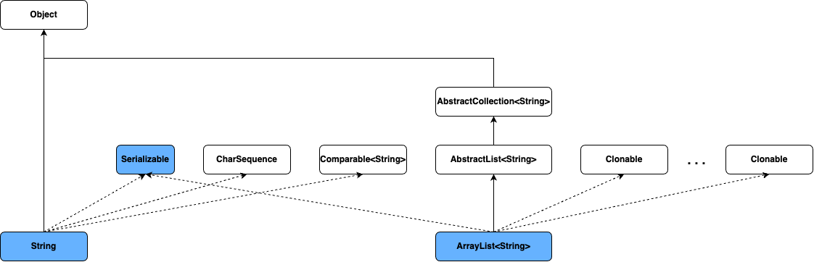

# Generics

## Why Use Generics?

Generics의 사용은 아래와 같은 이점이 있다.

* Compile time에서의 type check
* Type cast 제거
* 코드 재사용성을 높여 Generic algorithm의 구현

## Generic Types

#### A Simple Box Class

위에서 정의한 클래스와 동일하게 어떠한 오브젝트를 담을 수 있는 Box 클래스가 있다.

~~~java
public class Box {
    private Object object;

    public void set(Object object) { this.object = object; }
    public Object get() { return object; }
}
~~~

* Object를 저장할 수 있으므로, Java에서의 모든 reference type 오브젝트를 담을 수 있다.

##### 문제. 아래 조건을 만족하도록 코드를 작성하고, 실행해 결과를 확인해 보자.(10분)

* 두개의 Box 클래스 배열을 만든다
  * 첫번째는 이름을
  * 두번째는 나이를 저장
* 데이터를 Box에 담아 저장
  * { "홍길동", 32}, {"김선달", 44}, {"심청이", 14}, {"홍범도", 24}
* 이름에서 '홍'씨가 몇명인지 찾아서 출력하라.
* 평균 나이를 계산해서 출력하라

**토론**

* Box 클래스를 사용함에 따른 문제점 또는 어려움은?
* Compile시에는 문제가 없지만, 실행시 문제가 될 수 있는 부분은?
* 해결 방법은?

#### A Generic Version of the Box Class

#### 형식

~~~java
class name<T1, T2, ..., Tn> { /* ... */ }
~~~

* T1, T2, ... : type parameter
* type parameter는 1개 이상 설정 가능하며, 쉽표(,)로 구분하여 <> 사이에 나열함
* 일반적으로 parameter에는 argument의 값이 복사되지만, type parameter는 type이 복사(?) 됨

##### Box class(generic version)

앞에서 정의한 Box class를 generic version으로 작성하면 아래와 같다.

// TODO : 수업 시간에 작성

~~~java
public class Box<T> {
  private T object;
  
  public void set(T object) { this.object = object; }
  public T get() { return object; }
}
~~~

* Type parameter는 하나만 필요하므로, type parameter는 \<T> 로 설정
* 다양한 오브젝트를 받기 위해 Object type으로 정의했던 것을 T type으로 변경

##### 문제. 위에서 작성한 Box class 사용 코드를  generic version의 Box class를 사용하도록 수정하라.

* 코드 작성중 불필요한 코드는 제거하라

**토론**

// TODO : 학생들이 먼저 작성하고, 함께 다시 작성해 보기

* 이전 버전과 동작의 차이는?
* 어떠한 다른 점이 있는가? 단점은? 장점은?

#### Type prameter의 이름 부여 규칙

* 알파벳 단일 대문자 사용

  * 코드상에서 type parameter와 type을 구분하기 위한 방법

* 일반적으로 사용되는 이름

  * E - Element

    * Java Collection Framework나 class를 구성하는 요소

    ~~~java
    List<E> list = ...;
    Set<E> set = ...;
    ~~~

  * K - Key

    ~~~java
    Map<K, V> map = ...;
    ~~~

  * N - Number

    ~~~java
    NumberBox<N> numberBox = ...;
    ~~~

  * T - Type

    ~~~java
    Box<T> box = ...;
    ~~~

  * V - Value

    ~~~java
    Map<K, V> map = ...;
    ~~~
  
    
  
  * S, U, V 등 - 기타
  
    * 2개 이상의 type parameter를 요구하고, E, K, N, T, V을 사용하고 추가적으로 필요한 경우
    
    ~~~java
    UserDB<K, S, U, V> db = ...;
    ~~~
    
    * K - primary key
    * S - name
    * U - 나이
    * V - 주소

#### Generic type의 생성과 호출

Generic type의 생성은 일반 클래스에서 인스턴스를 만드는 과정과 크게 다른지 않다. 다만, generic type을 사용하는 시점(변수를 선언하거나 new keyword를 이용해 인스턴스를 생성할때)에는 type parameter에 type argument를 지정해 줘야 한다.

##### 예제. Generic Box class를 사용해 Integer를 담을 수 있는 box를 생성하자

~~~java
class TestGenericBox {
  public static void main(String [] args) {
 		Box<__> integerBox1 = new Box<__>();   
 		Box<__> integerBox2 = new Box<__>();   

    
    integerBox1.set(10);
    integerBox2.set(20);

    __ sum = integerBox1.get() + integerBox2.get();
    System.out.println("Sum : " + sum);
  }
}
~~~

* __에는 무엇이 들어가나?
* __를 Double로 수정하면 어떻게 되는가? 

#### Diamond

* Generic type 사용시 type argument에 대한 추론이 가능하면 type argument 생략 가능

  ~~~java
  Box<Integer> integerBox1 = new Box<>;
  ~~~

#### Multiple Type Parameters

* Type parameter 두개 이상 가능

##### 예제. 키와 값을 갖는 Pair interface를 정의하고 이를 구현하여 동작을 확인해 보자.

Pair interface는 아래와 같다.

~~~java
public interface Pair<K, V> {
  public K getKey();
  public V getValue();
}
~~~

*  K, V 두개의 type parameter 사용

Pair interface를 이용해 OrderedPair class를 구현한다.

~~~java
public class OrderedPair<K, V> implements Pair<K, V> {

    private K key;
    private V value;

    public OrderedPair(K key, V value) {
			this.key = key;
			this.value = value;
    }

    public K getKey()	{ return key; }
    public V getValue() { return value; }
}
~~~

* K, V 두개의 parameter 사용
* 상속시에도 동일하게 적용

실제 동작을 확인해 보자.

~~~java
class TestMultipleTypeParameter {
  public static void main(String [] args) {
    Pair<String, Integer> p1 = new OrderedPair<>("Even", 8);
		Pair<String, String>  p2 = new OrderedPair<>("hello", "world");
    
    System.out.println("P1 : " + p1.getKey() + ", " + p1.getValue());
    System.out.println("P2 : " + p2.getKey() + ", " + p2.getValue());
  }
}
~~~

##### 문제. Pair<K, V>를 Pair<V, K>로 바꿔 봅니다.

~~~java
public class OrderedPair<K, V> implements Pair<V, K> {
  ...
}
~~~

또는 
~~~java
public class OrderedPair<V, K> implements Pair<K, V> {
  ...
}
~~~

* 무슨 문제가 있나요? 이유는?

#### Parameterized Type

* Type argument를 적용한 generic type

  ~~~java
  Box<Integer>
  ~~~

* 일반 type과 동일

  ~~~java
  OrderedPair<String, Box<Integer>> p1 = new OrderedPair<>();
  ~~~

  

  

### Raw Types

* Type argument를 사용하지 않은 class나 interface

  ~~~java
  public class Box<T> {
      public void set(T t) { /* ... */ }
      // ...
  }
  ~~~

* Parameterized type을 생성하면

  ~~~java
  Box<Integer> box = new Box<>();
  ~~~

* Type argument에 대한 아무런 정보가 없이 생성하면 raw type이라 한다.

  ~~~java
  Box box = new Box();
  ~~~

#### 문제점

* JDK 5.0 이전에는 지원되지 않아 기존 regacy 코드와의 호환을 위해 raw type 지원

  * Raw type 사용시 type argument는 Object로 제공

  * 버전 호환성 문제 해결을 위해 parameterized type을 raw type에 할당 허용

    ~~~java
    Box<String> stringBox = new Box<>();
    Box rawBox = stringBox; // OK
    ~~~

  * 하지만, raw type을 parameterized type에 할당하는 것은 허용하지 않음

    ~~~java
    box rawBox = new Box();
    Box<Integer> intBox = rawBox; // Warning : 확인되지 않은 변환
    ~~~

  * 마찬가지로, raw type의 method를 호출하는 것도 경고를 표시함

    ~~~java
    Box<String> stringBox = new Box<>();
    Box rawBox = stringBox;
    rawBox.set(8); // Warning : 확인되지 않는 set(T) 호출
    ~~~

  * 실제로는 error가 발생해야 하지만, raw type으로 인해 정확한 thpe check가 되지 않아 실행시 문제 발생

* 따라서, **raw type은 사용하지 않아야 함**

#### Unchecked Error Messages

* "Unchecked"

// TODO : 내용 추가

## Generic Methods

* Generic class와 동일하게 type parameter를 도입한 method
* Type parameter의 적용 범위가 해당  method로 제한
  * static method
  * non-static method
  * constructor

##### 예시. 두개의 Pair  오브젝트를 비교하는 generic method를 정의해 보자

~~~java
public class Util {
    public static <K, V> boolean compare(Pair<K, V> p1, Pair<K, V> p2) {
        return p1.getKey().equals(p2.getKey()) &&
               p1.getValue().equals(p2.getValue());
    }
}

public class Pair<K, V> {

    private K key;
    private V value;

    public Pair(K key, V value) {
        this.key = key;
        this.value = value;
    }

    public void setKey(K key) { this.key = key; }
    public void setValue(V value) { this.value = value; }
    public K getKey()   { return key; }
    public V getValue() { return value; }
}
~~~

* Util 클래스에 static generic method로 compare 정의
* Type parameter는 Pair class의 type argument로 사용

Util.compare의 사용은 아래와 같다.

~~~java
public class Util {
    public static <K, V> boolean compare(Pair<K, V> p1, Pair<K, V> p2) {
        return p1.getKey().equals(p2.getKey()) &&
               p1.getValue().equals(p2.getValue());
    }
  
  	public static void main(String[] args) {
      Pair<Integer, String> p1 = new Pair<>(1, "apple");
			Pair<Integer, String> p2 = new Pair<>(2, "pear");
			boolean same = Util.<Integer, String>compare(p1, p2);
    }
}
~~~

* compare method를 사용할때 명시적으로 type argument를 주었다.

하지만, 일반적으로 위와 같이 type의 유추가 가능한 경우에는 이를 생략할 수 있다.

~~~java
public class Util {
    public static <K, V> boolean compare(Pair<K, V> p1, Pair<K, V> p2) {
        return p1.getKey().equals(p2.getKey()) &&
               p1.getValue().equals(p2.getValue());
    }
  
  	public static void main(String[] args) {
      Pair<Integer, String> p1 = new Pair<>(1, "apple");
			Pair<Integer, String> p2 = new Pair<>(2, "pear");
			boolean same = Util.compare(p1, p2);
    }
}
~~~

## Bounded Type Parameters

* Type parameter에 적용 가능한 type argument를 제한

* extends keyword와 제한하고자 하는 type paramete로 작성

  ~~~java
  public class ClassName<T extends type_parameter> {...}
  ~~~

  * 적용 가능한 class나 interface의 이름 나열

##### 예제.  Bounded type parameter를 적용하고, 동작을 확인해 보자.

~~~java
public class Box<T> {

    private T t;          

    public void set(T t) {
        this.t = t;
    }

    public T get() {
        return t;
    }

    public <U extends Number> void inspect(U u){
        System.out.println("T: " + t.getClass().getName());
        System.out.println("U: " + u.getClass().getName());
    }

    public static void main(String[] args) {
        Box<Integer> integerBox = new Box<Integer>();
        integerBox.set(new Integer(10));
        integerBox.inspect("some text"); // error: this is still String!
    }
}
~~~

* error가 발생하는 이유는?

#### Type parameter의 method 사용

* Generic class나 generic mehod내에서 type parameter의 method 사용 가능
* Bouneded type parameter의 경우, bounded type에서 지원되는 method 사용 가능

##### 예제. Type parameter에서 지원 가능한 method를 이용해 보자.

~~~java
package example;

public class TypeParameterMethod<T extends Integer> {

    private T n;

    public TypeParameterMethod (T n)  { this.n = n; }

    public boolean isEven() {
        return n.intValue() % 2 == 0;
    }

    public static void main(String [] args) {
        TypeParameterMethod<Integer> method = new TypeParameterMethod<>(100);

        System.out.println(method.isEven());
    }
}
~~~

* intValue는 Integer에서 지원 가능 method

#### Multiple Bounds

* 둘 이상의 bounded type parameter 적용 가능
* bouned type간에는 & 로 구분
* Class type은 하나만 적용 가능, interface type은 하나 이상 가능
* 단, class와 interface가 혼재되어 있을때, class가 우선되어야 함

##### 예제. 다음 코드를 확인해 보자.

// TODO : Multiple Bounds 예제 추가

~~~java
~~~

### Generic Methods and Bounded Type Parameters

* Generic method는 범용 알고리즘 구현에서 중요함 
* Type parameter는 reference type으로 기본 연산자 적용에 한계가 있음

##### 예제. 배열에서 특정 요소보다 큰 요소들의 수를 셀 수 있느 generic method를 만들어 보자.

Type parameter가 reference type인 것을 고려하지 말고 만들어 보자.

~~~java
package example;

public class TestGenericMethodAndBoundedTypeParameters {
    public static <T> int countGreaterThan(T[] anArray, T elem) {
        int count = 0;
        for (T e : anArray)
            if (e > elem)
                ++count;
        return count;
    }

    public static void main(String [] args) {
      Integer [] intArray = {1,3,5,7,9};

      System.out.println(countGreaterThan(intArray, 4));
    }
  }
~~~

* 결과는? 이유는?

다음과 같이 수정하여 확인해 보자.

~~~java
package example;

public class TestGenericMethodAndBoundedTypeParameters {
  	// bounded type parameter 적용
    public static <T extends Comparable<T>> int countGreaterThan(T[] anArray, T elem) {
        int count = 0;
        for (T e : anArray)
            if (e.compareTo(elem) > 0)  // 수정함
                ++count;
        return count;
    }

    public static void main(String [] args) {
      Integer [] intArray = {1,3,5,7,9};

      System.out.println(countGreaterThan(intArray, 4));
    }
  }
~~~

* 결과는? 이유는?

  

## Generics, Inheritance, and Subtypes

* Parameterized type은 type argument의 상속 관계와 무관

#### Subclass 참조

상속 관계가 있는 경우 아래와 같이 subclass 오브젝트에 대한 참조가 가능하다.

~~~java
Object someObject = new Object();
Integer someInteger = new Integer(0);

someObject = someInteger;
~~~

또한, 배열의 요소나 method의 argument로도 subclass의 오브젝트 제공이 가능하다.

~~~java
package example;

class TestBox {
    static class Box {
        Number value;

        public Box(Number value) {
            this.value = value;
        }

        public Number getValue() {
            return this.value;
        }
    }

    public static void main(String[] args) {
        Box intBox = new Box(new Integer(10));
        Box doubleBox = new Box(new Double(10.0));

        System.out.println("intBox : " + intBox.getValue().intValue());
        System.out.println("doubleBox : " + doubleBox.getValue().doubleValue());
      	doubleBox = intBox;
        System.out.println("doubleBox : " + doubleBox.getValue().doubleValue());
    }
}
~~~

* Integer class나 Double class는 Number class의 subclass이므로 각각의 오브젝트를 Box 생성자의 argument로 사용 가능

#### Parameterized type에서의 subclass 참조

 다음은  Box class를 generic class로 정의한 예이다.

~~~java
package example;

class TestBox2 {
    static class Box<T> {
        T value;

        public Box(T value) {
            this.value = value;
        }

        public T getValue() {
            return this.value;
        }
    }

    public static void main(String[] args) {
        Box<Number> intBox = new Box<>(new Integer(10));
        Box<Number> doubleBox = new Box<>(new Double(10.0));

        System.out.println("intBox : " + intBox.getValue().intValue());
        System.out.println("doubleBox : " + doubleBox.getValue().doubleValue());
      	doubleBox = intBox;
        System.out.println("doubleBox : " + doubleBox.getValue().doubleValue());
    }
}
~~~

* Box class는 type parameter T가 정의되어 있는 generic class이다.
* Type argument로 Number가 주어졌지만, argument로 Integer class  인스턴스와 Double class 인스턴스가 사용되어도 문제가 없다.

#### Type argument와 subclass의 관계

Generic class의 경우에도 subclass의 적용이 가능한 것처럼 보인다. 

그렇다면, type argument가 다를 경우는 어떻게 될 것인가?

~~~java
package example;

class TestBox3 {
    static class Box<T> {
        T value;

        public Box(T value) {
            this.value = value;
        }

        public T getValue() {
            return this.value;
        }
    }

    public static void main(String[] args) {
        Box<Integer> intBox = new Box<>(new Integer(10));
        Box<Number> doubleBox = new Box<>(new Double(10.0));

        System.out.println("intBox : " + intBox.getValue().intValue());
        System.out.println("doubleBox : " + doubleBox.getValue().doubleValue());

        doubleBox = intBox;
        System.out.println("doubleBox : " + doubleBox.getValue().doubleValue());
    }
}
~~~

* 위 코드는 정상적으로 실행이 되는가? 
* 만약 문제가 있다면, 이유는?

**설정**

Parameterized class은 아래와 유사하다(절대로 같지 않음) 할 수 있다. 

~~~java
// Box<Number>
class BoxNumber {
    Number value;

    public Box(Number value) {
        this.value = value;
    }

    public Number getValue() {
        return this.value;
    }
}
~~~

~~~java
// Box<Integer>
class BoxInteger {
    Integer value;

    public Box(Integer value) {
        this.value = value;
    }

    public Integer getValue() {
        return this.value;
    }
}
~~~

* 두 클래스의 상속 관계는 어떠한가?
* Parameterized class는 type argument의 상속 관계와 무관하게 각각의 클래스가 된다. 

### Generic Classes and Subtyping

Generic class도 non-generic class와 동일하게 class 또는 interface에서의 확장이 가능하다.

또한, type argument를 적용하여 parameterized type의 경우에도 동일하게 상속관계가 성립된다. 다만, 클래스의 이름을 기준으로 하지는 않고, 클래스 이름과 type argument가 동일한 경우에만 해당한다.

* ArrayList class는 List class를 구현하고, List class는 Collection class를 확장
* Type argument가 주어진 parameterized type의 경우에도 동일한 type argument의 경우에는 non-generic class의 상속 관계가 적용됨
* Type argument가 다른 경우에는 generic class가 상속 관계에 있더라도 다른 클래스로 분류됨

##### 예제. Multiple type parameter에서의 type argument에 따른 클래스간 상속 관계를 통해 generic class에 대한 subtyping을 확인해 보자.

* List interface를 이용하여 PayloadList interface를 정의한다.

  ~~~java
  interface PayloadList<E,P> extends List<E> {
    void setPayload(int index, P val) {}
    ...
  }
  ~~~

* PayloadList interface를 이용해 아래와 같이 클래스를 정의한다.

  ~~~java
  class PayloadListImpl1 implements PayloadList<String,String>{
    void setPayload(int index, String val) {}
    ...
  }
  
  class PayloadListImpl2 implements PayloadList<String,Integer>{
    void setPayload(int index, Integer val) {}
    ...
  }
  
  class PayloadListImpl3 implements PayloadList<String,Exception>{
    void setPayload(int index, Exception val) {}
    ...
  }
  ~~~

  

* 각 PayloadListImpl의 상속관계를 확인해 보자.

  ~~~java
  PayloadListImpl1 payloadListImpl1 = new PayloadListImpl1();
  PayloadListImpl2 payloadListImpl2 = new PayloadListImpl2();
  PayloadListImpl3 payloadListImpl3 = new PayloadListImpl3();
  PayloadList<String,String> payloadList1 = payloadListImpl1;
  PayloadList<String,Integer> payloadList2 = payloadListImpl2;
  PayloadList<String,Exception> payloadList3 = payloadListImpl3;
  List<String> list = payloadList1;
  list = payloadList2;
  list = payloadList3;
  
  
  payloadList1 = payloadList2;
  payloadList1 = payloadList3;
  ~~~

* 클래스 관계는 아래와 같다.

## Type Inference(타입 추론)

* 호출을 적용할 수 있는 type argument를 결정하기 위해 각 method 호출 및 해당 선언을 살펴보는 Java 컴파일러의 기능

#### Type inference algorithm

* Argument type과 결과가 할당되거나 반환되는 type
* 특히, 모든 argument와 함께 적용 가능한 가장 구체적인 type

##### 예제. 아래의 코드를 보고, type inference algorithm 동작 방식을 확인하자.

* 코드에서 generic method로 pick 정의
* main에서 pick을 호출하면서, argument는 String, ArrayList로 주고 결과는 Serializable로 받음

~~~java
package example;

import java.io.Serializable;
import java.util.ArrayList;

public class TypeInferenceDemo {
    static <T> T pick(T a1, T a2) { return a2; }

    public static void main(String [] args) {
        Serializable s = pick("d", new ArrayList<String>()); 
    }
}
~~~

* 위 3가지 type에 대한 클래스 계층은 아래와 같다.

   

### Type Inference and Generic Methods

* Generic methods를 사용할때 type argument를 명시 하지 않더라도 compiler에서 type에 대한 추론이 가능한 경우 생략 가능

~~~java
public class BoxDemo {

  public static <U> void addBox(U u, java.util.List<Box<U>> boxes) {
    Box<U> box = new Box<>();
    box.set(u);
    boxes.add(box);
  }

  public static <U> void outputBoxes(java.util.List<Box<U>> boxes) {
    int counter = 0;
    for (Box<U> box: boxes) {
      U boxContents = box.get();
      System.out.println("Box #" + counter + " contains [" +
             boxContents.toString() + "]");
      counter++;
    }
  }

  public static void main(String[] args) {
    java.util.ArrayList<Box<Integer>> listOfIntegerBoxes = new java.util.ArrayList<>();
    BoxDemo.<Integer>addBox(Integer.valueOf(10), listOfIntegerBoxes);
    BoxDemo.addBox(Integer.valueOf(20), listOfIntegerBoxes);
    BoxDemo.addBox(Integer.valueOf(30), listOfIntegerBoxes);
    BoxDemo.outputBoxes(listOfIntegerBoxes);
  }
}
~~~

* main에서 첫번째 addBox에서는 type argument 명시
* 두번째와 세번째에서는 type argument 생략
* addBox의 argument를 통해서 추론 가능

### Type Inference and Instantiation of Generic Classes

* Generic class 인스턴스 생성을 위해서은 type argument 필요

  ~~~java
  Map<String, List<String>> myMap = new HashMap<String, List<String>>();
  ~~~

* Compiler에서 생성 후 인스턴스를 참조할 변수를 통해 추론이 가능할 경우 생략 가능

  ~~~java
  Map<String, List<String>> myMap = new HashMap<>();
  ~~~

  * <>을 비공식적으로 "다이아몬드"하고 함

* Type argument를 생략해도 된다고 해서, <>까지 제거하면 안됨.

  ~~~java
  Map<String, List<String>> myMap = new HashMap();
  ~~~

  * HashMap()은 raw type으로 warning 발생

// TODO : 예제 추가 필요

### Type Inference and Generic Constructors of Generic and Non-Generic Classes

* Generic class 여부에 상관없이 생성자에서 generic 적용 가능. 즉, generic method와 같이 생성자에서도 generic을 적용하여 다양한 생성자 지원 가능

  ~~~java
  class MyClass<X> {
    <T> MyClass(T t) {
      ...
    }
  }
  ~~~

* 생성자에서 type argument 지정 생략

  ~~~java
  MyClass<Integer> myObject = new MyClass<>("");
  ~~~

// TODO : 예제 추가

// 다양한 type을 받아서 String type으로 변환해서 id로 사용 

### Target Types

* Type argument을 통해서 최종적으로 만들어 내야하는 data type

* 예를 들어, Collections의 emptyList()를 보자

  ~~~java
  static <T> List<T> emptyList();
  ~~~

  * Generic method로 정의되어 있음

* 대입문에서 type argument를 명시하지 않음

  ~~~java
  List<String> listOne = Collections.emptyList();
  ~~~

* Generic method에서는 List\<String> 을 반환해야 하므로, type parameter T의 type argument는 String임을 compiler에서 추론 가능하여 적용

* 또한, 아래와 같은 mehod에서도 추론 가능

  ~~~java 
  void processStringList(List<String> stringList) {
    ...
  }
  ~~~

  ~~~java
  processStringList(Collections.emptyList());
  ~~~

  * argument로 주어져야 하는 type이 List\<String>이므로, Collections.emptyList()의 target type은 List\<String>
  * Java SE 7까지는 지원하지 않음

## Wildcards

// TODO : generic method로  구현할 수 있는데, wildcard를 사용해야 하는 이유는?

* Generic class나 interface를 parameterized type으로 만들어야 하지만, type argument를 확정하기 어려운 경우나 추가적인 활용이 가능한 경우 적용 가능

* Generic method 호출, generic class 생성 및 super type 으로 사용되지는 않음

* 일반적인 generic method처럼 type parameter로 정의할 경우, generic class 간 상속 문제로 인해 특정 type에 고정되는 것을 막기 위해 사용됨

  ~~~java
  public static double sumOfList(List<Number> list) {
      double s = 0.0;
      for (Number n : list)
          s += n.doubleValue();
      return s;
  }
  ~~~

  sumOfList의 parameter type이 List\<Number>고정되어 List\<Integer>, List\<Double> 등 적용 불가능

  ~~~java
  List<Integer> li = Arrays.asList(1, 2, 3);
  System.out.println("sum = " + sumOfList(li));
  ~~~

* Wildcard 사용시 가능

  ~~~java
  public static double sumOfList(List<? extends Number> list) {
      double s = 0.0;
      for (Number n : list)
          s += n.doubleValue();
      return s;
  }
  ~~~

  

  

### Upper Bounded Wildcards

* Type argument로 적용 가능한 type들의 최상위  클래스 지정으로 subclass에 대해서도 동일하게 사용 가능

  ~~~java 
  public static double sumOfList(List<? extends Number> list) {
      double s = 0.0;
      for (Number n : list)
          s += n.doubleValue();
      return s;
  }
  ~~~

  ~~~java
  List<Integer> li = Arrays.asList(1, 2, 3);
  System.out.println("sum = " + sumOfList(li));
  List<Double> ld = Arrays.asList(1.0d, 2.0d, 3.0d);
  System.out.println("sum = " + sumOfList(ld));
  ~~~

* 또한,  제한된 type으로 요소들에 접근 가능

  ~~~java
  public static double sumOfList(List<?> list) {
      double s = 0.0;
      for (Number n : list) // error
          s += n.doubleValue();
      return s;
  }
  ~~~

  

### Unbounded Wildcards

* Generic type을 parameter로 받지만, 해당 요소에 대해서 별도의 사용이 없거나 최상위 클래스인 Object class로서의 접근만 필요한 경우 사용 가능

  

##### 예제. 주어진 List의 요소들을 나열하여 출력하기 위한 메소드를 만들어 보자.

~~~java
public class PrintListDemo {
  ...
    
  public static void main(String [] args) {
    List<Integer> li = Arrays.asList(1, 2, 3);
		List<String>  ls = Arrays.asList("one", "two", "three");
    
		printList(li);
		printList(ls);
  }
} 
~~~

* Parameterized type의 상속 관계는 type argument에 대한 상속 관계와 무관하다. 따라서, List\<Integer>와 List\<String>을 만들어줘야 한다.

  ~~~java
  public class PrintListDemo {
    public static void printList(List<Integer> list) {
      for (Integer elem: list)
          System.out.print(elem + " ");
      System.out.println();
    }
      
  
    public static void printList(List<String> list) {
      for (String elem: list)
          System.out.print(elem + " ");
      System.out.println();
    }
      
    public static void main(String [] args) {
      List<Integer> li = Arrays.asList(1, 2, 3);
  		List<String>  ls = Arrays.asList("one", "two", "three");
      
  		printList(li);
  		printList(ls);
    }
  } 
  ~~~

* 추가된 두 method는 type argument만 다를 뿐 동일한 코드로 코드 중복에 의한 자원 낭비 및 유지 관리에 대한 부담을 갖게 된다. Wildcard 사용하면 다음과 같다.

  ~~~java
  public class PrintListDemo {
    public static void printList(List<?> list) {
      for (Object elem: list)
          System.out.print(elem + " ");
      System.out.println();
    }
  
    public static void main(String [] args) {
      List<Integer> li = Arrays.asList(1, 2, 3);
  		List<String>  ls = Arrays.asList("one", "two", "three");
      
  		printList(li);
  		printList(ls);
    }
  } 
  ~~~

    

### Lower Bounded Wildcards

* Upper bounded wildcard와 마찬가지로 type argument를 제한
* Upper bounded wildcard의 extends keyword 대신 super keyword 사용
* 지정된 type의 superclass에 대해서만 사용 가능
* method내에서는 Object type으로 처리됨
* method의 입력보다는 결과 저장으로 많이 사용됨

##### 예제. Lower bounded wildcard를  이용해 정수만 받을 수 있도록 제한하라.

~~~java
package example;

import java.util.Arrays;
import java.util.List;

public class LowerBoundedWildcardDemo {
    public static int findZero(List<? super Integer> list) {
        int count = 0;
        Integer zero = 0;
        for(Object object : list) {
            if (object.equals(zero)){
                count++;
             }
        }

        return  count;
    }

    public static void main(String[] args) {
       List<Integer>  intList = Arrays.asList(1,2,3);
       List<Number>  numberList = Arrays.asList(1,2,3);

       System.out.println("Int zero : " + findZero(intList));
       System.out.println("Number zero : " + findZero(numberList));
    }
}
~~~

* findZero method 내에서 list 요소는 Object type으로 제한됨.
* main에서 Double 등의 다른 list를 만들어 확인해 보자

##### 문제. 숫자들이 담겨져 있는 list에서 정수만 추출해 Integer나 Number만을 위한 list에 저장해 보자

### Wildcards and Subtyping

* 일반적인 Generic class는 type argument가 주어지면 별도의 type이 됨

  

* Wildcard는 type parameter의 제한에 따라 상속 관계가 성립될 수 있음

  

### Wildcard Capture and Helper Methods

// TODO : 내용 추가

### Guidelines for Wildcard Use

- In 변수는 upper bounded wildcard로 정의되며, extends keyword 사용
- Out 변수는 lower bounded wildcard로 정의되며, super keyword 사용
- Object 클래스 에 정의된 메서드를 사용하여 in 변수에 액세스할 수 있는 경우, unbounded wildcard 사용
- 변수를 in 및 out 변수로 모두 사용하는 경우, wildcard 사용하지 않음

#### 참고

- In  변수
  - method에서 사용할 데이터 전달
  - 대부분의 parameter
- Out 변수
  - method에서 연산된 결과를 반환
  - 예를 들어, copy(src, dest)로 dest는 src의 데이터를 받아 옴

#### Return type에는 미적용

아래의 코드를 이용해 확인해 본다.

~~~java
class NaturalNumber {

    private int i;

    public NaturalNumber(int i) { this.i = i; }
    // ...
}

class EvenNumber extends NaturalNumber {

    public EvenNumber(int i) { super(i); }
    // ...
}
~~~

~~~java
List<EvenNumber> le = new ArrayList<>();
List<? extends NaturalNumber> ln = le;
ln.add(new NaturalNumber(35));  // compile-time error
~~~

* ln은 요소로서 NaturalNumber(subclass 포함)를 가지는 List를 참조할 수 있어 , le 참조 가능

* ln에 요소 추가시에는 에러 발생

  * //TODO : 이유는? 

  

## Type Erasure

* Generic type으로 선언된 경우, compile시 가능한 type으로 변환
* Bounded type parameter는 제한되는 type으로 변환되고, 그렇지 않으면 Object type으로 변환
* Runtime에서는 generic type에 대한 정보가 사라지므로, 필요한 경우 type cast를 이용

// TODO : 내용 추가
