# Language Basics


## Variables(변수)


### 종류

* Access modifier, 선언된 위치에 따라 분류

  

#### Instance Variables(인스턴스 변수)

* Non-static fields
* static 없이 선언된 field
* 각 class의 instance 별로 개별 값을 가지며, runtime에 instance가 생성될 때마다 새롭게 생성됨


#### Class Variables(클래스 변수)

* Static fields
* static으로 선언된 필드
* Compiler에서 class의 instance 개수와 상관없이 하나만 생성함
* final이 추가될 경우,  변경되지 않음


#### Local Variables(지역 변수)

* Method에서 선언되어 일시적으로 사용하는 variable
  * Local variable에서도 static으로 선언된 경우, 일시적으로 사용되는 변수는 아니지만 특수한 경우에만 사용함 

* Local variable 구분을 위한 별도의 keyword 없음
* 해당 method 내에서만 선언되는 시점에서부터 사용되며
* 해당 method를 벗어나면 해지되거나, 접근이 불가능함


#### Parameters (매개 변수)

* Method 호출자와 호출된 method 간 상태 공유를 위해 사용
* Method 호출 과정에서 생성됨
* Method가 반환되면서 해지됨


#### 예제. 다음의 코드를 실행해 보고, 변수의 종류에 대해 알아 보자.

**Step1. VS Code에서 example 폴더 아래에 있는 VariableDemo.java 파일 열어 아래와 같은지 확인한다.**

* 코드에 대해서는 몰라도 상관 없다.

~~~java
package example;

public class VariableDemo {
    Integer instanceVariable;
    static Integer classVariable = 0;

    public VariableDemo() {
        instanceVariable = 0;
    }
    public void setInstanceVariable(Integer value) {
        instanceVariable = value;
    }

    public Integer getInstanceVariable() {
        return  instanceVariable;
    }

    public void setClassVariable(Integer value) {
        VariableDemo.classVariable = value;
    }

    public Integer getClassVariable() {
        return  VariableDemo.classVariable;
    }

    public Integer sumOfVariables() {
        Integer sum = 1;

        sum += instanceVariable + VariableDemo.classVariable;

        return  sum;
    }

    public String toString() {
        return  "" + getInstanceVariable() + ", " + getClassVariable();
    }
    public static void main(String[] args) {
        VariableDemo demo1 = new VariableDemo();
        VariableDemo demo2 = new VariableDemo();

        System.out.println("demo1 : " + demo1);
        System.out.println("demo2 : " + demo2);
        demo1.setInstanceVariable(1);
        demo2.setInstanceVariable(2);
        System.out.println("demo1 : " + demo1);
        System.out.println("demo2 : " + demo2);
        demo1.setClassVariable(1);
        demo2.setClassVariable(2);
        System.out.println("demo1 : " + demo1);
        System.out.println("demo2 : " + demo2);
    }
}
~~~


**Step2. Break point를 설정한다.**

* 그림에서와 같이 38라인 앞에 빨간점(처음에는 없음) 위치에 마우스 포인트를 가져가 클릭하여 break point를 설정한다.
  * 해당 위치에 마우스 포인트가 위치하면 어두운 빨간점이 보인다.
* 정상적으로 설정되면 그림에서와 같이 빨간점이 생긴다.

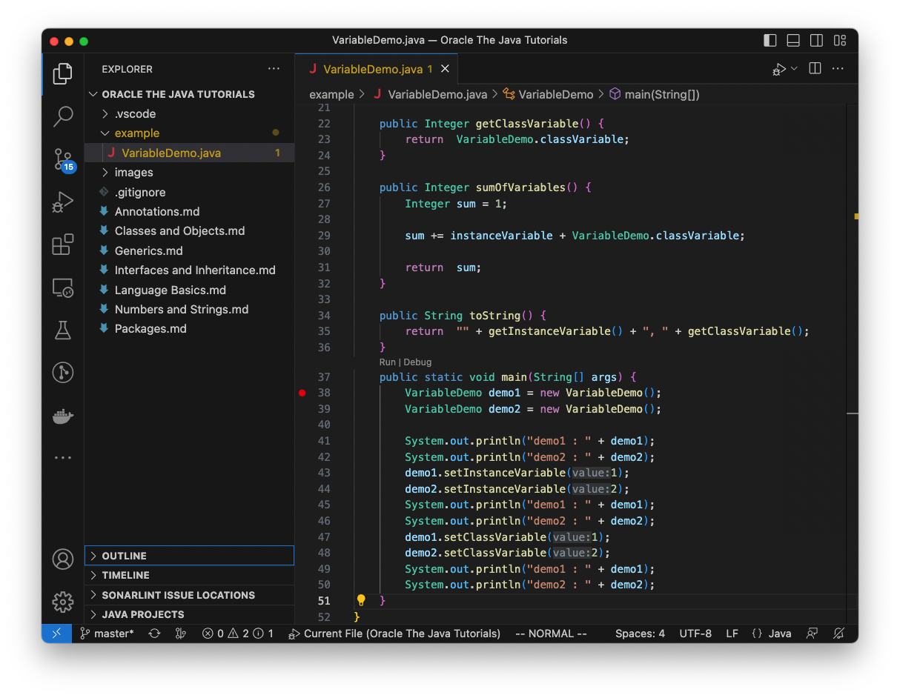

**Step3. Debug 모드로 실행한다.**

* 37라인 main위에 보이는 Debug를 클릭한다. (Debug가 안보이면 개발환경 설정이 잘못된 것이다)

* 장상적으로 실행되면 아래와 같이 보인다.

  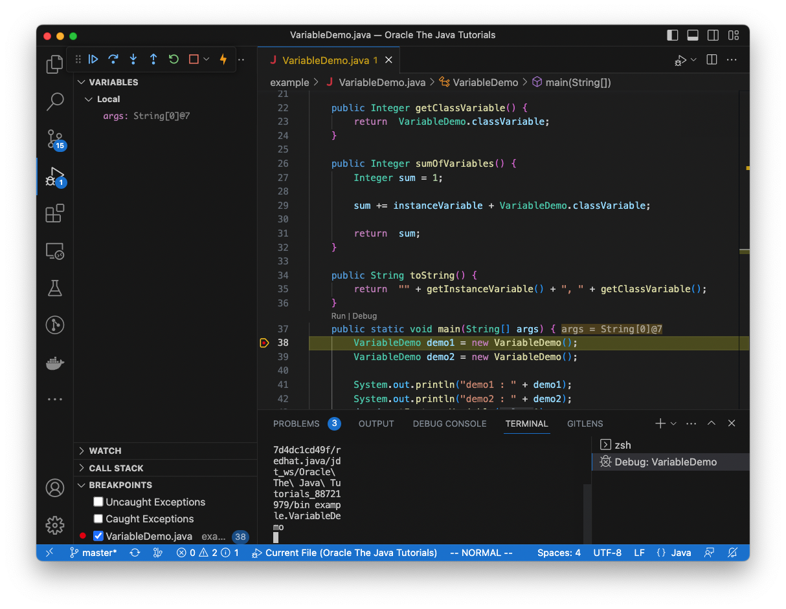

**Step4. 왼쪽창에서 WATCH에 확인할 변수들을 등록한다.**

* 왼쪽에서 WATCH를 찾고, "> WATCH"로 되어 있으면, WATCH를 클릭하여 해당 창을 펼친다. 

* WATCH창 아래 빈 공간을 클릭해서 선택하면 WATCH 타이틀 오른쪽에 "+" 기호가 보인다.

  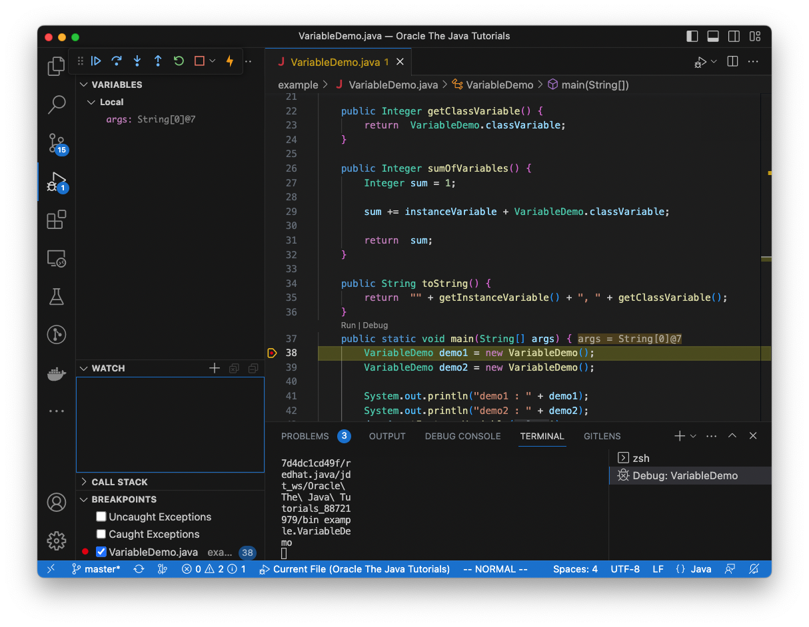

* "+"를 눌러 변수를 추가한다.

  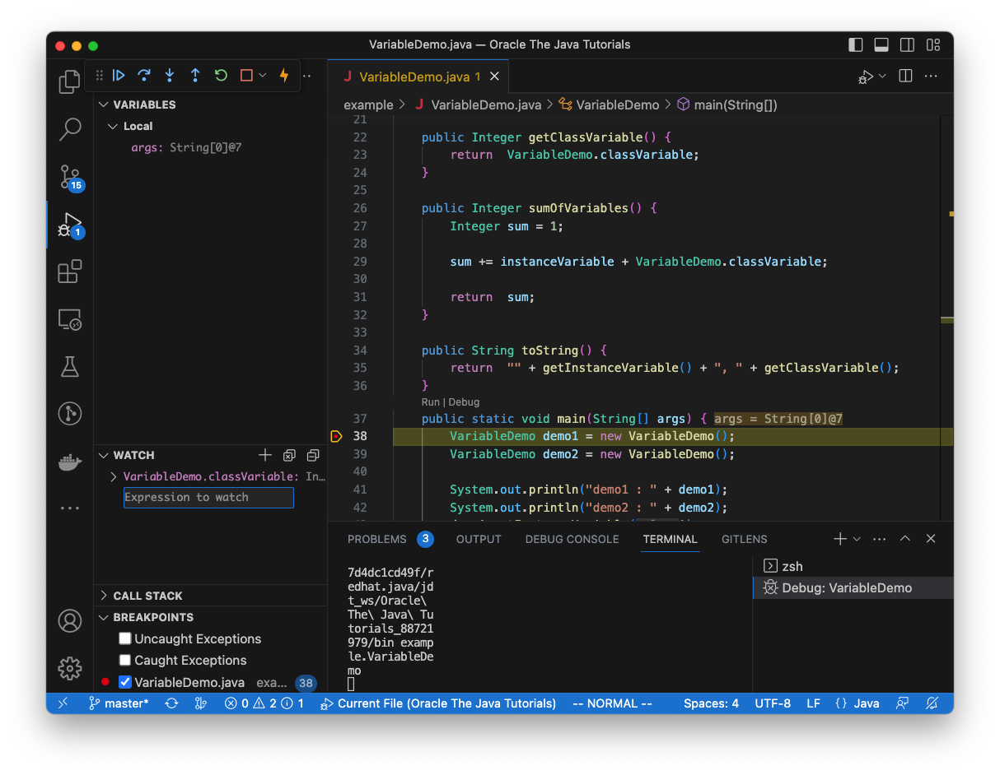

  * VariableDemo.classVariable
  * instanceVariable
  * value
  * sum

* 모두 추가되면 아래와 같다.

  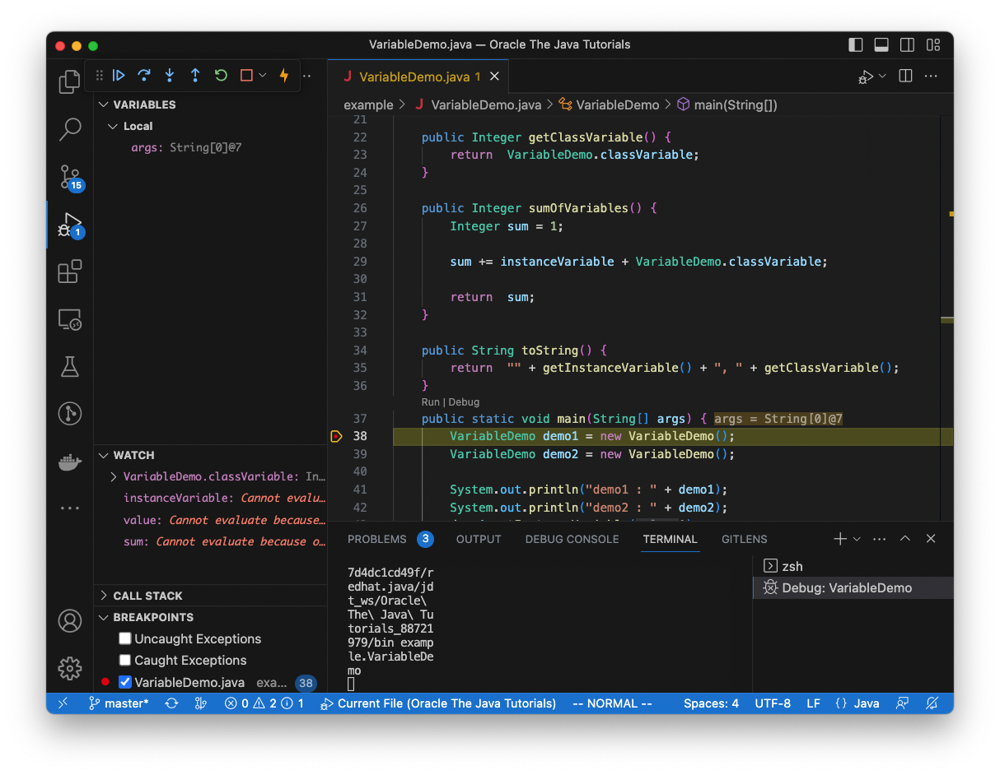

* **Step5. Break point를 추가한다.**

  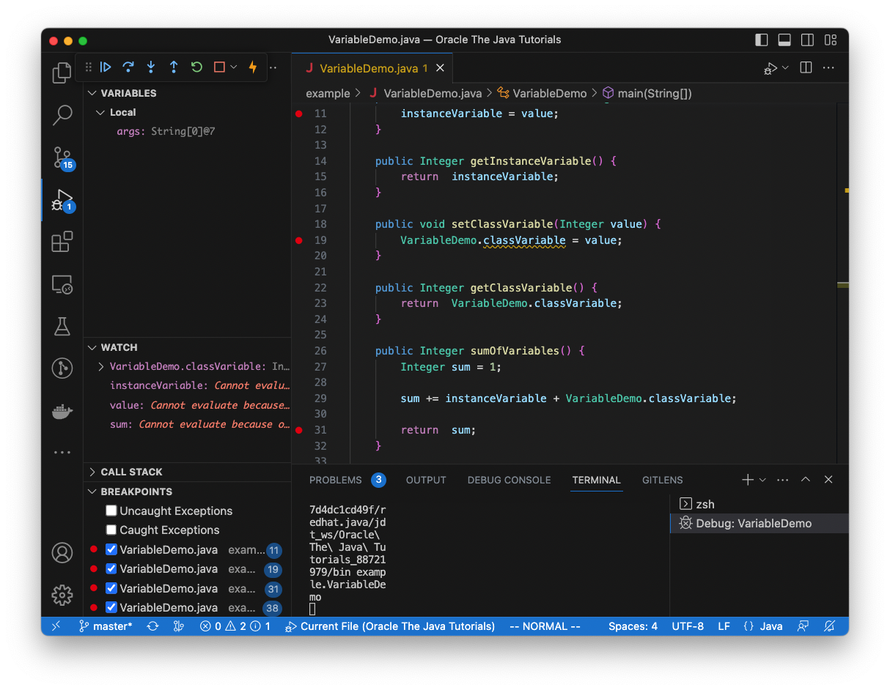

  * 11, 19, 31 라인에 추가

* **Step6. 왼쪽 상단에 있는 debugging control 버튼을 이용해 각 위치에서의 변수들을 확인한다.**

  * 버튼중 첫번째 continue 버튼을 누르면 순차적으로 진행하다 break point를 만나면 멈춘다.
  * 왼쪽에 보이는 VARIABLES와 WATCH 창을 통해 변수들을 확인한다.

  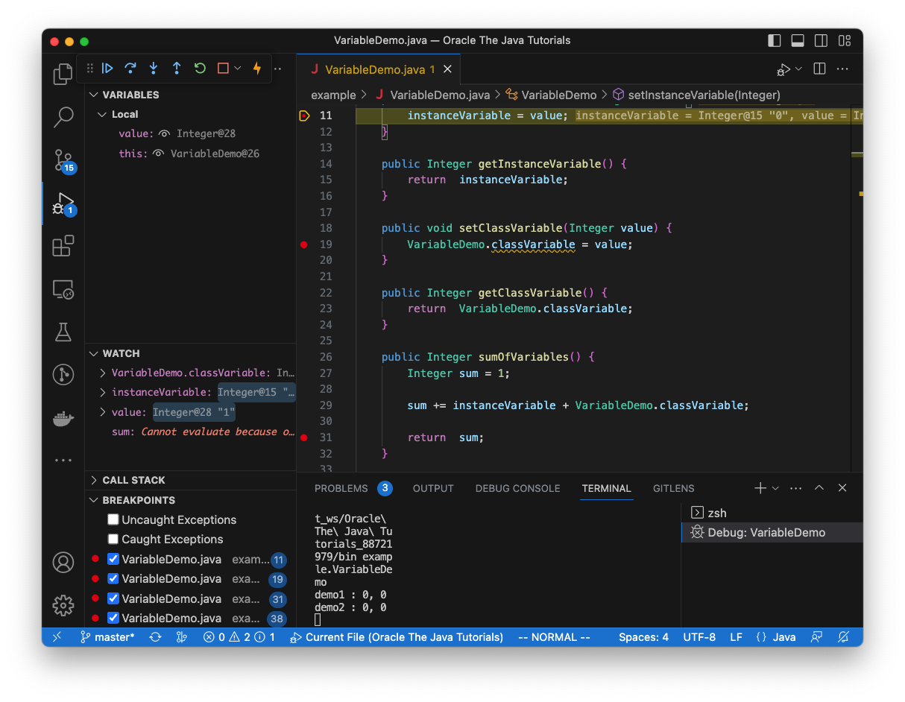

### 이름 붙이기

* 하나 이상의 글자(영문자, 숫자, '_', '$')로 구성
* 첫 번째 글자는 영문자, '_' 또는 '$'
* 한 단어인 경우, 소문자로만 구성
* 두 단어 이상인 경우, lower camel case로 구성
* Constant(상수)와 같이 저장된 값을 사용하는 변수의 경우, 대문자로만 구성
* 예약된 keyword는 사용할 수 없음
  * Abstract, super, boolean, default, if, finally, class, ...
* 잘못된 이름의 경우, compile 과정에서 에러 발생

#### Camel case

* 이름을 지정할 때 단어를 붙여 쓰되, 단어의 첫 번째 글자가 대문자로 시작하도록 이름을 지정하는 방법
* 첫 번째 글자를 대문자 또는 소문자 표기에 따라 upper camel case와 lower camel case로 구분
* upper camel case를 pascal case로, lower camel case를 camel case로 부르기도 함


**Lower camel case**

* Method, local variable, field 또는 parameter의 이름

  ```java
  class Box {
    int value;                  // field name
  
    public Box(int value) {     // parameter name
      this.value = value;
    }
  
    public int getValue() {     // method name
      return  value;
    }
  
    public String getString() {
      String string = "";       // local variable name
    }
  }
  ```

**Upper camel case(pascal case)**

* Class, interface 또는 enum의 이름
  ```java
  class Box{ ... }                    // class name
  interface Movable { ... }           // interface name
  enum Direction { LEFT, RIGHT, ... } // enum name
  ```

#### 모두 대문자

* 상수
  ~~~java
  static final int MIN_WIDTH = 4;     // final로 선언된 상수
  static final int MAX_WIDTH = 999;
  static final int GET_THE_CPU = 1;
  enum Direction { LEFT, RIGHT, ... } // enum에 정의되는 상수
  ~~~


#### 피해야 할 이름들

* 변수 이름을 대문자로 쓰는 것
* 변수 이름을 '_'로 시작되는 것
* 약어 사용


#### 예제. 다음 코드를 보고 변수 이름 작성법에 알아 보자.

~~~java
package example;

public class VariableNamingDemo {
    enum VariableType {
        INSTANCE,
        CLASS,
        LOCAL,
        PARAMETER
    }

    interface Static {}

    public static class Variable {
        public VariableType type;
        public VariableType _type;

        public Variable(VariableType type) {
            this.type = type;
            this._type = type;
        }

        public VariableType getType() {
            return  type;
        }
    }

    public static class InstanceVariable extends Variable {
        public InstanceVariable () {
            super(VariableType.CLASS);
        }
    }

    public static class ClassVariable extends Variable implements Static {
        public ClassVariable () {
            super(VariableType.CLASS);
        }
    }

    static final int MIN_VALUE = 4;
    static final int MAX_VALUE = 999;

    public static void main(String[] args) {
        InstanceVariable instanceVariable = new InstanceVariable();
        ClassVariable classVariable = new ClassVariable();
        InstanceVariable iv = new InstanceVariable();
        ClassVariable CLASSVARIABLE = new ClassVariable();

        System.out.println(VariableNamingDemo.MIN_VALUE);
        System.out.println(instanceVariable.getType());
        System.out.println(classVariable.getType());
        System.out.println(instanceVariable.getType() == VariableType.CLASS);
        System.out.println(instanceVariable.type);
        System.out.println(instanceVariable._type);
        System.out.println(iv.getType());
        System.out.println(CLASSVARIABLE.getType());
    }
}
~~~

* 변수 이름을 대문자만으로 정한다면? 변수와 상수가 구분되는가? 

* '_'로 시작하는 경우와 그렇지 않은 경우의 차이는?

* iv가 무엇을 나타내는 변수인지 알 수 있나?

  * iv? intanceVariable? initialValue? isVariable?

  

#### 참고

* [Google Java Style Guide - Naming](https://google.github.io/styleguide/javaguide.html#s5-naming)


### Primitive Data Types

* Java에서 지원하는 8가지 primitive data type 지원
* 기본값이 존재하는 data type으로 null이 존재하지 않음
* 정수, 실수, 문자, 논리 리터럴 등의 실제 데이터값을 저장
* 예약된 keyword를 통해 정의
  * int , long, float, double 등의 예약된 keyword 사용


#### 종류

**byte**

* 부호 있는 정수
* 8 bit
* 최솟값 -128
* 최댓값 127
* 기본값 0


**short**

* 부호 있는 정수
* 16 bit
* 최솟값 -32,768
* 최댓값  32,767
* 기본값 0


**int**

* 부호 있는 정수
* 32 bit
* 최솟값 -2^31 (-2,147,483,648)
* 최댓값  2^31 -1 (2,147,483,647)
* 기본값 0


**long**

* 부호 있는 정수
* 64 bit
* 최솟값 -2^63 (-9,223,372,036,854,775,808)
* 최댓값  2^63 -1 (9,223,372,036,854,775,807)
* 기본값 0


**char**

* Unicode 문자
* 16 bit
* 최솟값 '\u0000' (또는 0)
* 최댓값 '\uffff'(또는 65,535)
* 기본값 '\u0000'


**float**

* Single-precision IEEE 754 floating point(단정밀도  [IEEE 754 부동 소수점](https://en.wikipedia.org/wiki/IEEE_754))
* 32 bit
* 최솟값 1.4 E-45
* 최댓값 3.402823466 E+38
* 기본값 0.0f


**double**

* Double-precision IEEE 754 floating point(배정밀도 [IEEE 754 부동 소수점](https://en.wikipedia.org/wiki/IEEE_754))
* 64 bit
* 최솟값 4.9 E-324
* 최댓값 1.7976931348623158 E+308
* 기본값 0.0d


**boolean**

* true와 false 두 가지 값만 사용
* 조건식과 논리 계산에 사용
* 기본값 false


##### 예제. 다음의 코드를 보고 primitive type에 대해 알아보자.

~~~java
package example;

public class PrimitiveTypeDemo {
    public static void main(String[] args) {
        byte b;
        float f;

        b = Byte.MAX_VALUE;
        System.out.println("byte max value: " + b);
        b = Byte.MIN_VALUE;
        System.out.println("byte min value : " + b);

        f = Float.MAX_VALUE;
        System.out.println("float max value: " + f);
        f = Float.MIN_VALUE;
        System.out.println("float min value : " + f);
    }

}

~~~


##### 문제. byte, float외에 다른 primitive type들에 대해서도 예제와 같이 출력해 보자.

* byte는 Byte class를 참조하고,  float은 Float class를 참조하였다.
* 나머지 primitive type들은 어떠한 클래스를 참조하는지 확인하고 추가해 보자.

~~~java
package example;

public class PrimitiveTypeTest {
    public static void main(String[] args) {
        byte b;
        short s;
        int i;
        long l;
        char c;
        float f;
        double d;
        boolean bool;

        b = Byte.MAX_VALUE;
        System.out.println("byte max value: " + b);
        b = Byte.MIN_VALUE;
        System.out.println("byte min value : " + b);

				...
          
      	f = Float.MAX_VALUE;
        System.out.println("float max value: " + f);
        f = Float.MIN_VALUE;
        System.out.println("float min value : " + f);

      	...
    }

}

~~~

결과는 다음과 같다.

~~~sh
byte max value: 127
byte min value : -128
short max value: 32767
short min value : -32768
int max value: 2147483647
int min value : -2147483648
long max value: 9223372036854775807
long min value : -9223372036854775808
char max value: ￿(65535)
char min value : (0)
float max value: 3.4028235E38
float min value : 1.4E-45
double max value: 1.7976931348623157E308
double min value : 4.9E-324
~~~


* 앞에서 알려준 값들과 일치하는가?

* 정수형(byte, short, int, long)의 최솟값과 최댓값은 절대값으로 1차이는 반면, 실수형(float, double)은 그렇지 않다. 왜 그럴까?

* 각 class에서는 해당 primitive type 최댓값과 최솟값을 상수로 정의하여 제공한다.  이외에 어떠한 값들이 정의되어 있는지 확인해 보자.

  

#### Literals

* Primitive type을 초기화할 때는 new를 사용하지 않음
* 고정된 값을 소스 코드상에서 표현한 것으로 별도의 계산 과정이 없음

  ~~~java
  boolean result = true;
  char capitalC = 'C';
  byte b = 100;
  short s = 10000;
  int i = 100000;
  ~~~


##### Integer Literals

* 정수형은 byte, short, int, long
* long은 구분을 위해 'l' 또는 'L'을 붙여서 사용하며, '1'과 'l'의 구별이 어려우므로 'L' 사용을 권장함
* 10진수를 기본으로 사용
* 16진수로 표기할 경우
  * 앞에 0x 접두사가 붙음
  * 영문자 a-f 또는 A-F가 사용될 수 있으며, 대소문자 구분하지 않음.
* 2진수로 표기할 경우, 앞에 0b 접두사가 붙음
  ~~~java
  // 10진수 26
  int decVal = 26;
  // 16진수 26
  int hexVal = 0x1a;
  // 2진수 26
  int binVal = 0b11010;
  ~~~


##### Floating-Point Literals

* float와 double 두 가지 data type이 있으며
* float는 f 또는 F로 끝나고
* double은 d 또는 D로 끝남
* Scientific notation을 위해서 e 또는 E 사용 가능
  ~~~java
  double d1 = 123.4;
  // same value as d1, but in scientific notation
  double d2 = 1.234e2;
  float f1  = 123.4f;
  ~~~


##### Character(문자) and String(문자열) Literals

* Unicode(UTF-16) 사용
* 문자 표현 시 single quotes(작은따옴표) 사용
* Editor나 file system에서 Unicode  편집을 지원하지 않는 경우, unicode escape 사용 가능
  * 문자로 표현하거나
    *  '\u0108'
  * 문자열 내에서 사용 가능
    * "S\u00ED Se\u00F1or" (Sí Señor in Spanish)

* 특수 문자를 위한 escape
  * Backspace : '\\b'
  * Tab : '\\t'
  * Line feed : '\\n'
  * Form feed : '\\f'
  * Carriage return : '\\r'
  * Double quote : '\\"'
  * Single Quote : '\\''
  * Backslash : '\\\\'


##### 예제. 다음 코드를 보고 prmitive type별 literal에 대해 알아 보자.

 ~~~java
package example;

public class LiteralDemo {
    public static void main(String[] args) {
        byte decimalByte = 100;
        byte hexByte = 0x64;
        byte binaryByte = 0b01100100;
        byte octalByte = 0144;
        float piFloat = 3.1415F;

        System.out.println(decimalByte + ", " 
                           + hexByte + ", " 
                           + binaryByte + ", " 
                           + octalByte);
        System.out.println(piFloat);
    }
}
 ~~~


##### 문제. Byte, float 외에 다른 primitive type들에 대해서도 예제와 같이 확인해 보자.

* byte 값은 12

* short 값은 1234
* int 값은 123456
* long 값은 1234567890
* char 값은 1234
* float 값은 3.14159265359
* double 값은 3.14159265359

~~~java
package example;

public class LiteralTest {
    public static void main(String[] args) {
        byte decimalByte = 12;
        byte hexByte = 0xc;
        byte binaryByte = 0b00001100;
        byte octalByte = 014;
      	...
        float piFloat = 3.14159265359F;

        System.out.println("byte : " + decimalByte + ", "
                + hexByte + ", "
                + binaryByte + ", "
                + octalByte);
        ...
        System.out.println("float : " + piFloat);
        ...
    }
}

~~~

결과는 아래와 같다.

~~~sh
byte : 12, 12, 12, 12
short : 1234, 1234, 1234, 1234
int :  123456, 123456, 123456, 123456
long : 1234567890, 1234567890, 1234567890, 1234567890
char : Ӓ, Ӓ, Ӓ, Ӓ
float : 3.1415927
double : 3.1415927410125732
~~~

* 리터럴이 진법에 따라 달라지지만, 결과가 동일한가요?

* double과 float에 동일한 값을 주었는데 결과는 어떠한가요? 

  위 출력 결과와 같다면 이유는? 

  다르다면 이유는?

* 부동 소수점(float이나 double)을 사용할때 문제점은 없나요? 

  만약, 문제가 있다면 어떻게 해야 할까요?

* 해당 type의 최댓값과 최솟값을 벗어난 literal이 주어진 경우, 어떻게 되나요?


##### Numeric literal에서의 밑줄('_') 사용

* 코드의 가독성을 위해 numeric literal의 숫자 그룹 구분
* 화폐 표기 시 일단 단위 기준으로 쉼표(,)를 넣는 것과 같이 그룹 구분
* 실제 값에는 아무런 영향을 주지 않음
* **다음의 위치에는 사용 불가**

  * 숫자의 시작 또는 끝

  * 부동 소수점에서 소수점 앞뒤

  * F, L 등의 접미사 앞

  * 0x, 0b 등의 접두사 사이


##### 예제. 다음 코드를 보고 numeric literal에서의 밑줄 (_) 사용에 대해 알아보자.

* 아래 코드는 compiler에서 정상적으로 인식되거나 오류를 발생시킨다.
* 각 라인에 대해 이유를 알아보자.

  ~~~java
  package example;
  
  public class LiteralUnderbarDemo {
      public static void main(String[] args) {
          long creditCardNumber = 1234_5678_9012_3456L;
          long socialSecurityNumber = 999_99_9999L;
          float pi =  3.14_15F;
          long hexBytes = 0xFF_EC_DE_5E;
          long hexWords = 0xCAFE_BABE;
          long maxLong = 0x7fff_ffff_ffff_ffffL;
          byte nybbles = 0b0010_0101;
          long bytes = 0b11010010_01101001_10010100_10010010;
          float pi1=3_.1415F;
          float pi2=3._1415F;
          long socialSecurityNumber1=999_99_9999_L;
          int x1=5_2;
          int x2=52_;
          int x3=5_______2;
          int x4=0_x52;
          int x5=0x_52;
          int x6=0x5_2;
          int x7=0x52_;
      }
  }
  ~~~

* 위에서 설명한 사용 불가중 어디에 해당하는지 말해보자.
* 어떠한 규칙을 찾을 수는 없는지 생각해 보자.


### Reference type

// TODO : 내용 추가 필요 - class, interface, instance 설명 나오기 전이라도 다른 설명을 위해서 필요함


### null Type

// TODO : null type이라는 의미가 맞나?

  * Reference type( class instance)은 아니지만, reference type에 사용 가능한 special type
  * 값의 존재 여부를 나타내는 것 외에는 사용할 경우가 없음


##### 예제. 다음 코드를 보고 null에 대해 알아보자.

~~~java
package example;

public class NullDemo {
    public static void main(String[] args) {
        String string = null;

        System.out.println(string);
        System.out.println("Is null an instance of String? " + (string instanceof String));
        System.out.println("Is null an instance of Object? " + (string instanceof Object));
        System.out.println("Is the string null? " + (string == null));
    }
}

~~~

다음 질문에 대해 생각해 보고, 결과를 확인해 보자.

* null을 primitive type에 대입하면 어떠한가?

* null은 reference type인가요?

  

### Array(배열)
* 고정된 수의 단일 type 값을 보유하고 있는 **container object**
* 길이는 생성 시 결정
* Element(요소)로 구성되며, index를 통해서 접근
* Index는 0부터 시작

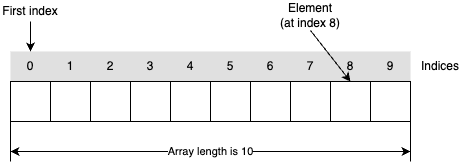


#### 표기법

배열은 아래와 같은 형식으로 선언한다.


* Element의 type은 primitive data type 또는 reference type
* 대괄호([])는 변수 선언에서 해당 type에 대한 배열임을 표시하는 특수 기호
* 배열의 크기는 선언에서 지정하지 않고, 생성 시 지정
* 대괄호를 배열 이름 앞이나 뒤에 선언 가능하지만, 앞에 선언하는 것을 관례로 권장함

  ~~~java
  byte anArrayOfBytes[];        // 배열 이름뒤에 [] 기호 사용은 권장하지 않음
  short anArrayOfShorts[];
  long anArrayOfLongs[];
  float[] anArrayOfFloats;
  double[] anArrayOfDoubles;
  boolean[] anArrayOfBooleans;
  char[] anArrayOfChars;
  String[] anArrayOfStrings;
  ~~~


#### 1차원 배열

##### 변수 선언

* 변수를 선언한다고 배열이 생성되지 않음.

* 변수는 배열이 아니다.단지, 배열 instance를 참조하기 위한 지시자일 뿐이다. // TODO : 용어가 맞나?

* 일반적으로 변수를 배열이라고 부르고, 선언만 되어 있는 경우는 초기화되지 않은 배열이라고 한다.

  ~~~java
  int [] row;
  int [] copy;
  ~~~

  

  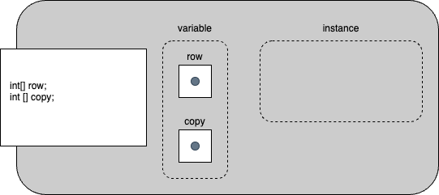

##### 변수 생성

* 배열은 primitive data type이 아니므로, new를 이용해 생성

  ~~~java
  int [] row;
  int [] copy;
  ...
  row = new int[4];
  ~~~

  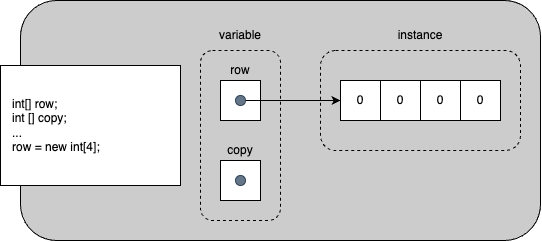

* 배열은 생성 시 초깃값이 주어지지 않을 경우, 기본값으로 설정됨


##### 변수 초기화

* 변수를 선언하면서 초기화할 수 있음
  ~~~java
  int [] row = new int[]{1, 2, 3, 4};
  int [] row = {1, 2, 3, 4};
  ~~~
  

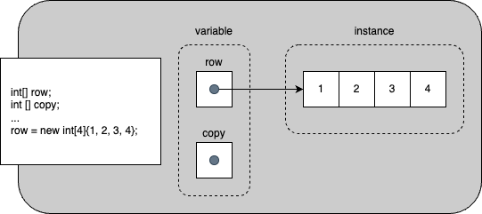

* 생성에서 초기화 시 크기를 지정할 수 없음
  ~~~java
  int [] anArray = new int[3]{1,2,3}; // error
  ~~~


##### 요소에 접근

* 각 배열에 대한 정수 인덱스가 제공됨
* 인덱스는 0에서 시작

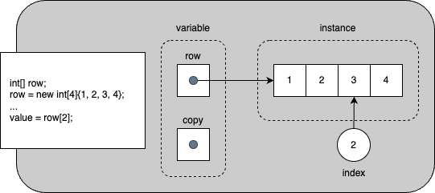


##### 예제. 다음 코드를 보고, 다차원 배열에서의 선언과 여러가지 인스턴스를 생성 방법에 대해 알아보자

~~~java
package example;

import java.util.Arrays;

public class ArrayDemo {
    public static void main(String[] args) {
        int [] array1;
        int [] array2 = new int [3];
        int [] array3 = new int []{ 1, 2, 3};
        int [] array4 = { 1, 2, 3};
        int [] array5 = array4;

        array1 = new int [3];
        System.out.println("01 : array1 = " + array1);
        System.out.println("02 : array2 = " + array2);
        System.out.println("03 : array3 = " + array3);
        System.out.println("04 : array4 = " + array4);
        System.out.println("05 : array5 = " + array5);

        System.out.println("06 : array1 = " + Arrays.toString(array1));
        System.out.println("07 : array2 = " + Arrays.toString(array2));
        System.out.println("08 : array3 = " + Arrays.toString(array3));
        System.out.println("09 : array4 = " + Arrays.toString(array4));
        System.out.println("10 : array5 = " + Arrays.toString(array5));

        for(int i = 0 ; i < array1.length ; i++) {
            array1[i] = i+1;
            array4[i] = array4[i]+1;
        }

        System.out.println("11 : array1 = " + Arrays.toString(array1));
        System.out.println("12 : array2 = " + Arrays.toString(array2));
        System.out.println("13 : array3 = " + Arrays.toString(array3));
        System.out.println("14 : array4 = " + Arrays.toString(array4));
        System.out.println("15 : array5 = " + Arrays.toString(array5));
    }
}

~~~

* array1은 instance 생성 전까지 어떤값을 가질까?
* array1 초기화시 array4와 같이 new를 사용하지 않고 가능할까?
* array2는 어떤 값들을 가질까?
* array4와 array5의 관계는?
* array4 요소값을 변경하였을때, array5의 요소값은 어떻게 될까?


##### 문제. 아래의 코드는 compile 과젱에서 오류가 발생한다. 무엇이 문제인가? 해결 방법은?
  ~~~java
  public class TestArrays {
    public static void main(String [] args) {
      int [] anArray;

      System.out.println("Array[0] : " + anArray[0]);
    }
  }
  ~~~


#### Multidimensional Array(다차원 배열)

* 1차원, 2차원, 3차원...


##### 변수 선언

* 배열 선언 시 대괄호의 개수로 다차원 선언 가능

* 다차원 배열이라고 변수가 다르지는 않다. 배열 instance를 참조하기 위한 지시자는 동일하다.

  ~~~java
  int [][] array1;   // 2차원 배열
  int [][][] array2; // 3차원 배열
  int [][][][] array3;// 4차원 배열
  ~~~

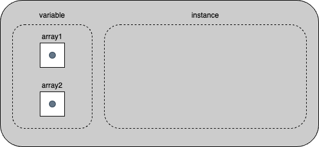

##### 변수 생성

* new 를 이용해 생성하거나

* 배열 리터럴을 이용해 생성할 수 있다.

  ~~~java
  int [][] array1 = new int[2][3];
  int [][] array2 = {{1,2,3}, {1,2,3}};
  int [][] array3 = new int [][] {{1, 2, 3},{1, 2, 3, 4}};
  ~~~

  

##### 변수 초기화

* 1차원 배열과 마찬가지로 변수를 선언하면서 초기화하거나,

  ~~~java
  int [][] array1 = new int [][] {{1,2,3},{1,2,3}};
  int [][] array2 = {{1,2,3},{1,2,3}};
  ~~~

* 추후 생성하여 참조할 수 있다

  ~~~java
  int [][] array1;
  int [][] array2;
  
  array1 = new int [][] {{1,2,3},{1,2,3}};
  ~~~

* 생성되어 있던 배열이나 새로운 배열을 생성하여 초기화도 가능

  ~~~java
  int [] array1 = {1,2,3};
  int [][] array2 = {{1,2,3}, array1};
  int [][][] array3 = {array2, {{1,2,3},{1,2}} new int [2][2]};
  
  ~~~

* 생성에서 초기화 시 크기를 지정할 수 없음

  ~~~java
  int [][] array1 = new int[2][3]{{1,2,3},{1,2,3}}; // error
  int [][] array2 = new int[2][]{{1,2,3},{1,2,3}}; // error
  ~~~

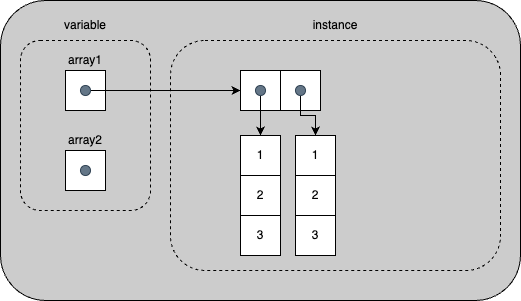


##### 예제. 다음 코드를 보고, 다차원 배열에서의 선언과 여러가지 인스턴스를 생성 방법에 대해 알아보자.

  ~~~java
  package example;
  
  import java.util.Arrays;
  
  public class MuiltidimensionalArrayDemo {
      public static void main(String[] args) {
          int [][] array1 = new int [][] {{1,2,3},{1,2,3}};
          int [][] array2 = {{1,2,3},{1,2,3}};
          int [][] array3;
          int [][] array4;
  
          array3 = new int [][] {{1,2,3},{1,2,3}};
  
          System.out.println("01 : array1 = " + array1);
          System.out.println("02 : array2 = " + array2);
          System.out.println("03 : array3 = " + array3);
          System.out.println("04 : array1 = " + Arrays.toString(array1));
          System.out.println("05 : array2 = " + Arrays.toString(array2));
          System.out.println("06 : array3 = " + Arrays.toString(array3));
          System.out.println("07 : array1[0] = " + array1[0]);
          System.out.println("08 : array2[0] = " + array2[0]);
          System.out.println("09 : array3[0] = " + array3[0]);
          System.out.println("10 : array1[0] = " + Arrays.toString(array1[0]));
          System.out.println("11 : array2[0] = " + Arrays.toString(array2[0]));
          System.out.println("12 : array3[0] = " + Arrays.toString(array3[0]));
          System.out.println("13 : array1[0][0] = " + array1[0]);
          System.out.println("14 : array2[0][0] = " + array2[0]);
          System.out.println("15 : array3[0][0] = " + array3[0]);
  
          array4 = new int [][] {null, null};
          System.out.println("16 : array4 = " + array4);
          System.out.println("17 : array4 = " + Arrays.toString(array4));
          array4[0] = new int [] {1, 2, 3};
          array4[1] = new int [] {1, 2, 3, 4};
  
          System.out.println("18 : array4 = " + Arrays.toString(array4));
          System.out.println("19 : array4[0] = " + array4[0]);
          System.out.println("20 : array4[0] = " + Arrays.toString(array4[0]));
          System.out.println("21 : array4[0][0] = " + array4[0]);
      }
  }
  ~~~
* array1과 array1[0]은 무엇이 같고, 무엇이 다른가요?
* Arrays.toString 은 배열을 문자열로 만들어 준다. 04, 05, 06에서의 배열은 무엇을 표시하고 있는것인가?
* 04, 05, 06의 결과와 07, 08, 09의 결과에서 무엇을 알 수 있나?
* 17에서 알 수 있는 것은?
* 17과 18 사이는 array4를 초기화 하는 과정이다. 다른 2차원 배열과의 같은 점은? 또, 다른점은?


##### 요소에 접근

* 각 배열에 대한 정수 인덱스가 제공됨
* 인덱스는 0에서 시작
* 다차원 배열은 배열을 요소로 갖는 배열로서 1차원 배열을 계속해서 따라가는 것과 같다

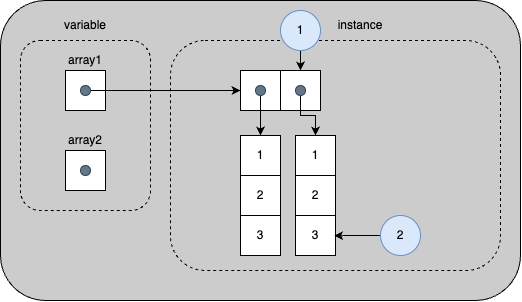


##### 예제. 다음 코드를 보고, 다차원 배열에서의 요소 접근에 대해 알아보자.

~~~java
package example;

import java.util.Arrays;

public class MultidimensionalArrayIndexingDemo {
    public static void main(String[] args) {
        int [][] array1 = {{1,2,3},{4,5,6}};

        System.out.println("01 : array1 = " + array1);
        System.out.println("02 : Arrays.toString(array1) = "
                + Arrays.toString(array1));
        System.out.println("03 : array1[1] = " + array1[1]);
        System.out.println("04 : Arrays.toString(array1[1]) = " 
                + Arrays.toString(array1[1]));
        System.out.println("05 : array1[1][2] = " + array1[1][2]);
    }
}
~~~

* array1 값은 무엇이고, 위 그림에서 무엇을 나타내는가?

* array1[1] 값은 무엇이고, 위 그림에서 무엇을 나타내는가?

* array1\[1][2] 값은 무엇이고, 위 그림에서 무엇을 나타내는가?

  

##### 문제. 다음 코드는 compile 과정에서 오류가 발생하지 않는다. 왜 오류가 발생하지 않는가?
  ~~~java
package example;

public class MultidimensionalArrayTest1 {
    public static void main(String[] args) {
        int [][] array;

        array = new int[10][];
        System.out.println("array[0][0] : " + array[0][0]); 
    } 
}
  ~~~


##### 문제. 다음 코드는 위 코드와 크게 다르지 않지만, compile 과정에서 오류가 발생한다. 무엇이 문제인가? 

  ~~~java
package example;

public class MultidimensionalArrayTest2 {
    public static void main(String[] args) {
        int [][] array;

        array = new int[][10];

        System.out.println("array[0][0] : " + array[0][0]);
    }
}
  ~~~


##### 문제. 아래의 코드는 무엇이 같고, 무엇이 다른가? 이유는?
 ~~~java
  int [][] twoDimensionalArrayOfInts1 = new int[3][2];
  int [][] twoDimensionalArrayOfInts2 = {{1,2,3}, {1,2}};
 ~~~


#### 복사

* 배열을 복사하면 변수만 복사되고 값은 복사되지 않아 두 개의 변수가 같은 배열을 가리키게 됨

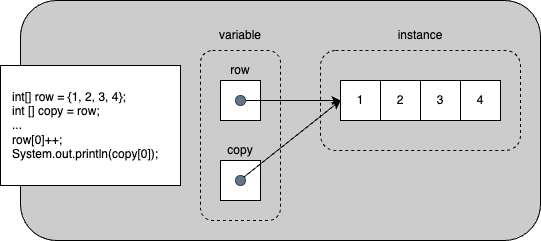

##### 예제. 다음 코드를 보고, 배열 복사에 대해 알아보자.

~~~java
package example;

import java.util.Arrays;

public class ArrayCopyDemo {
    public static void main(String[] args) {
        int [] array1 = {1, 2, 3} ;
        int [] array2 = new int [3];

        System.out.println("01 : array1 = " + Arrays.toString(array1));
        System.out.println("02 : array2 = " + Arrays.toString(array2));

        array2 = array1;
        System.out.println("03 : array1 = " + Arrays.toString(array1));
        System.out.println("04 : array2 = " + Arrays.toString(array2));

        array1[0] = 4;
        array1[1] = 5;
        array1[2] = 6;
        System.out.println("05 : array1 = " + Arrays.toString(array1));
        System.out.println("06 : array2 = " + Arrays.toString(array2));

        for(int i = 0 ; i < 3 ; i++) {
            array2[i] = array1[i];
        }
        System.out.println("07 : array1 = " + Arrays.toString(array1));
        System.out.println("08 : array2 = " + Arrays.toString(array2));

        array1[0] = 7;
        array1[1] = 8;
        array1[2] = 9;
        System.out.println("09 : array1 = " + Arrays.toString(array1));
        System.out.println("10 : array2 = " + Arrays.toString(array2));
    }
}
~~~

* array2 = array1의 결과는?

* array2는 아무런 작업을 하지 않았는데, 06에서04와 다른 이유는? 

* array2가 04에서 06은 변경된 반면, 08에서 10은 변화되지 않았다. 이유는?

  

##### arraycopy

* 배열을 다른 배열에 복사하는 System class에서 지원하는 method

  ~~~java
  public static void arraycopy(Object src, int srcPos,
                               Object dest, int   destPost, int length);
  ~~~

  * src : 복사할 소스 배열
  * srcPos : 복사할 배열의 시작 index
  * dest : 복사할 대상 배열
  * destPost : 대상 배열의 시작 index
  * length : 복사할 요소의 개수

  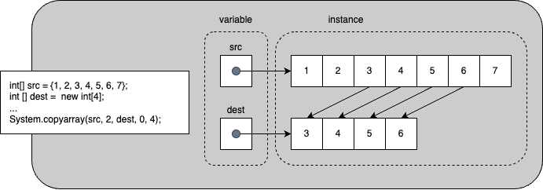

##### 예제. 다음 코드를 보고, System.arraycopy에 대해 알아보자.

~~~java
package example;

import java.util.Arrays;

public class ArrayCopyDemo2 {
    public static void main(String[] args) {
        int [] array1 = {1, 2, 3} ;
        int [] array2 = new int [3];

        System.out.println("01 : array1 = " + Arrays.toString(array1));
        System.out.println("02 : array2 = " + Arrays.toString(array2));

        System.arraycopy(array1, 0, array2, 0, 3);

        System.out.println("03 : array1 = " + Arrays.toString(array1));
        System.out.println("04 : array2 = " + Arrays.toString(array2));

        array1[0] = 4;
        array1[1] = 5;
        array1[2] = 6;
        System.out.println("05 : array1 = " + Arrays.toString(array1));
        System.out.println("06 : array2 = " + Arrays.toString(array2));
    }
}
~~~

* System.arraycopy에서는 무엇을 하는가?


##### 문제. 다음 코드는 다차원 배열을 복사한다. 코드를 완성하라.

~~~java
package example;

import java.util.Arrays;

public class MultidimensionalArrayCopyTest {
    public static void main(String[] args) {
        int[][] array1 = { { 1, 2, 3 }, { 4, 5, 6 } };
        int[][] array2 = new int[2][3];

        System.out.println("01 : array1 = ["
                + Arrays.toString(array1[0]) + ", " + Arrays.toString(array1[1]) + "]");
        System.out.println("02 : array2 = ["
                + Arrays.toString(array2[0]) + ", " + Arrays.toString(array2[1]) + "]");

        // 여기서부터
      
      	// 여기까지에 넣어 주세요        
        System.out.println("03 : array1 = ["
                + Arrays.toString(array1[0]) + ", " + Arrays.toString(array1[1]) + "]");
        System.out.println("04 : array2 = ["
                + Arrays.toString(array2[0]) + ", " + Arrays.toString(array2[1]) + "]");

        array1[0][0] = 7;
        array1[1][2] = 8;
        System.out.println("05 : array1 = ["
                + Arrays.toString(array1[0]) + ", " + Arrays.toString(array1[1]) + "]");
        System.out.println("06 : array2 = ["
                + Arrays.toString(array2[0]) + ", " + Arrays.toString(array2[1]) + "]");
    }
}

~~~

결과는 다음과 같이 출력된다.

~~~sh
01 : array1 = [[1, 2, 3], [4, 5, 6]]
02 : array2 = [[0, 0, 0], [0, 0, 0]]
03 : array1 = [[1, 2, 3], [4, 5, 6]]
04 : array2 = [[1, 2, 3], [4, 5, 6]]
05 : array1 = [[7, 2, 3], [4, 5, 8]]
06 : array2 = [[1, 2, 3], [4, 5, 6]]
~~~

* 코드를 추가하고 동일한 결과가 출력되나?

* System.arraycopy가 다차원 배열에 대해서는 어떻게 작동할까?

  

#### 배열을 위한 지원되는 다양한 기능들

* java.util.Arrays class에서 다양한 배열 조작 기능 제공


##### copyOfRange : 배열 부분 복사

* System.arraycopy와 같은 기능을 수행하지만, 대상 배열을 받지 않고 instance를 생성하고 요소를 복사하여 반환

  ~~~java
  public static boolean[] copyOfRange(boolean[] original, int from, int to)
  public static byte[] copyOfRange(byte[] original, int from, int to)
  public static int[] copyOfRange(int[] original, int from, int to)
  ...
  public static String[] copyOfRange(String[] original, int from, int to)
  ~~~


##### 문제. copyOfRange를 이용해 배열을 복제하라.

~~~java
package example;

import java.util.Arrays;

public class ArrayCopyOfRangeDemo {
    public static void main(String[] args) {
        int [] array1 = {1, 2, 3, 4, 5 ,6 ,7 , 8, 9, 10};
        int [] array2 = {1, 2, 3};
        
        System.out.println("01 : array1 = " + array1 + ", " + Arrays.toString(array1));
        System.out.println("02 : array2 = " + array2 + ", " + Arrays.toString(array2));

        // 코드 추가 시작
        
        // 코드 추가 끝

        System.out.println("03 : array1 = " + array1 + ", " + Arrays.toString(array1));
        System.out.println("04 : array2 = " + array2 + ", " + Arrays.toString(array2));
    }
}

~~~

결과는 다음과 같이 출력된다.

~~~sh
01 : array1 = [I@7de26db8, [1, 2, 3, 4, 5, 6, 7, 8, 9, 10]
02 : array2 = [I@1175e2db, [1, 2, 3]
03 : array1 = [I@7de26db8, [1, 2, 3, 4, 5, 6, 7, 8, 9, 10]
04 : array2 = [I@36aa7bc2, [3, 4, 5, 6, 7]
~~~

* 결과는 동일하기 출력되었나요?
* array2가 어떻게 되었나요?
* System.arraycopy와 무엇이 다른가요?


##### binarySearch : 이진 검색

* 배열에서 해당 요소를 찾아 그 요소의 index를 반환

  ~~~java
  public static int binarySearch(byte []a, byte key)
  public static int binarySearch(int []a, int key)
  ...
  public static int binarySearch(Object []a, Object key)
  ~~~


##### 예제. binarySearch를 이용해 배열에서 해당 요소의 위치를 찾아 본다.

~~~java
package example;

import java.util.Arrays;

public class ArrayBinarySearchTest {
    public static void main(String[] args) {
        int [] array1 = {0, 1, 2, 3, 4, 5, 6, 7, 8, 9};

        System.out.println("3의 index는 " + Arrays.binarySearch(array1, 3) + "입니다.");
        System.out.println("5의 index는 " + Arrays.binarySearch(array1, 5) + "입니다.");
        System.out.println("11의 index는 " + Arrays.binarySearch(array1, 11) + "입니다.");
    }
}
~~~

* Index가 정확하게 표시되나요?
* 없는 요소를 찾으면 어떠한 결과가 나오나요? 이유는?
* binarySearch가 무엇일까요? (자세히는 따로 공부하고, 간단히 무엇인지 정도만)


##### equals : 배열 요소 비교

* 두 배열의 요소들이 동일한지 비교

  ~~~java
  public static boolean equals(byte []a, byte []a2)
  public static boolean equals(int []a, int []a2)
  ...
  public static boolean equals(Object []a, Object []a2)
  ~~~


##### 문제. 다음 코드를 수정하여 배열들이 같은 요소를 가지고 있는지 비교하라.

~~~java
package example;

import java.util.Arrays;

public class ArrayEqualsTest {
    public static void main(String[] args) {
        int [] array1 = {1, 2, 3};
        int [] array2 = new int [3];
        int [] array3;
        double [] array4 = {1.0f, 2.0f, 3.14159265359f};
        double [] array5 = {1.0d, 2.0d, 3.14159265359d};
        boolean result;

        // 코드 추가 시작
        
        // 코드 추가 끝

        System.out.println("01 : array1 = " + array1 + ", " + Arrays.toString(array1));
        System.out.println("02 : array2 = " + array2 + ", " + Arrays.toString(array2));
        System.out.println("03 : array1과 array2는 같다? " + result);

        // 코드 추가 시작
        
        // 코드 추가 끝

        System.out.println("03 : array1 = " + array1 + ", " + Arrays.toString(array1));
        System.out.println("04 : array3 = " + array3 + ", " + Arrays.toString(array3));
        System.out.println("05 : array1과 array3는 같다? " + result);


        // 코드 추가 시작
        
        // 코드 추가 끝

        System.out.println("06 : array4 = " + array4 + ", " + Arrays.toString(array4));
        System.out.println("07 : array5 = " + array5 + ", " + Arrays.toString(array5));
        System.out.println("08 : array4과 array5는 같다? " + result);
    }
}

~~~

결과는 다음과 같이 출력된다.

~~~sh
01 : array1 = [I@1175e2db, [1, 2, 3]
02 : array2 = [I@36aa7bc2, [0, 0, 0]
03 : array1과 array2는 같다? false
03 : array1 = [I@1175e2db, [1, 2, 3]
04 : array3 = [I@76ccd017, [1, 2, 3]
05 : array1과 array3는 같다? true
06 : array4 = [D@26f0a63f, [1.0, 2.0, 3.1415927410125732]
07 : array5 = [D@3830f1c0, [1.0, 2.0, 3.14159265359]
08 : array4과 array5는 같다? false
~~~

* int만 비교했을때, 결과는? 이유는?
* double을 비교했을때, 결과는? 이유는?


##### fill : 배열 요소 채우기

* 배열의 모든 요소를 주어진 요소로 채움

  ~~~java
  public static void fill(byte []a, byte val)
  public static void fill(int []a, int val)
  ...
  public static boolean equals(Object []a, Object val)
  ~~~


##### 예제. 다음 코드를 보고, fill 동작에 대해 알아보자.

~~~java
package example;

import java.util.Arrays;

public class ArrayFillDemo {
    public static void main(String[] args) {
        int [] array1 = {1, 2, 3 ,4};

        System.out.println("01 : array1 = " + array1 + ", " + Arrays.toString(array1));
        Arrays.fill(array1, 0, 4, 0);
        System.out.println("02 : array1 = " + array1 + ", " + Arrays.toString(array1));
        Arrays.fill(array1, 2, 4, 1);
        System.out.println("03 : array1 = " + array1 + ", " + Arrays.toString(array1));
    }
}
~~~

* 02, 03의 결과가 예상한 것과 같이 나왔나?


##### sort : 정렬

* 배열을 오름차순으로 정렬

  ~~~java
  public static void sort(byte []a)
  public static void sort(int []a)
  ...
  public static boolean sort(Object []a)
  ~~~


##### stream : stream 생성

* 주어진 배열을 source로 하는 stream 생성

  ~~~java
  public static IntStream stream(int[] array)
  public static LongStream stream(long [] array)
  ...
  public static DoubleStream stream(double [] array)
  ~~~


##### toString : 문자열로 변환

* 배열을 이용해 문자열 생성

* 각 요소를 문자열로 생성하고, 이를 쉼표로 분리한 후 대괄호로 감싸 출력

  ~~~java
  public static String toString(boolean []a)
  public static String toString(int []a)
  ...
  public static String toString(Object []a)
  ~~~


## Operators(연산자)

* 하나, 둘 또는 세 개의 operand(피연산자)에 대해 특정 작업(계산, 선택, 확인 등)을 수행 후 결과를 반환하는 특수 기호


**연산자 우선순위**

* 표의 위쪽 연산자 우선순위가 높음

  | 우선순위 | 종류                 | 연산자                               |
  | --------- | -------------------- | ------------------------------------ |
  | 1         | postfix              | expr++ expr--                        |
  | 2         | unary                | ++expr --expr  +expr -expr ~ !       |
  | 3         | multiplicative       | * / %                                |
  | 4         | additive             | + -                                  |
  | 5         | shift                | << >> >>>                            |
  | 6         | relational           | < > <= => instanceof                 |
  | 7         | equality             | == !=                                |
  | 8         | bitewise AND         | &                                    |
  | 9         | bitwise exclusive OR | ^                                    |
  | 10        | bitwise inclusive OR | \|                                   |
  | 11        | logical AND          | &&                                   |
  | 12        | locigal OR           | \|\|                                 |
  | 13        | ternary              | ? :                                  |
  | 14        | Assignment           | = += -= *= /= %= &= \|= <<= >>= >>>= |


### The Simple Assignment Operator(할당 연산자)

* 오른쪽에 있는 값을 왼쪽에 있는 피연산자에 할당

  ~~~java
  int cadence = 0;
  long speed = 0;
  byte gear = 1;
  ~~~

* Object 참조를 위해서도 사용

  ~~~java
  int [] anArray = new int [2];
  Point originOne = new Point(100, 100);
  ~~~


### The Arithmetic Operators(산술 연산자)

* 일반적으로 알고 있는 더하기, 빼기 등의 사칙 연산을 기본으로 하는 연산자

* 추가로 하나의 피연산자가 나머지 피연산자를 나누고 남은 나머지를 반환하는 나머지 연산자

  | Operator |  설명  |
  | :------: | :----: |
  |    +     | 더하기 |
  |    -     |  빼기  |
  |    *     | 곱하기 |
  |    /     | 나누기 |
  |    %     | 나머지 |


##### 문제. 다음 코드는 primitive data type에 대해 산술 연산이다. 코드를 완성하라.

~~~java
package example;

public class ArithmeticOperatorTest {
    public static void main(String[] args) {
        byte byteValue1 = 2;
        byte byteValue2 = 5;
        short shortValue1 = 2;
        short shortValue2 = 5;
        int intValue1 = 2;
        int intValue2 = 5;
        long longValue1 = 2;
        long longValue2 = 5;
        float floatValue1 = 2.1f;
        float floatValue2 = 5.1f;
        double doubleValue1 = 2.1d;
        double doubleValue2 = 5.1d;

        System.out.format("%d %d %d %d %d%n", byteValue1+byteValue2,
                byteValue1 - byteValue2, byteValue1 * byteValue2,
                byteValue1 / byteValue2, byteValue1 % byteValue2);

				// 코드 작성 시작
      
      	// 코드 작성 끝
    }
}

~~~

결과는 다음과 같이 출력된다.

~~~sh
7 -3 10 0 2
7 -3 10 0 2
7 -3 10 0 2
7 -3 10 0 2
7.200000 -3.000000 10.709999 0.411765 2.100000
7.200000 -3.000000 10.710000 0.411765 2.100000
~~~

* char와 boolean을 제외한 6가지의 primitive data type에 대해 +, -, *, /를 적용하고, 정수형인 경우 % 를 적용하였나?
* 정수 나눗셈의 결과는 예상한 결과인가?
* 나머지 연산에 대해 이해 하였는가?


##### 문제. 다음 코드는 primitive data type에서 정수에 대해 산술 연산이다. 다음 연산을 적용한 코드를 완성하라.

* byte = byte + byte
* short = short + short
* int = int + int
* long = long + long
* short = byte + short
* int = byte + short
* int = short + int
* int = int + long
* long = int + long

~~~java
package example;

public class ArithmeticOperatorTest2 {
    public static void main(String[] args) {
        byte byteValue1 = 2;
        byte byteValue2 = 5;
        byte byteResult;
        short shortValue1 = 2;
        short shortValue2 = 5;
        short shortResult;
        int intValue1 = 2;
        int intValue2 = 5;
        int intResult;
        long longValue1 = 2;
        long longValue2 = 5;
        long longResult;

        byteResult = byteValue1 + byteValue2;
        System.out.println(byteResult + " = " + byteValue1 + " + " + byteValue2);

				// 코드 작성 시작
      
      	// 코드 작성 끝
    } 
}

~~~

* 모든 계산이 문제가 없나? 문제가 있다면 어디서 어떤 문제가 생기나요?
* 어떠한 규칙은 가지고 있다고 생각이 드나? 이유는?
* type casting(형 변환)에 대해 아시나요? 
  * [Type conversion](https://en.wikipedia.org/wiki/Type_conversion) 참고


##### 문제. 앞에 문제와 동일하게 float과 double에 대해서 결과를 예측해보고 확인하라.

* float = float + float
* double  = double + double
* float = float + double
* double = double + double

~~~java
package example;

public class ArithmeticOperatorTest3 {
    public static void main(String[] args) {
        float floatValue1 = 2.1f;
        float floatValue2 = 5.1f;
        float floatResult;
        double doubleValue1 = 2.1d;
        double doubleValue2 = 5.1d;
        double doubleResult;

				// 코드 작성 시작
      
      	// 코드 작성 끝
    }
}
~~~

* 결과가 예측과 동일한가?


##### 문제. char type에서 다음 조건을 이용해서 문자를 출력하라.

* c1은 'A' 이다.
* c2는 'B'이다.
* c3는 'B'의 값보다 1 큰 문자이다.
* c4는 c2의 값보다 1 큰 문자이다. 

~~~java
package example;

public class ArithmeticOperatorTest4 {
    public static void main(String[] args) {
      	char c1 = 'A';
				// 코드 작성 시작
      
      	// 코드 작성 끝

				System.out.println("c1 = " + c1);
				System.out.println("c2 = " + c2);
				System.out.println("c3 = " + c3);
				System.out.println("c4 = " + c4);
    }
}
~~~

결과는 다음과 같이 출력된다.

~~~sh
c1 = A
c2 = B
c3 = B
c4 = C
~~~

* 동일하게 출력되나요? 아니면, 오류가 발생하나요? 
* 오류의 원인은?

  

### The Unary Operators(단항 연산자)

* 하나의 피연산자
* 피연산자를 증가 또는 감소로 변경
* 계산된 값 부호 변경
* 계산된 부울 값 전환


연산자는 아래와 같다.

| Operator | 설명                                                         | 피연산자 변경 |
| :------: | ------------------------------------------------------------ | :-----------: |
|    +     | 양수 값을 표현하기 위한 것으로 특별히 사용되지는 않음        |   영향 없음   |
|    -     | 음수 값은 양수 값으로, 양수 값은 음수 값으로 변경하여 출력함 |   영향 없음   |
|    ++    | increment operator(증가 연산자), 피연산자 값을 1 증가시킴   |    변경됨     |
|    --    | decrement operator(감소 연산자), 피연산자 값을 1 감소시킴    |    변경됨     |
|    !     | 논리 보수 연산자, 부울 값을 반전시킴                         |   영향 없음   |

##### 예제. 다음 코드를 보고, 단항 연산자에 대해 알아보자.

~~~java
package example;

class UnaryDemo {

    public static void main(String[] args) {

        int result  = +1;
        System.out.println("01 : result = +1 : " + result);

        result--;
        System.out.println("02 : result-- : " + result);

        result++;
        System.out.println("03 : result++ : " + result);

        --result;
        System.out.println("04 : --result : " + result);

        ++result;
        System.out.println("05 : ++result : " + result);

        result = +result;
        System.out.println("06 : result = +result : " + result);

        result = -result;
        System.out.println("07 : result = -result : " + result);

        boolean success = false;
        System.out.println("08 : success = false : " + success);

        boolean booleanResult = !success;
        System.out.println("09 : !success : " + booleanResult);
    }
}
~~~

결과는 아래와 같다.

~~~sh
01 : result = +1 : 1
02 : result-- : 0
03 : result++ : 1
04 : --result : 0
05 : ++result : 1
06 : result = +result : 1
07 : result = -result : -1
08 : success = false : false
09 : !success : true
~~~

* 단항 연산자 + 는 언제 사용될까요?
* 단항 연산자 +, -, ! 과 ++, --의 차이점은 무엇인가요?

* 단항 연산자 +,-,!은 ++, --와 달리 다른 연산과 함께 사용되었다. ++,--와 같이 사용할때는 어떻게 되는가? 이유는? 


#### The increment/decrement operators(증가/감소 연산자)

* 증가/감소 연산자는 피연산자의 앞 또는 뒤에 붙여서 사용

* 최종 결과는 피연산자 값을 1 증가시키거나 1 감소시킴

* 단, 해당 연산자가 적용되는 피연산자가 더 큰 연산에 적용될 경우

  * 앞에 붙으면, 더 큰 연산이 적용되기 전에 단항 연산자가 처리되고
  * 위에 붙으면, 더 큰 연산이 적용된 후에 단항 연산자가 처리됨


##### 예제. 다음 코드를 보고, 증가 연산자의 동작에 대해 알아보자.

~~~java
package example;

public class PrePostIncrementDemo {
    public static void main(String[] args){
        int i = 3;
        System.out.println("01 : " + i);
        i++;
        System.out.println("02 : " + i);
        ++i;
        System.out.println("03 : " + i);
        System.out.println("04 : " + ++i);
        System.out.println("05 : " + i++);
        System.out.println("06 : " + i);
    }
}
~~~

동작 결과는 아래와 같다. 자신이 생각하는 동작과 일치하는지 확인해 보자.

~~~sh
01 : 3
02 : 4
03 : 5
04 : 6
05 : 6
06 : 7
~~~

* 04에서도 1 증가시키고 05에서 1증가 시켰지만, 출력이 동일하다. 이유는?

  

##### 예제. 다음의 결과를 예상해 보고, 실행 후 비교해 보자.

~~~java
package example;

class IncrementTest {
    public static void main(String[] args){
      int [] anArray = {1, 2, 3, 4};

      int i = 0;
      int result1 = anArray[++i] + anArray[++i];
      int result2 = anArray[i++] + anArray[i++];

      System.out.println("result1 : " + result1 + ", result2 : " + result2);
    }
}
~~~

* 실행에 문제는 없나요?
* 결과가 예상과 일치하나요?


##### 예제. result1과 result2의 순서를 변경하였다.  예상되는 결과와 실행 후 비교해 보자.

~~~java
package example;


class IncrementTest {
    public static void main(String[] args){
      int [] anArray = {1, 2, 3, 4};

      int i = 0;
      int result2 = anArray[i++] + anArray[i++];
      int result1 = anArray[++i] + anArray[++i];

      System.out.println("result1 : " + result1 + ", result2 : " + result2);
    }
}
~~~

* 실행에 문제는 없나요?
* 결과가 예상과 일치하나요?


// TODO : increment/decrement 예제 추가


### The Equality and Relational Operators(관계 연산자)

* 피연산자 간의 관계(크거나 작거나 같거나 혹은 다르거나) 결정한다.
* 수학에서는 "="이 같음을 나타내지만, Java에서는 "=="이 같음을 나타낸다.


관계연산자는 아래와 같다.

| Operator | 설명                                             |
| -------- | ------------------------------------------------ |
| ==       | 두 피연산자가 같음을 확인                        |
| !=       | 두 피연산자가 같지 않음을 확인                   |
| >        | 앞에 연산자가 뒤에 연산자보다 큼을 확인          |
| >=       | 앞에 연산자가 뒤에 연산자보다 크거나 같음을 확인 |
| <        | 앞에 연산자가 뒤에 연산자보다 작음을 확인        |
| <=       | 앞에 연산자가 뒤에 연산자보다 작거나 같음을 확인 |


##### 예제. 다음 코드를 보고, 관계 연산자에 대해 알아보자.


~~~java
package example;

public class RelationalOperatorDemo {
    public static void main(String[] args){
        int value1 = 1;
        int value2 = 2;
        System.out.println("01 : value1 == value2 : " + (value1 == value2));
        System.out.println("02 : value1 != value2 : " + (value1 != value2));
        System.out.println("03 : value1 > value2 : " + (value1 > value2));
        System.out.println("04 : value1 < value2 : " + (value1 < value2));
        System.out.println("05 : value1 <= value2 : " + (value1 <= value2));
        System.out.println("06 : value1 >= value2 : " + (value1 >= value2));
    }
}
~~~

결과는 아래와 같다.

~~~shell
01 : value1 == value2 : false
02 : value1 != value2 : true
03 : value1 > value2 : false
04 : value1 < value2 : true
05 : value1 <= value2 : true
06 : value1 >= value2 : false
~~~

* value1과 value2를 바꿔서 실행해 보자.


// TODO : 문제 확인할 것

##### 문제. 관계 연산자의 피연산자는 모든 data type이 가능한가? 직접 코드를 작성해 compile 과정에 error가 발생하는지 확인해 보자.

* 피연산자는 primitive type, reference type, null type, array가 될 수 있다.

~~~java
package example;

public class RelationalOperatorTest {
    public static void main(String[] args) {
        byte b1 = 1;
        byte b2 = 2;

        System.out.println("01 : b1 == b2 : " + (b1 == b2));
        System.out.println("01 : b1 != b2 : " + (b1 != b2));
        System.out.println("01 : b1 <  b2 : " + (b1 <  b2));
        System.out.println("01 : b1 >  b2 : " + (b1 >  b2));
        System.out.println("01 : b1 <= b2 : " + (b1 <= b2));
        System.out.println("01 : b1 >= b2 : " + (b1 >= b2));
    }
}
~~~

정상적으로 수행되고, 결과는 아래와 같이 출력된다.

~~~java
01 : b1 == b2 : false
01 : b1 != b2 : true
01 : b1 <  b2 : true
01 : b1 >  b2 : false
01 : b1 <= b2 : true
01 : b1 >= b2 : false
~~~

*  다른 data type에 대해서도 적용해 본다.


##### 문제. 관계 연산자에 사용되는 두 개의 피연산자가 서로 다른 data type일 경우에도 가능한가? 가능하다면, 어떻게 처리될까?

* 서로 다르지만 비교 가능한 data type은? 이유는?
* 서로 다르면서 비교가 되지 않은 data type은? 이유는?

~~~java
package example;

public class RationalOperatorTest2 {
    public static void main(String[] args) {
        byte b1 = 1;
        float b2 = 2;

        System.out.println("01 : b1 == b2 : " + (b1 == b2));
        System.out.println("01 : b1 != b2 : " + (b1 != b2));
        System.out.println("01 : b1 <  b2 : " + (b1 <  b2));
        System.out.println("01 : b1 >  b2 : " + (b1 >  b2));
        System.out.println("01 : b1 <= b2 : " + (b1 <= b2));
        System.out.println("01 : b1 >= b2 : " + (b1 >= b2));
    }
}
~~~

결과는 실행해서 확인해 본다.


### The Conditional Operators(조건 연산자)

* 두 개의 부울 식으로 AND나 OR 연산을 수행

##### 예제. 다음 코드를 보고, and와 or 연산에 대해 알아보자.

  ~~~java
  package example;
  
  public class ConditionalOperatorDemo {
      public static void main(String[] args) {
          int v1 = 1;
          int v2 = 2;
          System.out.println("v1 is 1 AND v2 is 2 : " + ((v1 == 1) && (v2 == 2)));
          System.out.println("v1 is 1 OR v2 is 1 : " + ((v1 == 1) || (v2 == 1)));
      }
  }
  ~~~


* [Short-circuit evaluation](https://en.wikipedia.org/wiki/Short-circuit_evaluation)으로 첫 번째 피연산자에 의해 결과가 결정된 경우, 두 번째 피연산자를 계산하지 않음
  
  * expression1 && expression2에서 expression1이 false인 경우, expression2는 계산하지 않음
  
  * expression1 || expression2에서 expression1이 true인 경우, expression2는 계산하지 않음
  
    
  
#####  예제. 다음 코드를 보고, short-circuit evaluation에 대해 알아보자.
~~~java
package example;

public class ShortCircuitEvaluationDemo {
    public static void main(String[] args) {
        int v1 = 1;
        int v2 = 2;

        System.out.println("01 : v1 : " + v1);
        System.out.println("02 : v2 : " + v2);
        System.out.println("03 : (++v1 == 2) && (++v2 == 3) : "
                + ((++v1 == 2) && (++v2 == 3)));
        System.out.println("04 : v1 : " + v1);
        System.out.println("05 : v2 : " + v2);

        System.out.println("06 : (v1++ == 3) && (v2++ == 4) : "
                + ((v1++ == 3) && (v2++ == 4)));
        System.out.println("07 : v1 : " + v1);
        System.out.println("08 : v2 : " + v2);

        System.out.println("09 : (++v1 == 4) || (++v2 == 4) : "
                + ((++v1 == 4) || (++v2 == 4)));
        System.out.println("10 : v1 : " + v1);
        System.out.println("11 : v2 : " + v2);

        System.out.println("12 : (++v1 == 4) || (++v2 == 4) : "
                + ((++v1 == 4) || (++v2 == 4)));
        System.out.println("13 : v1 : " + v1);
        System.out.println("14 : v2 : " + v2);
    }
}
~~~

결과는 다음과 같이 출력된다.

~~~sh
01 : v1 : 1
02 : v2 : 2
03 : (++v1 == 2) && (++v2 == 3) : true
04 : v1 : 2
05 : v2 : 3
06 : (v1++ == 3) && (v2++ == 4) : false
07 : v1 : 3
08 : v2 : 3
09 : (++v1 == 4) || (++v2 == 4) : true
10 : v1 : 4
11 : v2 : 3
12 : (++v1 == 4) || (++v2 == 4) : true
13 : v1 : 5
14 : v2 : 4
~~~

* 03에서 v1에 증가 연산자가 적용되었나요? v2에 증가 연산자가 적용되었나요? 이유는?

* 06에서 v1에 증가 연산자가 적용되었나요? v2에 증가 연산자가 적용되었나요? 이유는?

* 09에서 v1에 증가 연산자가 적용되었나요? v2에 증가 연산자가 적용되었나요? 이유는?

* 12에서 v1에 증가 연산자가 적용되었나요? v2에 증가 연산자가 적용되었나요? 이유는?

  

#### Shorthand if else (Ternary Operator : 삼항 연산자)

* If-then-else 문을 식으로 표현
  ~~~java
  if 조건식 ? true일때 실행식 : false일때 실행식
  ~~~
* 세 개의 피연산자가 필요한 삼항 연산자

  * 조건식, true인 경우 실행문, false인 경우 실행문


##### 예제. 다음 코드를 보고 삼항 연산자의 동작에 대해 확인해 보자.

  ~~~java
package example;

public class TernaryOperatorDemo {
    public static void main(String[] args){
        int v1 = 1;
        int v2 = 2;
        int result;

        result = v1 < v2? v1 : v2;

        System.out.println(result);
    }
}
  ~~~

* if-then-else는 뒤에서 배움
* 삼항 연산자의 정의에 따라 v1이 v2보다 적은 경우  v1을 반환하고, 그렇지 않은 경우 v2를 반환
* 결과는?
* v1과 v2 값을 바꾸면?


##### 문제. 삼항 연산자만을 사용해서 원하는 달의 날수를 출력하라.

* 2월은 28일로 한다.

~~~java
package example;

public class TernaryOperatorTest {
    public static void main(String[] args) {
        int month = 3;
				      
				// 코드 작성 시작
      
      	// 코드 작성 끝

        System.out.println(month + "월은 " + day + "입니다.");
    }
}
~~~

결과는 다음과 같이 출력된다.

~~~sh
3월은 31입니다.
~~~


#### instanceof

* Object가 주어진 type인지 확인
* Object가 특정한 class의 instance(extends 포함)인지, interface의 implements 인지 확인
* 조건문을 이용해 특정 type에 대한 확인이 필요한 경우 사용

##### 예제. 다음 코드를 보고 instanceof 연산자의 동작일 이해해 보자.

  ~~~java
package example;

class InstanceofDemo {
    public static void main(String[] args) {

        Parent obj1 = new Parent();
        Parent obj2 = new Child();
        EnumType1 enum1 = EnumType1.REFERENCE;
        EnumType2 enum2 = EnumType2.CLASS;

        System.out.println("01 : obj1 instanceof Parent: "
            + (obj1 instanceof Parent));
        System.out.println("02 : obj1 instanceof Child: "
            + (obj1 instanceof Child));
        System.out.println("03 : obj1 instanceof MyInterface: "
            + (obj1 instanceof MyInterface));
        System.out.println("04 : obj2 instanceof Parent: "
            + (obj2 instanceof Parent));
        System.out.println("05 : obj2 instanceof Child: "
            + (obj2 instanceof Child));
        System.out.println("06 : obj2 instanceof MyInterface: "
            + (obj2 instanceof MyInterface));
        System.out.println("07 : enum1 instanceof EnumType1: "
            + (enum1 instanceof EnumType1));
        System.out.println("08 : enum2 instanceof EnumType2: "
            + (enum2 instanceof EnumType2));
        // System.out.println("09 : class1 instanceof EnumType2: "
        //     + (enum1 instanceof EnumType2));
        // System.out.println("10 : enum2 instanceof EnumType1: "
        //     + (enum2 instanceof EnumType1));
    }
}

enum EnumType1{
    PRIMITIVE,
    REFERENCE
}

enum EnumType2 {
    CLASS,
    INTERFACE,
    ENUM
}

class Parent {}
class Child extends Parent implements MyInterface {}
interface MyInterface {}
  ~~~

결과는 아래와 같다.

  ~~~sh
  01 : obj1 instanceof Parent: true
  02 : obj1 instanceof Child: false
  03 : obj1 instanceof MyInterface: false
  04 : obj2 instanceof Parent: true
  05 : obj2 instanceof Child: true
  06 : obj2 instanceof MyInterface: true
  07 : enum1 instanceof EnumType1: true
  08 : enum2 instanceof EnumType2: true
  ~~~

* obj1은 단순 Parent class로서 첫 번째 확인에서만 true

* obj2는 Parent class에서 확장하고, MyInterface interface를 구현한 것으로 모든 확인에서 true

* enum1은 EnumType1이므로 true

* enum2는 EnumType2이므로 true

* 그렇다면, enum1 instanceof EnumType2는 어떻게 될까?

  // TODO : 확인 필요


### Bitwise and Bit Shift Operators (비트와 비트 shift 연산자)

* 정수 type(byte, short, int, long)에 대해서만 지원
* 정수를 비트 단위로 이동, 반전 또는 설정하는 연산


비트 연산자는 다음과 같다.

| Operator         | 설명                                                         |
| ---------------- | ------------------------------------------------------------ |
| ~                | 단항 연산자로 피연산자의 패턴을 반전 시킴 (0을 1로, 1을 0으로) |
| <<               | 비트 패턴을 왼쪽으로 이동. 오른쪽 새로운 비트 패턴은 0으로 채워짐 |
| >>               | 비트 패턴을 오른쪽으로 이동. 왼쪽 새로운 비트 패턴은 이전 가장 왼쪽 비트 패턴과 동일함 |
| >>>              | 비트 패턴을 오른쪽으로 이동. 왼쪽 새로운 비트 패턴은 0으로 채워짐 |
| &                | 두 피연산자를 비트 단위로 AND 연산을 적용 (1을 true로 0을 false로) |
|ㅣ(vertical bar) | 두 피연산자를 비트 단위로 OR 연산을 적용 (1을 true로 0을 false로) |
| ^                | 두 피연산자를 비트 단위로 XOR 연산을 적용 (1을 true로 0을 false로) |


#### Bit Shift 연산자

* 비트단위로 왼쪽이나 오른쪽으로 이동
* 빈자리는 이전 값을 유지 하거나 0으로 채워짐

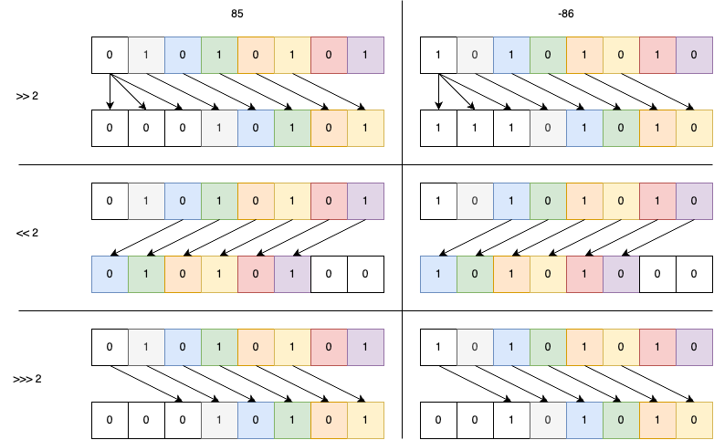


##### 예제. 다음 코드를 보고, bit shift 연산자에 대해 알아보자.

~~~java
package example;

public class ShiftOperatorDemo {
    public static void main(String[] args) {
        int x = -123456789;
        int y =  123456789;
        String s;
				
        s = Integer.toBinaryString(x);
        System.out.println("01 : x       =   "
                + ("00000000000000000000000000000000" + s).substring(s.length()));
        s = Integer.toBinaryString(x << 2);
        System.out.println("02 : x <<  2 = "
                + ("00000000000000000000000000000000" + s).substring(s.length()));
        s = Integer.toBinaryString(x >> 2);
        System.out.println("03 : x >>  2 =   "
                + ("00000000000000000000000000000000" + s).substring(s.length()));
        s = Integer.toBinaryString(x >>> 2);
        System.out.println("04 : x >>> 2 =   "
                + ("00000000000000000000000000000000" + s).substring(s.length()));

        System.out.println("");
        s = Integer.toBinaryString(y);
        System.out.println("05 : y       =   "
                + ("00000000000000000000000000000000" + s).substring(s.length()));
        s = Integer.toBinaryString(y << 2);
        System.out.println("06 : y <<  2 = "
                + ("00000000000000000000000000000000" + s).substring(s.length()));
        s = Integer.toBinaryString(y >> 2);
        System.out.println("07 : y >>  2 =   "
                + ("00000000000000000000000000000000" + s).substring(s.length()));
        s = Integer.toBinaryString(y >>> 2);
        System.out.println("08 : y >>> 2 =   "
                + ("00000000000000000000000000000000" + s).substring(s.length()));
    }
}

~~~

결과는 다음과 같이 출력된다.

~~~sh
01 : x       =   11111000101001000011001011101011
02 : x <<  2 = 11100010100100001100101110101100
03 : x >>  2 =   11111110001010010000110010111010
04 : x >>> 2 =   00111110001010010000110010111010

05 : y       =   00000111010110111100110100010101
06 : y <<  2 = 00011101011011110011010001010100
07 : y >>  2 =   00000001110101101111001101000101
08 : y >>> 2 =   00000001110101101111001101000101
~~~


##### 문제. 다음에 주어진 값을 bit shift 연산자를 이용해 계산해 보자.

* $2^3 = ?$
* $2^{30}=?$
* $2^{40}=?$

~~~
package example;

public class ShiftOperatorTest {
    public static void main(String[] args) {
        System.out.println("2^3 = " ...);
        System.out.println("2^30 = " ...);
        System.out.println("2^40 = " ...);
    }
}
~~~

결과는 다음과 같이 출력된다.

~~~sh
2^3 = 16
2^30 = 2147483648
2^40 = 2199023255552
~~~


#### Bit 연산자

* bit 단위로 &(and), |(or), ^(xor), ~(not) 적용

  

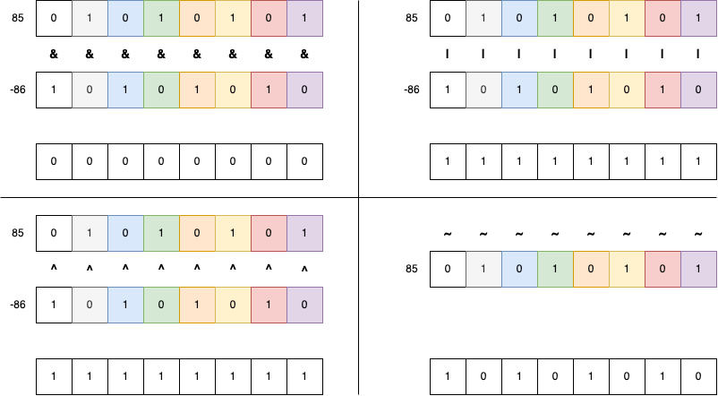


##### 예제. 다음 코드를 보고, 비트 연산자에 대해 알아보자.

~~~java
package example;

public class BitOperatorDemo {
    public static void main(String[] args) {
        int x = -123456789;
        int y = 123456789;
        String s;

        s = Integer.toBinaryString(x);
        System.out.println("01 : x          = "
                + ("00000000000000000000000000000000" + s).substring(s.length()));
        s = Integer.toBinaryString(y);
        System.out.println("02 : y          = "
                + ("00000000000000000000000000000000" + s).substring(s.length()));
        s = Integer.toBinaryString(x & y);
        System.out.println("03 : x & y = "
                + ("00000000000000000000000000000000" + s).substring(s.length()));
        s = Integer.toBinaryString(x | y);
        System.out.println("04 : x | y = "
                + ("00000000000000000000000000000000" + s).substring(s.length()));
        s = Integer.toBinaryString(x ^ y);
        System.out.println("05 : x ^ y = "
                + ("00000000000000000000000000000000" + s).substring(s.length()));
        s = Integer.toBinaryString(~x);
        System.out.println("06 : ~x         = "
                + ("00000000000000000000000000000000" + s).substring(s.length()));
        s = Integer.toBinaryString(~y);
        System.out.println("07 : ~y         = "
                + ("00000000000000000000000000000000" + s).substring(s.length()));

    }
}

~~~

결과는 다음과 같이 출력된다.

~~~sh
01 : x          = 11111000101001000011001011101011
02 : y          = 00000111010110111100110100010101
03 : x & y = 00000000000000000000000000000001
04 : x | y = 11111111111111111111111111111111
05 : x ^ y = 11111111111111111111111111111110
06 : ~x         = 00000111010110111100110100010100
07 : ~y         = 11111000101001000011001011101010
~~~


##### 문제. 다음에서 설명하는 내용을 구현하라.

* 자리는 총 32개 있습니다.
* 손님이 들어올때마다 0~31번 자리를 내어 줍니다.
* 다음의 각 과정마다 32개 자리가 비워져 있는지 출력합니다.
  * 손님이 들어와 5번 자리로 안내 합니다.
  * 손님이 들어와 2번 자리로 안내 합니다.
  * 손님이 들어와 18번 자리로 안내 합니다.
  * 5번 손님이 나갑니다.
  * 2번과 18번 손님이 함께 나갑니다.


~~~java
package example;

public class BitOperatorTest {
    public static void main(String[] args) {
        int seat = 0;
        String zeros = "00000000000000000000000000000000";
        String s;

        s = Integer.toBinaryString(seat);
        System.out.println("01 : " + (zeros + s).substring(s.length()));

				// 코드 작성 시작
      
      	// 코드 작성 끝


        s = Integer.toBinaryString(seat);
        System.out.println("06 : " + (zeros + s).substring(s.length()));
    }
}
~~~


결과는 다음과 같이 출력된다.

~~~sh
01 : 00000000000000000000000000000000
02 : 00000000000000000000000000100000
03 : 00000000000000000000000000100100
04 : 00000000000001000000000000100100
05 : 00000000000001000000000000000100
06 : 00000000000000000000000000000000
~~~


### Compound Assignment Operators(복합 할당 연산자)

#### Assignment operator와 arithmetic operator 조합

* +=, -=, *=, /=, %=

* 변수에 값을 더하는 연산은 자주 사용된다.

  아래 코드는 int형 변수에 값을 더하는 연산으로 1로 초기화된 변수에 20을 더해 21로 만든다.

  ```
  int customerCount;
  customerCount = 1;
  customerCount = customerCount + 20;
  ```

* 합성 할당 연산자를 사용할 수 있습니다

  위의 코드는 하나의 값만 더하므로 복잡하지 않을 수 있다. 아래의 코드를 보자. array의 index를 계산하기 위해 식이 사용되고, 이를 중복해서 여러 번 사용되어 복잡하고 오류가 발생할 가능성도 커진다.

  ```
  array[(i + 1) % 25] = array[(i + 1) % 25] + 20;
  ```

  합성 할당 연산자를 이용해 아래와 같은 단축된 형식으로 동일한 식의 중복 사용을 피할 수 있다.

  ```
  array[(i + 1) % 25] += 20;
  ```

* 산술 연산에 대해 단축된 형식을 사용할 수 있다

   ~~~java
   variable += expression; // variable = variable + expression;
   variable -= expression; // variable = variable - expression;
   variable *= expression; // variable = variable * expression;
   variable /= expression; // variable = variable / expression;
   variable %= expression; // variable = variable % expression;
   ~~~


##### 예제. 다음 코드를 보고, 복합 산술 할당 연산자에 대해 알아보자.

~~~java
package example;

public class CompoundArithmeticOperatorDemo {
    public static void main(String[] args) {
        int x = 10;
        int y = 10;

        System.out.println("01 : x = " + x + ", y = " + y);

        x = x + 10;
        y += 10;
        System.out.println("02 : x = x + 10 vs y += 10");
        System.out.println("03 : x = " + x + ", y = " + y);

        x = x - 10;
        y -= 10;
        System.out.println("04 : x = x - 10 vs y -= 10");
        System.out.println("05 : x = " + x + ", y = " + y);

        x = x * 10;
        y *= 10;
        System.out.println("06 : x = x * 10 vs y *= 10");
        System.out.println("07 : x = " + x + ", y = " + y);

        x = x / 10;
        y /= 10;
        System.out.println("08 : x = x / 10 vs y /= 10");
        System.out.println("09 : x = " + x + ", y = " + y);

        x = x % 3;
        y %= 3;
        System.out.println("10 : x = x % 3 vs y %= 3");
        System.out.println("11 : x = " + x + ", y = " + y);
    }
}
~~~

결과는 다음과 같이 출력된다.

~~~sh
01 : x = 10, y = 10
02 : x = x + 10 vs y += 10
03 : x = 20, y = 20
04 : x = x - 10 vs y -= 10
05 : x = 10, y = 10
06 : x = x * 10 vs y *= 10
07 : x = 100, y = 100
08 : x = x / 10 vs y /= 10
09 : x = 10, y = 10
10 : x = x % 3 vs y %= 3
11 : x = 1, y = 1
~~~


##### 문제. Byte 또는 short에 대해서도 예제와 같이 확인해 보자.

~~~java
package example;

public class CompoundArithmeticOperatorTest {
    public static void main(String[] args) {
        byte x = 10;
        byte y = 10;

				...
    }
}
~~~

* 문제가 없나요? 문제가 생겼다면 이유를 생각해 봅시다.
* 해결 방법은?


#### Assignment operator와 bitwire(or bit shift) operator 조합

* <<=, >>=, >>>=, &=, ^=, |=

* 비트 연산자에 대해서도 단축된 형식을 사용할 수 있다.


##### 예제. 다음 코드를 보고, 복합 할당 연산자에 대해 알아보자.

  ~~~java
  package example;
  
  public class CompoundBitOperatorDemo {
      public static void main(String[] args) {
          int originalX = -123456789;
          int x = -123456789;
          int y =  123456789;
  
          System.out.println("x        :   " + String.format("%32s",
                  Integer.toBinaryString(x)).replace(" ", "0"));
          x = originalX;
          x <<= 2;
          System.out.println("x <<= 2  : " + String.format("%32s",
                  Integer.toBinaryString(x)).replace(" ", "0"));
          x >>= 2;
          System.out.println("x >>= 2  :     " + String.format("%32s",
                  Integer.toBinaryString(x)).replace(" ", "0"));
          x = originalX;
          x >>>= 2;
          System.out.println("x >>>= 2 :     " + String.format("%32s",
                  Integer.toBinaryString(x)).replace(" ", "0"));
          x = originalX;
          x &= y;
          System.out.println("y        :   " + String.format("%32s",
                  Integer.toBinaryString(y)).replace(" ", "0"));
          System.out.println("x &= y   :   " + String.format("%32s",
                  Integer.toBinaryString(x)).replace(" ", "0"));
          x = originalX;
          x |= y;
          System.out.println("x |= y   :   " + String.format("%32s",
                  Integer.toBinaryString(x)).replace(" ", "0"));
          x = originalX;
          x ^= y;
          System.out.println("x ^= y   :   " + String.format("%32s",
                  Integer.toBinaryString(x)).replace(" ", "0"));
      }
  }
  ~~~

  결과는 아래와 같다.

  ~~~sh
  x        :   11111000101001000011001011101011
  x <<= 2  : 11100010100100001100101110101100
  x >>= 2  :     11111000101001000011001011101011
  x >>>= 2 :     00111110001010010000110010111010
  y        :   00000111010110111100110100010101
  x &= y   :   00000000000000000000000000000001
  x |= y   :   11111111111111111111111111111111
  x ^= y   :   11111111111111111111111111111110
  ~~~


## Expressions, Statements, and Blocks


### Expressions (식)

* 변수, 연산자 및 method 호출 등으로 단일 값을 계산해 내는 statement의 일부

* long을 제외한 정수형(byte, short, char, int) 산술연산 결과는 int 기본

* long의 산술연산 결과는 long

* int와 long 연산시 long, float와 double 연산시 double

* expression에서 반환되는 값은 expression을 구성하는 요소들에 따라 다름

  * Expression x = 2 은 "=" 연산자로 구성되어 있고, 결과는 "=" 연산자의 왼쪽 피연산자와 동일한 int
  * Expression result1 == result2는 "==" 연산자로 구성되어 있고, 피연잔자의 data type에 상관없이 결과는  boolean

* 연산자의 우선순위에 따라 계산

  * 앞에서 배운 연산자 우선순위에서 / 가 + 보다 높음. 따라서, 두 번째 문장이 출력됨
  * 연산자 우선순위에 따라 계산되어 문제는 없지만, 어느 연산을 먼저 해야 하는지 지정해 주는 것이 좋음

##### 예제. 다음 코드를 보고, expression에 대해 알아보자.


  ~~~ java
package example;

public class ExpressionDemo {
    public static void main(String[] args) {
        int x = 2;
        int y = 5;
        int z = 3;

        int result1 = x + y / z;
        int result2 = (x + y) / z;
        int result3 = x + (y / z);

        if (result1 == result2) {
            System.out.println("01 : + 연산자는 / 연산자보다 우선순위가 높다.");
        }

        if (result1 == result3) {
            System.out.println("02 : + 연산자는 / 연산자보다 우선순위가 낮다.");
        }

        z = y = x;
        System.out.println("03 : x = " + x + ", y = " + y + ", z = " + z);
    }
}

  ~~~

결과는 아래와 같이 출력된다.

~~~ sh
02 : + 연산자는 / 연산자보다 우선순위가 낮다.
03 : x = 2, y = 2, z = 2
~~~


### Statements (문)

* 완전한 실행 단위

* 다음의 expression을 ';'(세미콜론)으로 끝낸 경우

  * Assignment expressions(대입식)
  * ++ 또는 -- 사용
  * Method 호출

  ~~~java
  // assignment statement
  aValue = 8933.234;
  // increment statement
  aValue++;
  // method invocation statement
  System.out.println("Hello World!");
  // object declaration statement
  Bicycle myBike;
  ~~~
  
* Control flow statements(흐름 제어문)

  ~~~java
  if (x > 10) {
    ...
  }
  ~~~

* 변수 선언문

  ~~~java
  int x;
  float pi = 3.141592;
  ~~~

  

### Blocks

* 중괄호 사이에 0개 이상의 statement를 넣을 수 있다.

* 단일 명령문에 허용되는 모든 곳에서 사용 가능하다.

* Local variable의 범위를 설정한다.

  

##### 예제. 다음 코드를 보고, block에 대해 알아보자.

  ~~~java
  package example;
  
  public class BlockDemo {
      public static void main(String[] args) {
          boolean condition1 = true;
          { // begin block 1
              boolean condition2 = false;
              if (condition2) { // begin block 2
                  System.out.println("01 : Condition is true.");
              } // end block one
              else
                  System.out.println("02 : Condition is false.");
          }
          //condition1 = condition2;
      }   
  }
  ~~~

* Block 1 - boolean condition = true; 의 다음 statment 자리에서 사용
* Block 2 - if-then-else 문에서 then 실행문 자리에서 사용
* Condition1 = condition2는 오류가 발생한다. 이유는? 


## Control Flow Statements(흐름 제어문)

* 소스 파일 내의 statement는 일반적으로 위에서 아래로 순서대로 실행됨
* 흐름 제어문은 expression의 결과에 따라 반복하고, 분기를 사용하여 실행 흐름을 분리하여 프로그램이 특정 코드 블록을 실행하도록 함
* Java에서의 흐름 제어문
  * 결정문(if-then, if-then-else, switch)
  * 반복문(for, while, do-while)
  * 분기문(break, continue, return)


### if-then문

* 흐름 제어문 중 가장 기본이 되는 결정문으로  조건식과 실행문으로 구성

  ~~~java
  if (조건식) 실행문
  ~~~

* 조건식의 반환 값이 true인 경우, 조건문 뒤에 오는 statement 실행

  ~~~java
  int number = 1;
  if ((number % 2) == 1)
    System.out.println(number + "는 홀수입니다.");
  ~~~

* 조건식의 반환 값이 false인 겨우, if-then 결정문의 끝으로 제어 이동함

  ~~~java
  int number = 1;
  if ((number % 2) == 0)
    System.out.println(number + "는 짝수입니다.");
  ~~~

* 실행문이 단일 실행문일 경우,

  * 단일 실행문으로 처리할지, 블록으로 처리할지는 개인의 선택
  * 단, 실행문이 추가되는 과정에서 실수가 발생할 수 있음.

  ~~~java
  int number = 1;
  if ((number % 2) == 1)
    System.out.println(number + "는 홀수입니다.");
  	if ((number % 3) == 0)
      System.out.println(number + "는 3의 배수입니다."); // 홀수 중 3의 배수인 경우에만 출력되길 원했지만
  ~~~

  * 앞서의 statement 설명에서 block도 하나의 statement처럼 처리되므로 단일 실행문 대신 block으로 처리
  ~~~java
  int number = 1;
  if ((number % 2) == 1) {
    System.out.println(number + "는 홀수입니다.");
  	if ((number % 3) == 0) {
      System.out.println(number + "는 3의 배수입니다."); // 홀수 중 3의 배수인 경우에만 출력
    }
  }
  ~~~


##### 문제. if-then문을 이용해 홀수와 짝수를 구분하라.

~~~java
package example;

public class IfThenTest {
    public static void main(String[] args) {
        int x = 3;
				int y = 4;

				// 코드 작성 시작
      
      	// 코드 작성 끝
    }    
}
~~~

결과는 다음과 같이 출력된다.

~~~sh
3는 홀수 입니다.
4는 짝수 입니다.
~~~

* if문이 몇개 사용되었나?
* if문의 조건식으로는 무엇을 사용했나?

**참고** 

* 출력문은 아래와 같이 작성하면된다.

  ~~~java
  System.out.println(x + "는 짝수 입니다.");
  ~~~

  

### if-then-else문

* if-then문과 기본 동작은 동일하지만, 조건식의 반환 값이 false인 경우에도 결정문의 끝으로 이동하는 대신 설정된 부가 실행문을 실행함

  ~~~java
  if (조건식)
    실행문
  else
    부가 실행문
  ~~~

* 부가 실행문은 실행문과 동일하게 단일 실행문 또는 block이 될 수 있음

  ~~~java
  int number = 1;
  if ((number % 2) == 1) {
    System.out.println(number + "는 홀수입니다."); // 실행문
  } else {
     System.out.println(number + "는 짝수입니다."); // 부가 실행문
  }
  ~~~


* 부가 실행문에 다시 if 문이 올 수도 있음

  ~~~java
  public class CascadingIf {
    public static void main(String[] args) {
      int monthNumber = 2;
      int daysInMonth = 0;
      if (monthNumber == 2) {
         daysInMonth = 28;
      }
      else if (monthNumber == 4) {
         daysInMonth = 30;
      }
      else if (monthNumber == 6) {
         daysInMonth = 30;
      }
      else if (monthNumber == 9) {
         daysInMonth = 30;
      }
      else if (monthNumber == 11) {
         daysInMonth = 30;
      } else {
         daysInMonth = 31;
      }
      System.out.println(daysInMonth);
    }
  }
  ~~~

* 명시적으로 block 처리를 할 경우, 더욱 명확해 짐

  ~~~java
  public class CascadingIf {
    public static void main(String[] args) {
      int monthNumber = 2;
      int daysInMonth = 0;
      if (monthNumber == 2) {
         daysInMonth = 28;
      }
      else {
        if (monthNumber == 4) {
         daysInMonth = 30;
        }
        else {
          if (monthNumber == 6) {
            daysInMonth = 30;
          }
          else {
            if (monthNumber == 9) {
              daysInMonth = 30;
            }
            else {
              if (monthNumber == 11) {
                daysInMonth = 30;
              } else {
                daysInMonth = 31;
              }
            }
          }
        }
      }
      System.out.println(daysInMonth);
    }
  }
  ~~~


##### 문제. If-then-else문을 이용해 IfThenTest 코드를 수정하라.

~~~java
package example;

public class IfThenElseTest {
    public static void main(String[] args) {
        int x = 3;
				int y = 4;

				// 코드 작성 시작
      
      	// 코드 작성 끝
    }    
}
~~~

* 결과는 똑같이 출력되나?
* if-then문과 어떤 차이가 있나?


### switch문

* if 문은 조건식의 반환 값이 true 또는 false지만 switch 문의 조건식 결괏값으로 결정

   ~~~java
   switch(조건식) {
     case label1:
       ...
     case label2:
       ...
     case label3, label4: //java 14에서부터 지원
       ...
   }
   ~~~

* 조건식에서 허용할 수 있는 결괏값은 int로 변환될 수 있거나, String 및 enum으로 제한


* 조건식의 결괏값과 일치하는 label로 이동(점프)하여 실행

   


* if 결정문은 true일 때의 실행문과 false일 때의 부가 실행문으로 구분되지만, switch 문에서는 조건식의 결괏값 종류의 일부 수만큼 구분할 수 있음
* Label은 조건식의 결괏값과 호환되는 type의 literal 또는 상수(final)만 가능

 ##### 예제. 다음 코드를 보고 switch문에 대해 알아 보자.

~~~java
package example;

public class SwitchDemo {
    public static void main(String[] args) {
      int monthNumber = 2;
      int daysInMonth = 0;
      switch(monthNumber) {
        case 2:
          daysInMonth = 28;
          break;
        case 4:
          daysInMonth = 30;
          break;
        case 6:
          daysInMonth = 30;
          break;
        case 9:
          daysInMonth = 30;
          break;
        case 11:
          daysInMonth = 30;
          break;
        default:
          daysInMonth = 31;
          break;
      }
      System.out.println(daysInMonth);
  }
}
~~~

* monthNumber를 byte, short, long으로 바꾸면? 되는 경우와 안되는 경우 이유는?
* 중간에 break 문이 빠지면? 
* label로 명시되지 않은 값들에 대해서는 어떻게 될까?


##### 문제. SwitchDemo를 수정하여, 4를 APRIL 상수로 변경하라.

~~~java
public class SwitchDemo {
  public static void main(String[] args) {
    ...
  switch(monthNumber) {
     case 2:
        daysInMonth = 28;
        break;
      case APRIL:
        daysInMonth = 30;
        break;
      ...
    }
    System.out.println(daysInMonth);
  }
}
~~~

* APRIL은 정수 리터럴이 아닌데 문제가 안되나?


#### label 미지정 값에 대한 처리 : default

* 조건식의 값에 해당하는 label을 갖는 case가 존재하지 않는 모든 경우에 대한 처리가 필요한 경우, default 사용
* default의 위치는 상관없지만, switch문의 마지막에 위치하는 것을 권장함


##### 문제. SwitchDemo를 수정하여 monthNumber가 1~12가 아닌 경우, 아래와 같은 메시지를 출력하라

~~~shell
13월은 존재하지 않습니다.
~~~


#### 다중 case label

* Switch문의 case label은 해당인 경우  제어의 이동 위치만 알려 줌
* Switch문을 수행 중 다른 case label을 만나더라도 실행에 영향을 주지 않음

##### 예제. 다음 코드를 보고, 다중 case label에 대해 알아보자.

~~~java
package example;

public class SwitchFallThroughDemo {
    public static void main(String[] args) {
        int month = 8;

        switch (month) {
            case 1:  System.out.println("January");
            case 2:  System.out.println("February");
            case 3:  System.out.println("March");
            case 4:  System.out.println("April");
            case 5:  System.out.println("May");
            case 6:  System.out.println("June");
            case 7:  System.out.println("July");
            case 8:  System.out.println("August");
            case 9:  System.out.println("September");
            case 10: System.out.println("October");
            case 11: System.out.println("November");
            case 12: System.out.println("December");
        }
   }
}
~~~


결과는 아래와 같다.

~~~sh
August
September
October
November
December
~~~

* 8이면서 August만 출력하지 않는 이유는?
* default가 없어도 문제 없나?
* break문이 없어도 문제 없나?


#### switch문 빠져나가기 : break

* switch문의 block 마지막에 도달하거나
* switch문의 block 실행 중 break를 만날 경우


#### 정리

1. case 값은 중복될 수 없다.
2. case 값은 조건식의 결괏값과 동일한 type이어야 한다.
3. case 값은 상수이거나 literal이어야 한다.
4. break는 switch문 내부 수행을 종료시킨다.
5. break는 switch문 내 임의의 위치에 올 수 있다.
6. default는 선택 사항이며, 임의의 위치에 올 수 있지만 case 들보다 뒤에 오는 게 좋다.


### while문

* 조건식이 true인 동안 뒤에 이어져 오는 단일 실행문을 반복적으로 수행

  ~~~java
  while(조건식)
    실행문
  ~~~

* 조건식은 true, false의 boolean type을 반환하는 식으로 제한


#### 예제. while문을 이용해 1부터 10까지 출력하라

~~~java
class WhileDemo {
    public static void main(String[] args){
        int count = 1;
        while (count < 11) {
            System.out.println("Count is: " + count);
            count++;
        }
    }
}
~~~

결과는 다음과 같이 출력된다.

~~~sh
Count is: 1
Count is: 2
Count is: 3
Count is: 4
Count is: 5
Count is: 6
Count is: 7
Count is: 8
Count is: 9
Count is: 10
~~~


#### 문제. while문을 이용해 1부터 10까지 합을 출력하라

~~~java
class SumUsingWhileDemo {
    public static void main(String[] args){
        int count = 1;
      	...

        System.out.println("1 + ... + 10 = " + result);
    }
}
~~~

결과는 아래와 같다.

~~~sh
1 + ... + 10 = 55
~~~


### do-while문

* while문은 조건식을 계산하여 결과를 확인 후 실행문의 실행 여부를 결정

* do-while문은 실행문을 우선 실행하고, 조건식을 계산하여 결과를 확인하고 계속해서 반복할지 결정

* while문 앞에 while문의 실행문을 추가하면 do-while문과 동일

  ~~~java
  do
    실행문
  while(조건식)
  ~~~

  ~~~java
  실행문
  while(조건식)
    실행문
  ~~~

#### do {...} while(expression)

do와 while 사이에 반드시 block이 되어야 하는 것은 아니지만, 가독성이나 코드 관리 면에서 중괄호를 이용한 block으로 작성할 것을 권장한다.

아래 코드를 보자.

~~~java
  package examples;

  public class DoWhileDemo {
      public static void main(String[] args){
          int count = 1;
          do
              System.out.println("Count is: " + count);
          while (++count < 11);
      }
  }
~~~

 코드에서 ++count를 조건식 밖으로 빼고 싶어 아래와 같이 수정해 본다.

~~~java
  package examples;

  public class DoWhileDemo {
      public static void main(String[] args){
          int count = 1;
          do
              System.out.println("Count is: " + count);
        			++count;
          while (count < 11);
      }
  }
~~~

결과는?


코드를 바꿔 실행문을 block으로 만들어 보자.


  ~~~java
  package examples;

  public class DoWhileDemo {
      public static void main(String[] args){
          int count = 1;
          do {
              System.out.println("Count is: " + count);
          } while (++count < 11);
      }
  }
  ~~~

위와 같이 ++count를 조건식 밖으로 빼서 수정해 보자.

  ~~~java
  package examples;

  public class DoWhileDemo {
      public static void main(String[] args){
          int count = 1;
          do {
              System.out.println("Count is: " + count);
            	++count;
          } while (count < 11);
      }
  }
  ~~~

결과는?


두 결과를 비교해 보자.


### for문

* 일정 값 범위를 반복하는 간결한 방법 제공

  ~~~java
  for (초기화; 조건식; 증분)
    실행문
  ~~~

  * 초기화
    * for문 실행에 필요한 초기화 과정 수행되는 expression으로 for문 진입 시점에 1회 수행됨
    * for문 내에서만 사용할 수 있는 변수 선언 가능
  * 조건식
    * for문을 종료할 조건식. 조건식의 결괏값이 false인 경우 실행문 반복을 중지하며, 실행문 수행 전에 계산됨.
  * 증분
  * 실행문 수행 후 대상 변경, index 증가 등 반복적으로 수행되는 expression


##### 예제. 1에서 10까지 순차적으로 출력하라.

~~~java
package example;

public class ForStatementDemo {
    public static void main(String[] args) {
        for (int i = 1; i < 11; i++) {
            System.out.println("Count is: " + i);
        }
    }
}
~~~

결과는 다음과 같이 출력된다.

~~~sh
Count is: 1
Count is: 2
Count is: 3
Count is: 4
Count is: 5
Count is: 6
Count is: 7
Count is: 8
Count is: 9
Count is: 10
~~~

* 앞서 본 while문과 동일한 결과를 출력한다. 무엇이 다른가? 좋은 점은 무엇인가?

* for문내에 선언된 i는 어디까지 살아 있을까?

  

##### 문제. 1에서 10까지의 합을 출력하라.

~~~java
class SumUsingForDemo {
  public static void main(String[] args){
    ...
    for(int i=1; i<11; i++){
      ...
    }
    ...
	}
}
~~~


#### 일정 값 범위란 연속되거나 연속되지 않은 값들의 모음 또는 조건식을 만족하는 값들의 모음

* 1과 10 사이의 정수를 값 또는 인덱스로 사용

* 0.0과 1.0 사이의 0.1 간격의 실수 (0.0, 0.1, 0.2, 0.3, 0.4, 0.5, 0.6, 0.7, 0.8, 0.9, 1.0)

* Java collections (나중에 배움)


##### 예제. 1에서 10까지 순차적으로 출력하라.

~~~java
package example;

public class FloatUsingForDemo {
    public static void main(String[] args) {
        for (float value = 0; value <= 1; value += 0.1) {
            System.out.println("Count is: " + value);
        }
    }
}
~~~

결과는 아래와 같다.

~~~ shell
Count is: 0.0
Count is: 0.1
Count is: 0.2
Count is: 0.3
Count is: 0.4
Count is: 0.5
Count is: 0.6
Count is: 0.70000005
Count is: 0.8000001
Count is: 0.9000001
~~~

**참고**

* 부동 소수점은 정확한 값을 보장하지 않는다!


#### 초기화와 증분에서의 둘 이상의 식 사용

* 초기화 과정에서 둘 이상의 초기화가 필요한 경우나 증분에서 둘 이상의 변숫값 변화가 필요한 경우, 쉽표(,)를 이용해 추가 가능
* 단, 초기화와 증분은 expression이므로, expression 조건을 위배해서는 안 된다.


##### 예제. 1에서 10까지 순차적 증가와 10에서 1로의 순차적 감소를 출력하라

~~~java
package examples;

public class UpDownPrintUsingForDemo {
    public static void main(String[] args) {
        for(int i = 1, j = 10; i <= 10 && j >= 1 ; i++,j--) {
            System.out.println("Up : " + i + ", Down : " + j);
        }
    }
}
~~~

결과는 아래와 같다.

~~~sh
Up : 1, Down : 10
Up : 2, Down : 9
Up : 3, Down : 8
Up : 4, Down : 7
Up : 5, Down : 6
Up : 6, Down : 5
Up : 7, Down : 4
Up : 8, Down : 3
Up : 9, Down : 2
Up : 10, Down : 1
~~~


##### 문제. for문을 이용해 피보나치수열을 10번째까지 출력하라.

피보나치수열의 수학적 정의는 아래와 같다.
$$
F_n = \begin{cases}
0 & n = 0 \\
1 & n = 1\\
F_{n-1} + F_{n-2} & n > 2
\end{cases}
$$


기본 코드는 아래와 같으며,  for문만 수정하도록 한다.

~~~java
public class FibonacciUsingForDemo {
    public static void main(String[] args) {
        for(... ; ... ; ...) {
          ...
        }
    }
}

~~~

결과는 아래와 같다.

~~~sh
0 : 0
1 : 1
2 : 1
3 : 2
4 : 3
5 : 5
6 : 8
7 : 13
8 : 21
9 : 34
~~~


##### 문제. 보나치수열에 배열 이용하여 10번째까지 출력하라.


기본 코드는 아래와 같으며,  for문만 수정하도록 한다.

~~~java
package example;

import java.util.Arrays;

public class FibonacciTest2 {
    public static void main(String[] args) {
        int [] f = new int [10];
      	// 코드 추가

      	//
        System.out.println(Arrays.toString(f));
    }
}
~~~

결과는 아래와 같다.

~~~sh
[0, 1, 1, 2, 3, 5, 8, 13, 21, 34]
~~~


#### Enhanced for문

* 동일한 과정을 반복하는 iteration을 위해 지원
* Collection과 Array에 대해 지원


##### 예제. 1에서 10까지를 담고 있는 배열을 출력하라.

~~~java
package example;

public class EnhancedForDemo {
    public static void main(String[] args) {
        int[] numbers = { 1, 2, 3, 4, 5, 6, 7, 8, 9, 10 };
        for (int item : numbers) {
            System.out.println("Number is: " + item);
        }
    }
}
~~~

결과는 아래와 같다.

~~~sh
Number is: 1
Number is: 2
Number is: 3
Number is: 4
Number is: 5
Number is: 6
Number is: 7
Number is: 8
Number is: 9
Number is: 10
~~~


#### 생각해 보기

##### 물음. Enhanced for문을 사용하면 무엇이 편리한가? 혹은 무엇이 불편한가?

* 나열되어 있는 요소들을 순차적 접근할때 필요한 것은?
* 나열되어 있는 요소들을 비순차적으로 접근할때 필요한 것은?
* 일반 for문이 필요한 경우는?
* enhanced for문이 필요한 경우는?


### break 문

* 현재 실행 중인 block의 끝으로 이동한다. 단, 여기에서 block은 switch문을 구성하는  block이거나 반복문(for, while, do-while)의 실행문이 block인 경우를 말함
* switch문 설명에서 break문의 사용을 확인함


##### 예제. 다음 코드를 보고, 주어진 배열에서 특정 값이 몇 번째에 있는지 찾아서 출력되는지 확인해 보자.

~~~java
package example;

public class BreakDemo {
    public static void main(String[] args) {

        int[] arrayOfInts = { 32, 87, 3, 589, 12, 1076, 2000, 8, 622, 127 };
        int searchfor = 12;

        int i;
        boolean foundIt = false;

        for (i = 0; i < arrayOfInts.length; i++) {
            if (arrayOfInts[i] == searchfor) {
                foundIt = true;
                break;
            }
        }

        if (foundIt) {
            System.out.println("Found " + searchfor + " at index " + i);
        } else {
            System.out.println(searchfor + " not in the array");
        }
    }
}
~~~

결과는 아래와 같다.

~~~sh
Found 12 at index 4
~~~

* for문을 통해 배열의 값을 순차적으로 탐색
* 첫 번째 if문에서 찾고자 하는 값과 비교
* 찾고자 하는 값이면, break
* 그렇지 않으면, 계속 다음 index를 이용해 검색 계속


위 코드의 동작은 간단하다. 여기서 확인할 것은 for문이 언제 끝나는 것인가이다.

종료 조건은 i가 배열 arrayOfInts의 길이와 같거나 클 경우이다.


추가로 for문을 빠져나오는 것은 무엇인가?

if문 내의 break문이 실행될 때이다.

break문이 실행되면 해당 block을 빠져나오게 되는데, 여기서 if문의 block은 앞에서 이야기하는 해당 block이 될 수 없으며, 그보다 상위 block인 for문을 빠져나가게 된다.


#### Labeled break문

* break문은 break문을 싸고 있는 가장 안쪽 block까지만 빠져나간다.

* 코드 중에는 반복문이 중첩되어 있으면, 반복적인 조건 검사를 통해 break문을 사용하지 않고 한 번에 지정된 반복문 단계까지 빠져나간다

* Label은 반복문에만 붙일 수 있다.


##### 예제. 다음 코드를 보고, 2차원 배열에서 주어진 값을 찾아 출력한다.

~~~java
package example;

public class LabeledBreakDemo {
    public static void main(String[] args) {

        int[][] arrayOfInts = {
                { 32, 87, 3, 589 },
                { 12, 1076, 2000, 8 },
                { 622, 127, 77, 955 }
        };
        int searchfor = 12;

        int i;
        int j = 0;
        boolean foundIt = false;

        for (i = 0; i < arrayOfInts.length; i++) {
            for (j = 0; j < arrayOfInts[i].length; j++) {
                if (arrayOfInts[i][j] == searchfor) {
                    foundIt = true;
                    break;
                }
            }

            if (foundIt) {
                break;
            }
        }

        if (foundIt) {
            System.out.println("Found " + searchfor + " at " + i + ", " + j);
        } else {
            System.out.println(searchfor + " not in the array");
        }
    }
}
~~~

결과는 아래와 같다.

~~~sh
Found 12 at 1, 0
~~~

**설명**

* 주어진 값을 찾으면 break에 의해 가장 안쪽 for문을 빠져나온다.
* 아이템을 찾았으므로, 바깥쪽 for문을 빠져나오기 위해 아이템을 찾았는지 확인하고 break문을 이용해 바깥쪽 for문을 빠져나온다..


##### 문제. 위 코드를 labeled break문을 사용하여 수정하라.

위 코드를 label을 이용한 break문으로 수정하면 아래와 같다.

~~~java
package example;

public class LabeledBreakTest {
    public static void main(String[] args) {

        int[][] arrayOfInts = {
                { 32, 87, 3, 589 },
                { 12, 1076, 2000, 8 },
                { 622, 127, 77, 955 }
        };
        int searchfor = 12;

        int i;
        int j = 0;
        boolean foundIt = false;

      	// 코드 작성 시작

       // 코드 작성 끝
        if (foundIt) {
            System.out.println("Found " + searchfor + " at " + i + ", " + j);
        } else {
            System.out.println(searchfor + " not in the array");
        }
    }
}
~~~

* Labeled break문으로 얻을 수 있는 이점은 무엇인가?
* 문제점은 없나?


**설명**

* 주어진 값을 찾으면 break에 의해 빠져나오면서 주어진 label이 붙어 있는 반복문까지 한 번에 빠져나온다.


### continue 문

* break문과 유사하게 반복문 내에서 continue문 아래는 실행하지 않는다.
* 단, break문은 반복문을 빠져나가지만, continue문은 실행문만 끝내고 반복 과정을 계속 실행한다.

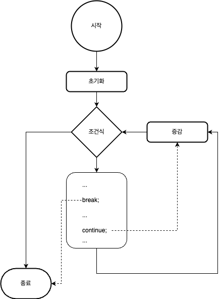

#### Labeled continue문

* Labeled break문과 동일하게 label이 붙어 있는 반복문의 실행문 끝가지 이동한다.


##### 예제. Labeled continue문을 이용해 불필요한 과정을 제거하라.

~~~java
class ContinueWithLabelDemo {
    public static void main(String[] args) {

        String searchMe = "Look for a substring in me";
        String substring = "sub";
        boolean foundIt = false;

        int max = searchMe.length() -
                  substring.length();

    test:
        for (int i = 0; i <= max; i++) {
            int n = substring.length();
            int j = i;
            int k = 0;
            while (n-- != 0) {
                if (searchMe.charAt(j++) != substring.charAt(k++)) {
                    continue test;
                }
            }
            foundIt = true;
                break test;
        }
        System.out.println(foundIt ? "Found it" : "Didn't find it");
    }
}
~~~

결과는 아래와 같다.

~~~sh
Found it
~~~


**설명**

위 코드의 동작 과정을 확인하고 싶으면, debugger를 이용해 추적하거나, 출력문을 이용해 확인할 수 있다.

위 코드는 주어진 문장에서 특정 문자열을 찾는 것이다.

문자열 비교 중 다른 문자가 나와 더 이상의 비교가 필요 없는 경우 문자열 비교를 중단하고 다음 위치에서부터 다시 검색한다.

Labeled continue문은 문자열이 달라 더 이상의 추가 검색이 필요 없으면, 나머지 과정을 넘기는 역할을 해 전체 수행 시간을 단축할 수 있다.

// TODO : 설명에 대한 그림이 있으면 이해가 쉬울 듯


### return문

*  break문, continue문 등과 같이 현재 수행 중인 실행문을 중지하고, method를  종료한다.
* return문에서 return keyword 뒤에 값을 추가할 경우, method의 수행 결괏값으로 반환된다.
* 반환 값은 method 선언 과정에서 지정된 type과 동일하거나 호환되어야 한다.
* 반환 값이 없는 경우, method 선언에서는 반환 type을 void로 지정해야 한다.


