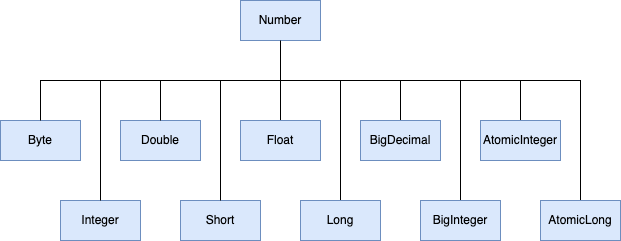

# Numbers and Strings

## Numbers

*  Java.lang
* PrintStream class
* DecimalFormat class
* Math class

### The Numbers Classes

* primitive type에 대한 wrapper class
* Autoboxing and unboxing

#### Number 오브젝트 사용 이유

1. Method에서 오브젝트 argument  요구
2. Data type의 값 범위 및 최대/최소값에 대한 상수 제공
3. Primitive type간 변환, 문자열과의 변환, Number system(10진수, 8진수 등)간 변환

#### Number class

* Abstract class

~~~java
public abstract class Number implements java.io.Serializable {
    public abstract int intValue();
    public abstract long longValue();
    public abstract float floatValue();
    public abstract double doubleValue();
    public byte byteValue() {
        return (byte)intValue();
    }
    public short shortValue() {
        return (short)intValue();
    }

    /** use serialVersionUID from JDK 1.0.2 for interoperability */
    private static final long serialVersionUID = -8742448824652078965L;
}
~~~

#### 변환 method

| Method                                        | 설명                                              |
| --------------------------------------------- | ------------------------------------------------- |
| `static Integer decode(String s)`             | 문자열을 정수로 변환                              |
| `static int parseInt(String s)`               | 정수를 반환합니다(십진수만 해당).                 |
| `static int parseInt(String s, int radix)`    | 문자열 정수와 진수를 주면 정수로 반환             |
| `String toString()`                           | 오브젝트 값을 문자열로 반환                       |
| `static String toString(int i)`               | 인수로 주어진 정수를 문자열로 반환                |
| `static Integer valueOf(int i)`               | Primitive type 정수를 Integer 오브젝트로 반환     |
| `static Integer valueOf(String s)`            | 문자열 정수를 Integer 오브젝트로 반환             |
| `static Integer valueOf(String s, int radix)` | 문자열 정수와 진수를 주면 Integer 오브젝트로 반환 |

### Formatting Numeric Print Output

* 숫자 출력 형식

* print & println

  

#### printf와 format method

* PrintStream class
* 형식을 갖는 출력은 print, println 대신 printf나 format

##### 예제. println과 format을 사용해 같은 문장을 출력한다. 무엇이 같고 다른지 비교해 보자.

~~~java 
package example;

class FormatDemo {
    public static void main(String[] args) {
        float floatVar = 10.0f;
        int intVar = 10;
        String stringVar = "10";

        System.out.println("The value of " + "the float variable is " 
                           + floatVar + ", while the value of the " 
                           + "integer variable is " + intVar + ", " 
                           + "and the string is " + stringVar);
        System.out.format("The value of " + "the float variable is " 
                          + "%f, while the value of the " + "integer variable is %d, " 
                          + "and the string is %s%n", floatVar, intVar, stringVar);
    }
}
~~~

* println은 숫자의 형식 지정이 가능한가?
* format에서 숫자의 출력 형식을 지정하는 부분은 어디인가?

#### Converter

* 숫자의 형식을 지정
* 형식 지정자 "%"로 시작해서 converter로 끝남
* 형식 지정자 "%"와 converter 사이 추가적인 형식 정보(flag) 첨가 가능

| Converter | Flag | Explanation                                                  |
| :-------: | :--: | ------------------------------------------------------------ |
|     d     |      | A decimal integer.                                           |
|     f     |      | A float.                                                     |
|     n     |      | A new line character appropriate to the platform running the application. You should always use `%n`, rather than `\n`. |
|    tB     |      | A date & time conversion—locale-specific full name of month. |
|  td, te   |      | A date & time conversion—2-digit day of month. td has leading zeroes as needed, te does not. |
|  ty, tY   |      | A date & time conversion—ty = 2-digit year, tY = 4-digit year. |
|    tl     |      | A date & time conversion—hour in 12-hour clock.              |
|    tM     |      | A date & time conversion—minutes in 2 digits, with leading zeroes as necessary. |
|    tp     |      | A date & time conversion—locale-specific am/pm (lower case). |
|    tm     |      | A date & time conversion—months in 2 digits, with leading zeroes as necessary. |
|    tD     |      | A date & time conversion—date as %tm%td%ty                   |
|           |  08  | Eight characters in width, with leading zeroes as necessary. |
|           |  +   | Includes sign, whether positive or negative.                 |
|           |  ,   | Includes locale-specific grouping characters.                |
|           |  -   | Left-justified..                                             |
|           |  .3  | Three places after decimal point.                            |
|           | 10.3 | Ten characters in width, right justified, with three places after decimal point. |

##### 예제. 아래의 코드를 작성하여 숫자 출력 형식에 따른 결과를 확인하자.

~~~java
import java.util.Calendar;
import java.util.Locale;

public class TestFormat {
    
    public static void main(String[] args) {
      long n = 461012;
      System.out.format("%d%n", n);      //  -->  "461012"
      System.out.format("%08d%n", n);    //  -->  "00461012"
      System.out.format("%+8d%n", n);    //  -->  " +461012"
      System.out.format("%,8d%n", n);    // -->  " 461,012"
      System.out.format("%+,8d%n%n", n); //  -->  "+461,012"
      
      double pi = Math.PI;

      System.out.format("%f%n", pi);       // -->  "3.141593"
      System.out.format("%.3f%n", pi);     // -->  "3.142"
      System.out.format("%10.3f%n", pi);   // -->  "     3.142"
      System.out.format("%-10.3f%n", pi);  // -->  "3.142"
      System.out.format(Locale.FRANCE,
                        "%-10.4f%n%n", pi); // -->  "3,1416"

      Calendar c = Calendar.getInstance();
      System.out.format("%tB %te, %tY%n", c, c, c); // -->  "May 29, 2006"

      System.out.format("%tl:%tM %tp%n", c, c, c);  // -->  "2:34 am"

      System.out.format("%tD%n", c);    // -->  "05/29/06"
    }
}
~~~

* %d
* %n
* %08d
* %+8d
* %,8d
* %+,8d
* %f
* %.3f
* %10.3f
* %-10.3f
* %tB
* %te
* %tY
* %tl
* %tM
* %tp
* %tD

#### The DecimalFormat Class

* 숫자의 형식을 패턴으로 표현

  

##### 예제. DecimalFormat class를 이용해 출력되는 숫자형식을 확인해 보자.

~~~java
import java.text.*;

public class DecimalFormatDemo {

   static public void customFormat(String pattern, double value ) {
      DecimalFormat myFormatter = new DecimalFormat(pattern);
      String output = myFormatter.format(value);
      System.out.println(value + "  " + pattern + "  " + output);
   }

   static public void main(String[] args) {

      customFormat("###,###.###", 123456.789);
      customFormat("###.##", 123456.789);
      customFormat("000000.000", 123.78);
      customFormat("$###,###.###", 12345.67);  
   }
}
~~~

결과는 아래와 같다.

~~~sh
123456.789  ###,###.###  123,456.789
123456.789  ###.##  123456.79
123.78  000000.000  000123.780
12345.67  $###,###.###  $12,345.67
~~~

* 123456.789  ###,###.###  123,456.789

  * \# 숫자를 표시하고, 쉽표는 그룹화 구분 기호로 자리 표시자이며 마침표는 소수점 구분 기호로 사용됨

* 123456.789  ###.##  123456.79

  * 소수점 이하 패턴 지정시 자리수가 초과할 경우 반올림

* 123.78  000000.000  000123.780

  * 자리 수에 맞춰 0 채우기

* 12345.67  \$###,###.###  $12,345.67

  * 숫자 앞에 다른 기호($)를 붙임

  * 자리수는 실제 자리수로 맞춤

    

### Beyond Basic Arithmetic

* Math class

* Java.lang 
* 모두 static method로 지원
* import static java.lang.Math.*; 로 모두 가져와 기본 함수 처럼 패키지는 클래스 이름 없이 사용 가능
  * cos(angle)

#### Constants

* Math.E : 자연 로그의 밑

* Math.PI : 3.141592... 

  

#### Basic Methods

* abs : 절대값 반환
* ceil : argument보다 크거나 같은 가장 작은 정수
* floor : argument보다 작거나 같은 가장 큰 정수
* 외 40 여가지 이상 

##### 예제. 아래의 코드를 보고, Math에서 지원하는 basic method 활용법에 대해 알아 보자.

~~~java

~~~

#### Exponential and Logarithmic Methods

* exp : 자연 로그 e의 밑을 argument의 거듭 제공으로 반환
* log : argument를 자연 로그로 처리
* 기타

##### 예제. 아래의 코드를 보고, Math에서 지원하는 exponential and logarithmic method 활용법에 대해 알아 보자.

~~~java

~~~

#### Trigonometric Methods(삼각법)

* sin

* cos

* 기타

##### 예제. 아래의 코드를 보고, Math에서 지원하는 trigonometric method 활용법에 대해 알아 보자.

~~~java

~~~

#### Random Numbers

  * 0.0과 1.0 사이에서 의사 난수로 선택된 숫자 반환

  * 0.0은 포함되지만, 1.0은 포함되지 않음

##### 예제. 아래의 코드를 보고, Math에서 지원하는 random 활용법에 대해 알아 보자.

~~~java
~~~

​    

### 정리

*  Reference type을 사용해야 하는 곳에서는 wrapper class를 사용하여 primitive type을 이용함
* Java compiler에서 자동으로 boxing(wrapping)/unboxing
* Number class에서 수를 다루기 위한 다양한 기능 제공
* 숫자를 특정 형식에 맞춰 출력하기 위해서는 printf, format 사용 가능

* Math class를 이용해 다양한 수학 함수 지원

  

## Characters

## Strings

### Converting Between Numbers and Strings 

### Manupulating Characters in a String

### Comparing Strings and Portions of Strings

### 정리

## Autoboxing and Unboxing

